# FPGA 学习笔记

# 需要搞懂的问题

- [ ] DSP
- [ ] 眼图
- [ ] ADC（范围）

‍

使用 Verilog 实现

- FIFO
- RAM

‍

# 资料来源

> 还没有阅读的 | 阅读中的资料：
>
> https://zhuanlan.zhihu.com/p/502348278
>
> https://github.com/Edragon/FPGA_DOCS/blob/master/FPGA%E5%85%A5%E9%97%A8%E6%95%99%E7%A8%8B%E2%80%94%E8%AF%A6%E5%B0%BD%E7%9A%84%E5%9F%BA%E7%A1%80%E7%9F%A5%E8%AF%86.pdf
>
> https://vlab.ustc.edu.cn/guide/doc_fpga.html
>
> https://github.com/LeiWang1999/FPGA
>
> https://wsong83.github.io/supervision
>
> https://wsong83.github.io/supervision/digitalcircuit2022/4a.pdf
>
> https://wsong83.github.io/supervision/digitalcircuit2019/5.pdf
>
> https://wsong83.github.io/supervision/digitalcircuit2022/5e.pdf
>
> https://wsong83.github.io/supervision/digitalcircuit2020/6a.pdf
>
> ‍

‍

> 中国科学院大学网络空间安全学院专业必修课
>
> 课程大纲：https://jwba.ucas.ac.cn/sc/course/courseplan/242718
>
> 教授课程页面：https://wsong83.github.io/supervision.html
>
> ‍
>
> pdf 课件：
>
> https://wsong83.github.io/supervision/digitalcircuit2022/4a.pdf
>
> https://wsong83.github.io/supervision/digitalcircuit2019/5.pdf
>
> https://wsong83.github.io/supervision/digitalcircuit2022/5e.pdf
>
> https://wsong83.github.io/supervision/digitalcircuit2020/6a.pdf
>
> ‍
>
> **教学目的要求**
>
> 数字电路是数字系统的基石，数字集成电路、计算机组成原理和计算机体系结构的前修课程。这门课将介绍数字电路的逻辑代数基础、CMOS电路基础、组合逻辑和时序逻辑设计、可编程逻辑电路和随机存储器的基本内部构造。同时借助现有的开源EDA工具，学习使用Verilog设计数字电路的基本技能。
>
> **预修课程**
>
> 离散数学**主要内容**
>
> 第一章 数制和码制【理解】
>
> 1.1 常用数制和数制转换  
> 1.2 二进制算术运算
>
> 第二章 逻辑代数基础【掌握】
>
> 2.1 逻辑代数基本定理  
> 2.2 逻辑函数的表达形式  
> 2.3 逻辑函数的化简
>
> 第三章 CMOS门电路【理解】
>
> 3.1 MOS管简介  
> 3.2 CMOS反相器结构  
> 3.3 简单的CMOS门电路
>
> 第四章 组合逻辑电路【掌握】
>
> 4.1 组合逻辑电路的基本设计方法  
> 4.2 常用的组合逻辑电路  
> 4.3 组合逻辑电路的竞争冒险  
> 4.4 门级电路的时序分析  
> 4.5 Verilog硬件描述和EDA工具使用  
> 4.6 组合逻辑电路的仿真与测试
>
> 第五章 时序逻辑电路【掌握】
>
> 5.1 寄存器和锁存器  
> 5.2 时序逻辑电路的基本设计方法  
> 5.3 状态机的设计  
> 5.4 常用时序逻辑电路的设计（仲裁器、缓冲器）  
> 5.5 时序逻辑电路的时序分析  
> 5.6 时序逻辑电路的仿真与测试
>
> 第六章 半导体存储电路和可编程逻辑电路【了解】
>
> 6.1 静态随机存储器  
> 6.2 动态随机存储器  
> 6.3 可编程逻辑电路的基本结构
>
> ---
>
> **教材**
>
> 阎石, 王红. 数字电子技术基础(第6版)[M]. 北京：高等教育出版社, 2016.4 (ISBN 9787040444933)**参考文献**
>
> [1] Michael D. Ciletti 著, 李广军, 林水生, 阎波, 等译. Verilog HDL高级数字设计（第二版）[M]. 北京：电子工业出版社，2014.2  
> [2] IEEE 1364-2005: IEEE Standard for Verilog Hardware Description Language[S]. 纽约：IEEE，2006.4 ()  
> [3] Stephen Williams. Icarus Verilog[OL]. http://iverilog.icarus.com/

‍

# 🧀 物理相关

### 能级规律

**离原子核越近 → 电子能量越低（低能带）**

**离原子核越远 → 电子能量越高（高能带）**

- 内层电子被原子核牢牢吸引，束缚强、<span data-type="text" style="background-color: var(--b3-card-success-background); color: var(--b3-card-success-color);">动能势能都小</span>：**低能量能带**
- 外层价电子受原子核束缚弱，容易拿到能量乱跑：**高能量的价带、导带**

---

### 半导体禁带

**一楼**  **=**  **价带**：平常电子全都待在一楼房间里，挤得满满当当，没法自由跑动导电。

**二楼**  **=**  **导带**：在楼上，房间空旷，电子上去之后能自由乱跑、形成电流。

**一楼和二楼中间悬空没有楼板的空隙**  **=**  **禁带**  
**这片空隙没有落脚的地板，电子不能停留在半空，想要从一楼去二楼，必须一次性跳过整段空隙。**

‍

区分绝缘体 / 半导体 / 金属

- **绝缘体：一二楼间隔超大（禁带很宽）** 常温下电子没力气跳过大坑，永远待一楼，不导电。

- **半导体：楼层间隔窄（禁带窄）** 一点点热量、光照就能给电子充能，轻松蹦上二楼；电子上楼→二楼有自由电子，***一楼***<span data-type="text" style="background-color: var(--b3-card-success-background); color: var(--b3-card-success-color);">缺电子留下</span>**空穴**，二者都能导电。

- **金属：一二楼连在一起，没有悬空空隙（无禁带）** 电子本来就在一二楼自由穿梭，天生导电。

---

### 电子跃迁

电子跳过禁带就叫做”电子跃迁“

1. **价带电子吸收能量（热、光）→跨过禁带→进入导带**  **=**  **带间跃迁**

    - 电子离开价带（一楼）：价带留下**空穴**
    - 电子进到导带（二楼）：变成**自由电子**，两者都能导电，也就是半导体本征导电

2. 补充区分

    - 从高能级掉回低能级（导带电子落回价带、和空穴复合），**也是跃迁**，多余能量变成光或热量；
    - 只有跨过禁带从价带去导带，才会产生电子 - 空穴对。

一句话：**跨越禁带从价带蹦去导带，就是典型的**​**电子跃迁**

---

### **载流子**

在[物理学]( "物理学")中，**载流子**（charge carrier）又称**电荷载子**，简称**载子**（carrier），<span data-type="text" style="background-color: var(--b3-card-success-background); color: var(--b3-card-success-color);">指可以自由移动的</span>**带有****[电荷](https://zh.wikipedia.org/wiki/%E7%94%B5%E8%8D%B7 "电荷")****的**<span data-type="text" style="background-color: var(--b3-card-success-background); color: var(--b3-card-success-color);">物质微粒，如</span>[电子](https://zh.wikipedia.org/wiki/%E7%94%B5%E5%AD%90 "电子")<span data-type="text" style="background-color: var(--b3-card-success-background); color: var(--b3-card-success-color);">和</span>[离子](https://zh.wikipedia.org/wiki/%E7%A6%BB%E5%AD%90 "离子")。在[半导体](https://zh.wikipedia.org/wiki/%E5%8D%8A%E5%AF%BC%E4%BD%93 "半导体")物理学中，电子流失导致**共价键**上留下的空位（[空穴](https://zh.wikipedia.org/wiki/%E7%A9%BA%E7%A9%B4 "空穴")）被视为载流子。

在电解质溶液中，载流子是已溶解的[阳离子](https://zh.wikipedia.org/wiki/%E9%98%B3%E7%A6%BB%E5%AD%90 "阳离子")和[阴离子](https://zh.wikipedia.org/wiki/%E9%98%B4%E7%A6%BB%E5%AD%90)。类似地，游离液体中的阳离子和阴离子在液体和熔融态固体电解质中也是载流子。[霍尔－埃鲁法](https://zh.wikipedia.org/wiki/%E9%9C%8D%E5%B0%94%EF%BC%8D%E5%9F%83%E9%B2%81%E6%B3%95 "霍尔－埃鲁法")就是一个熔融电解的例子。

在[等离子体](https://zh.wikipedia.org/wiki/%E7%AD%89%E7%A6%BB%E5%AD%90%E4%BD%93 "等离子体")，如[电弧](https://zh.wikipedia.org/wiki/%E7%94%B5%E5%BC%A7 "电弧")中，电离气体和汽化的电极材料中的电子和阳离子是载流子。电极汽化在真空中也可以发生，但技术上电弧在真空中不能发生，而是发生在低压电气中；在[真空](https://zh.wikipedia.org/wiki/%E7%9C%9F%E7%A9%BA "真空")中，如[真空电弧](https://zh.wikipedia.org/w/index.php?title=%E7%9C%9F%E7%A9%BA%E7%94%B5%E5%BC%A7&action=edit&redlink=1 "真空电弧（页面不存在）")或[真空管](https://zh.wikipedia.org/wiki/%E7%9C%9F%E7%A9%BA%E7%AE%A1 "真空管")中，自由电子是载流子；在[金属](https://zh.wikipedia.org/wiki/%E9%87%91%E5%B1%9E "金属")中，金属[晶格](https://zh.wikipedia.org/wiki/%E6%99%B6%E6%A0%BC "晶格")中形成[费米气体](https://zh.wikipedia.org/wiki/%E8%B2%BB%E7%B1%B3%E6%B0%A3%E9%AB%94 "费米气体")的电子是载流子。

‍

### 空穴

**空穴**又称**电洞**、**電子孔**​<sup>[[1]](https://zh.wikipedia.org/wiki/%E7%A9%BA%E7%A9%B4#cite_note-1)</sup>（Electron hole）、**正孔**，在[固体物理学](https://zh.wikipedia.org/wiki/%E5%9B%BA%E4%BD%93%E7%89%A9%E7%90%86%E5%AD%A6 "固体物理学")中指[共價鍵](https://zh.wikipedia.org/wiki/%E5%85%B1%E5%83%B9%E9%8D%B5 "共價鍵")上流失一个[电子](https://zh.wikipedia.org/wiki/%E7%94%B5%E5%AD%90 "电子")，最後在共價鍵上留下空位的現象。

一個呈[電中性](https://zh.wikipedia.org/wiki/%E7%94%B5%E4%B8%AD%E6%80%A7 "电中性")的[原子](https://zh.wikipedia.org/wiki/%E5%8E%9F%E5%AD%90 "原子")，其正電的[質子](https://zh.wikipedia.org/wiki/%E8%B3%AA%E5%AD%90 "質子")和負電的電子的數量是相等的。現在由於少了一個負電的電子，所以那裡就會呈現出一個正電性的空位——電洞。當有外面一個電子進來掉進了電洞，就會發出[電磁波](https://zh.wikipedia.org/wiki/%E9%9B%BB%E7%A3%81%E6%B3%A2 "電磁波")——[光子](https://zh.wikipedia.org/wiki/%E5%85%89%E5%AD%90 "光子")。

電洞不是[正電子](https://zh.wikipedia.org/wiki/%E6%AD%A3%E9%9B%BB%E5%AD%90 "正電子")，電子與正電子相遇[湮滅](https://zh.wikipedia.org/wiki/%E6%B9%AE%E7%81%AD "湮灭")時，所發出來的光子是非常高能的。那是兩粒子的[質量](https://zh.wikipedia.org/wiki/%E8%B3%AA%E9%87%8F "質量")所完全轉化出來的[電磁波](https://zh.wikipedia.org/wiki/%E9%9B%BB%E7%A3%81%E6%B3%A2 "電磁波")（通常會轉出一對光子）。而電子掉入電洞所發出來的光子，其[能量](https://zh.wikipedia.org/wiki/%E8%83%BD%E9%87%8F "能量")通常只有幾個[電子伏特](https://zh.wikipedia.org/wiki/%E9%9B%BB%E5%AD%90%E4%BC%8F%E7%89%B9 "電子伏特")。

> 
>
> 当电子脱离[氦](https://zh.wikipedia.org/wiki/%E6%B0%A6 "氦")原子核後，会留下一个空穴，这会导致氦原子帶**正电**。

[半导体](https://zh.wikipedia.org/wiki/%E5%8D%8A%E5%AF%BC%E4%BD%93 "半导体")由于[禁带](https://zh.wikipedia.org/wiki/%E7%A6%81%E5%B8%A6 "禁带")较窄，电子只需不多的能量就能从[价带](https://zh.wikipedia.org/wiki/%E5%83%B9%E5%B8%B6 "價帶")激发到[导带](https://zh.wikipedia.org/wiki/%E5%AF%BC%E5%B8%A6 "导带")，从而在价带中留下空穴。周围电子可以填补这个空穴，同时在原位置产生一个新的空穴，因此实际上的电子运动看起来就如同是空穴在移动。

在半导体的制备中，要在4价的[本征半导体](https://zh.wikipedia.org/wiki/%E6%9C%AC%E5%BE%81%E5%8D%8A%E5%AF%BC%E4%BD%93 "本征半导体")（纯[硅](https://zh.wikipedia.org/wiki/%E7%A1%85 "硅")、[锗](https://zh.wikipedia.org/wiki/%E9%94%97 "锗")等的[晶体](https://zh.wikipedia.org/wiki/%E6%99%B6%E4%BD%93 "晶体")）的基础上[掺杂](https://zh.wikipedia.org/wiki/%E6%8E%BA%E6%9D%82_(%E5%8D%8A%E5%AF%BC%E4%BD%93) "掺杂 (半导体)")。若掺入3价元素杂质（如[硼](https://zh.wikipedia.org/wiki/%E7%A1%BC "硼")、[镓](https://zh.wikipedia.org/wiki/%E9%95%93 "镓")、[铟](https://zh.wikipedia.org/wiki/%E9%93%9F "铟")、[铝](https://zh.wikipedia.org/wiki/%E9%93%9D "铝")等），则可产生大量空穴，获得P型半导体，又称[空穴型半导体](https://zh.wikipedia.org/w/index.php?title=%E7%A9%BA%E7%A9%B4%E5%9E%8B%E5%8D%8A%E5%AF%BC%E4%BD%93&action=edit&redlink=1 "空穴型半导体（页面不存在）")。空穴是P型半导体中的多數[载流子](https://zh.wikipedia.org/wiki/%E8%BD%BD%E6%B5%81%E5%AD%90 "载流子")。

---

### 漂移电流

在[凝聚体物理学](https://zh.wikipedia.org/wiki/%E5%87%9D%E8%81%9A%E4%BD%93%E7%89%A9%E7%90%86%E5%AD%A6 "凝聚体物理学")和[电化学](https://zh.wikipedia.org/wiki/%E7%94%B5%E5%8C%96%E5%AD%A6 "电化学")中，**漂移电流**<span data-type="text" style="background-color: var(--b3-card-error-background); color: var(--b3-card-error-color);">是在施加</span><span data-type="text" style="background-color: var(--b3-card-success-background); color: var(--b3-card-success-color);">电场</span><span data-type="text" style="background-color: var(--b3-card-error-background); color: var(--b3-card-error-color);">下</span>[载流子](https://zh.wikipedia.org/wiki/%E8%BD%BD%E6%B5%81%E5%AD%90 "载流子")<span data-type="text" style="background-color: var(--b3-card-error-background); color: var(--b3-card-error-color);">定向运动产生的</span>[电流](https://zh.wikipedia.org/wiki/%E7%94%B5%E6%B5%81 "电流")<span data-type="text" style="background-color: var(--b3-card-error-background); color: var(--b3-card-error-color);">。当电场加在半导体材料上时，载流子流动产生电流。</span>

[漂移速度](https://zh.wikipedia.org/wiki/%E6%BC%82%E7%A7%BB%E9%80%9F%E5%BA%A6 "漂移速度")是指漂移电流中载流子运动的平均速度。漂移速度以及产生的电流，是通过迁移率(mobility)来表述的。更详细的内容，请参见[电子迁移率](https://zh.wikipedia.org/wiki/%E7%94%B5%E5%AD%90%E8%BF%81%E7%A7%BB%E7%8E%87 "电子迁移率")(对于固体)和[电迁移率](https://zh.wikipedia.org/w/index.php?title=%E7%94%B5%E8%BF%81%E7%A7%BB%E7%8E%87&action=edit&redlink=1 "电迁移率（页面不存在）")(更一般的讨论)。

在电流中，叫做空穴的带正电粒子顺电场方向移动，而带负电的电子逆电场方向移动。它和[扩散电流](https://zh.wikipedia.org/wiki/%E6%89%A9%E6%95%A3%E7%94%B5%E6%B5%81 "扩散电流")不同 如果将一个电场加在自由空间的一个电子上，它会从外加电压的负端到正端沿一条直线加速加速这个电子。但相同的事情不会发生在良导体内部的电子上。良导体内有大量自由电子在固定的正离子核之间无规则运动。电子在一条直线(宏观上)上的无规则运动叫做飘移运动。飘移运动也跟载流子在导[电介质](https://zh.wikipedia.org/wiki/%E4%BB%8B%E9%9B%BB%E8%B3%AA "介电质")中的迁移率有关。

---

‍

# 🧀 数值分析 & 数学模型

---

## 漂移误差

**漂移误差（Drift Error）是什么**

漂移误差指的是：**系统在输入不变的情况下，输出却随着时间缓慢变化的误差**。换句话说，就是“明明什么都没变，但测量结果自己在慢慢跑掉”。

注意**漂移误差 ≠ 一定随时间无限累积变大** **，更准确的说法是：漂移误差是“随时间缓慢变化的系统偏移”，它可以变大、变小、甚至往返变化，但核心特征是“低频、缓慢、不稳定”。**

它和随机噪声不一样，**噪声是上下快速抖动**，而<span data-type="text" style="background-color: var(--b3-card-success-background); color: var(--b3-card-success-color);">漂移是</span>**缓慢、单向或低频变化**，通常和温度、时间、电源变化有关。

‍

可以这样理解：

- 校准 \= “你把尺子刻准”
- 漂移 \= “尺子过一段时间自己变形了”
- 误差 \= 当前测量值 - 理想值

**注意：校准和**​**漂移****不是一个东西！！**

‍

---

在示波器里，漂移误差是一个非常实际的问题，因为*示波器本质是“高精度电压测量系统”* ，而任何模拟链路都会随环境变化产生偏移。

---

**一、示波器中最容易出现漂移的地方**

最典型的是<span data-type="text" style="background-color: var(--b3-card-success-background); color: var(--b3-card-success-color);">前端模拟通道，比如输入放大器、衰减器和ADC前端</span>。运放的输入失调电压会随着温度变化而变化，这会直接导致基线慢慢偏移，你看到的波形可能整体往上或往下漂。

其次是ADC本身。很多**高速ADC的参考电压和内部比较结构会随温度和供电变化产生偏移，这会表现为零点不稳定或增益缓慢变化**。

还有一个很关键但容易忽略的部分是参考电压源（Vref）。如果Vref漂移，那么整个数字化尺度都会变，相当于“刻度尺在变长或变短”，这会影响整体测量精度。

---

**二、数字部分也会有漂移吗**

会的，但形式不一样。FPGA里的数字逻辑本身不会漂移，但它依赖的时钟系统和模拟接口会引入“等效漂移”。

比如PLL输出的时钟如果有相位抖动或温度漂移，会影响采样点位置，长时间观察就会看到波形轻微“移动”。再比如ADC采样时钟偏移，也会造成等效时间轴漂移。

---

**三、示波器里漂移的表现是什么**

最直观的表现就是：输入短接到地时，波形不在0V，而是缓慢上下移动；或者同一信号长时间观察，基线位置缓慢漂移；在高精度测量中，还会表现为幅值慢慢变大或变小。

---

**四、工程上怎么处理漂移**

通常不会试图“消灭”，而是“抑制 + 校准 + 补偿”。

模拟部分会用低漂移运放、稳定参考源，并控制温度；系统上会做零点校准（短路校准或自校准）；数字部分会做基线跟踪，比如自动减去直流偏置。

在高端示波器里，还会有周期性的自校准机制，让系统在不同温度下重新标定增益和零点。

---

**一句话总结**

漂移误差就是“系统输出随时间缓慢变化的偏移误差”，在示波器中主要来源于模拟前端、参考电压和时钟系统，它会导致基线不稳和测量长期不准，需要通过硬件稳定性设计和软件校准共同抑制。

---

‍

## 校准

**示波器里的“校准”到底在做什么**

示波器校准的核心不是“算漂移”，而是：

> **建立一个“输入 → 数字结果”的准确**​**映射关系**

也就是确定：

- 零点在哪里（offset）
- 增益是多少（gain）
- 时间轴是否准确（time base）

---

通常校准会做这些事：

**① 零点校准（Offset Calibration）**   
输入接地 → 测量ADC输出 → 修正偏置

👉 解决“没有输入但输出不为0”的问题

**② 增益校准（Gain Calibration）**   
输入一个已知电压（比如 1V标准源）  
→ 看系统测出来是多少  
→ 调整比例系数

**③ 时间校准（Time Calibration）**   
用已知频率信号校正采样时钟

---

**三、漂移是什么（重点区分）**

漂移不是“校准出来的值”，而是：

> **在校准之后，随着时间/温度变化**​**重新****产生的误差**

校准不是在计算漂移，而是在“建立标准参考系”；**漂移是这个参考系在时间和环境作用下发生的偏移变化。**

也就是说：

- 校准：建立标准
- 漂移：偏离标准的变化

---

涉及到的“差值”，在工程上可能对应两种东西：

**① offset（零点偏移）**

输入 \= 0V 时：

- 理想输出 \= 0
- 实际输出 \= 5mV

👉 这个差值叫 offset，不叫漂移

**② drift（漂移量）**

同一个0V输入：

- 现在是 5mV
- 一小时后变成 8mV

👉 变化量（3mV）才是漂移

---

|概念|是否随时间变化|是否是“当前差值”|
| --------| ------------------| --------------------|
|校准|否（是一次过程）|不直接对应|
|offset|是固定偏移|是|
|drift|是变化量|是“变化后的差值”|

---

在示波器<span data-type="text" style="background-color: var(--b3-card-success-background); color: var(--b3-card-success-color);">里真实流程是</span>：

1. **校准** → 确定“0V应该显示0”
2. 使用 → 正常测量
3. 随时间 → 系统开始**偏移**（漂移产生）
4. 再校准 → 把偏移重新拉回标准

‍

# 🧀 电路微观层面

**PN 结 → 构成 MOS 管 → 构成 CMOS 门 → 构成 FPGA 内部硬件 → Vivado 负责配置这些硬件**​

> **PN 结是什么？** 
>
> - 半导体的基础结构
> - **有了 PN 结，才能做出 MOS 管**
> - 你可以理解成：**电子元件的原材料**
>
>> **MOS 管（NMOS/PMOS）是什么？** 
>>
>> - 用 PN 结做成的**电子开关**
>> - 高电平 / 低电平控制开 / 关
>> - 是芯片里**最小最小的单元**
>>
>>> **CMOS 是什么？** 
>>>
>>> - 1 个 NMOS + 1 个 PMOS
>>> - 组成**最基本的逻辑门**（非门、与非门、触发器）
>>> - **FPGA 内部所有逻辑都是 CMOS 电路**
>>>
>>>> **FPGA 是什么？** 
>>>>
>>>> - 由**几百万、几千万个 CMOS 门、触发器、LUT、布线**组成
>>>> - 是一个**可配置的 CMOS 芯片阵列**
>>>> - 你写代码，就是在**配置这些 CMOS 门怎么连接**
>>>>
>>>>> **Vivado 在这里面干什么？（最重要）** 
>>>>>
>>>>> Vivado **不制造 CMOS**，但它做三件事：
>>>>>
>>>>> 1. **综合：** 把你的 Verilog → 翻译成 **CMOS 逻辑门电路**
>>>>> 2. **布局：** 把这些逻辑门放到 FPGA 的硬件位置上
>>>>> 3. **布线：** 用金属线把它们连起来
>>>>> 4. **生成比特流：** 最终下载到 FPGA，**控制 CMOS 门的通断**
>>>>>
>>>>
>>>
>>

---

## 💿 MOS 晶体管

### P-N 结

一块半导体晶体一侧[掺杂](https://zh.wikipedia.org/wiki/%E6%8E%BA%E6%9D%82_(%E5%8D%8A%E5%AF%BC%E4%BD%93) "掺杂 (半导体)")成p型半导体，另一侧掺杂成n型半导体，中间二者相连的[接触面](https://zh.wikipedia.org/wiki/%E6%8E%A5%E9%9D%A2 "接面")间有一个过渡层，称为**pn接面**、**p-n接面**（p-n junction）。pn接面是[电子技术](https://zh.wikipedia.org/wiki/%E7%94%B5%E5%AD%90%E6%8A%80%E6%9C%AF "电子技术")中许多元件，例如半导体[二极管](https://zh.wikipedia.org/wiki/%E4%BA%8C%E6%A5%B5%E7%AE%A1 "二极管")、[双极性晶体管](https://zh.wikipedia.org/wiki/%E5%8F%8C%E6%9E%81%E6%80%A7%E6%99%B6%E4%BD%93%E7%AE%A1 "双极性晶体管")的物质基础。

‍


pn接面基本构造：图示为以[矽](https://zh.wikipedia.org/wiki/%E7%9F%BD "矽")为主要材料的pn接面。

---

### NMOS 开关电路

> 参考资料：
>
> https://wsong83.github.io/supervision/digitalcircuit2019/3.pdf

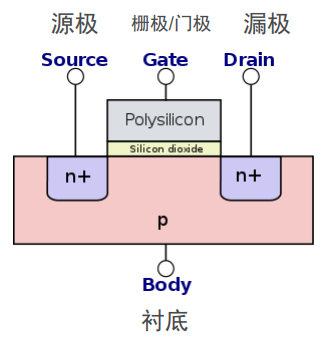

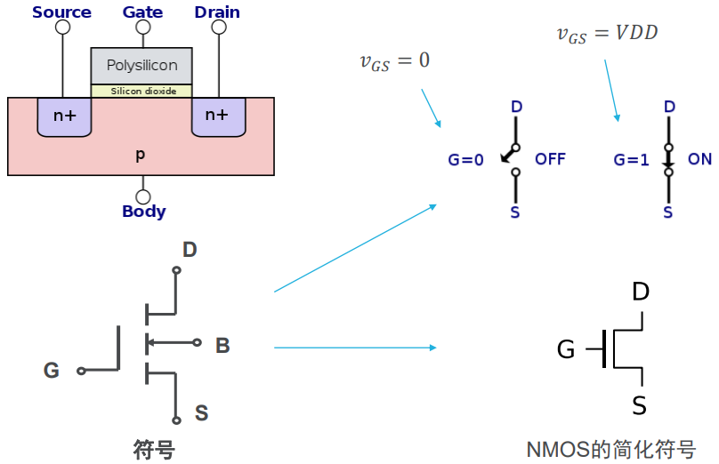

‍

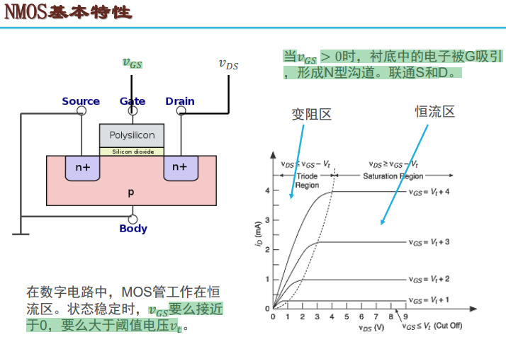​

- **导通条件**

  **栅极 G 电压**​<span data-type="text" style="background-color: var(--b3-card-success-background); color: var(--b3-card-success-color);"> </span> **&gt;** <span data-type="text" style="background-color: var(--b3-card-success-background); color: var(--b3-card-success-color);"> </span>**源极 S 电压**（<span data-type="text" style="background-color: var(--b3-card-success-background); color: var(--b3-card-success-color);">高电平导通</span>）

- **电流方向**

  电流从 **漏极 D → 源极 S**物理上：载流子是**电子**，<span data-type="text" style="background-color: var(--b3-card-success-background); color: var(--b3-card-success-color);">电子从 S→D</span>，电流方向与电子运动方向相反。

- **典型用法**

  常做**下拉开关**：S 接 GND（地），D 接信号 / 负载。导通后，引脚被拉到低电平。

---

### PMOS 开关电路

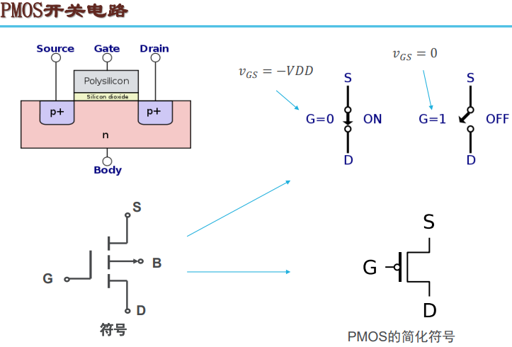

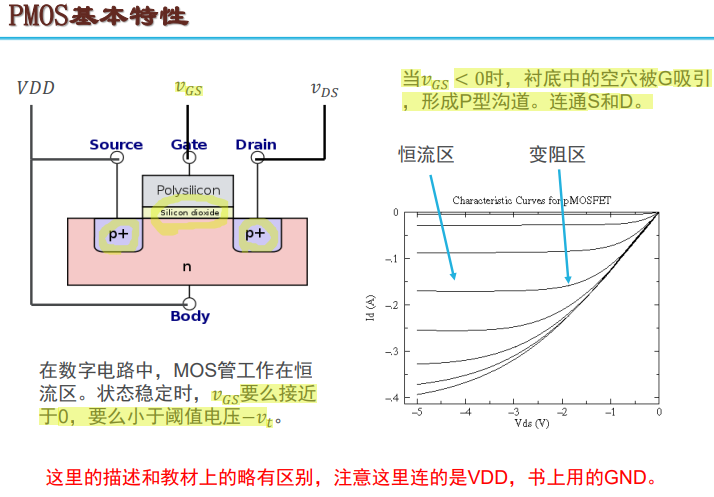

- 导通条件

  **栅极 G 电压**​<span data-type="text" style="background-color: var(--b3-font-background12);"> </span> **&lt;** <span data-type="text" style="background-color: var(--b3-font-background12);"> </span>**源极 S 电压**（<span data-type="text" style="background-color: var(--b3-font-background12);">低电平导通</span>）

- 电流方向

  电流从 **源极 S → 漏极 D**  物理上：载流子是**空穴**，空穴运动方向和电流方向一致。

- 典型用法

  常做**上拉开关**：S 接 VCC（电源），D 接信号 / 负载。导通后，引脚被拉到高电平。

---

## 💿 CMOS 门电路

> 参考资料：
>
> https://wsong83.github.io/supervision/digitalcircuit2019/3.pdf
>
> https://wsong83.github.io/supervision/digitalcircuit2022/3.pdf

> MOS：Complementary metal–oxide–semiconductor
>
> 互补MOS工艺，或者互补金属氧化物半导体工艺

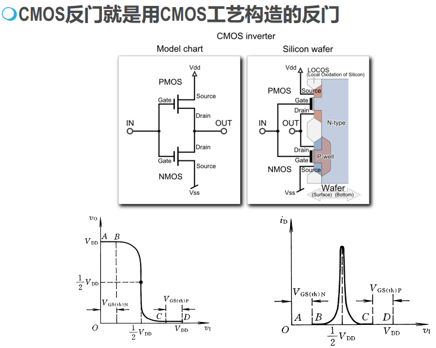

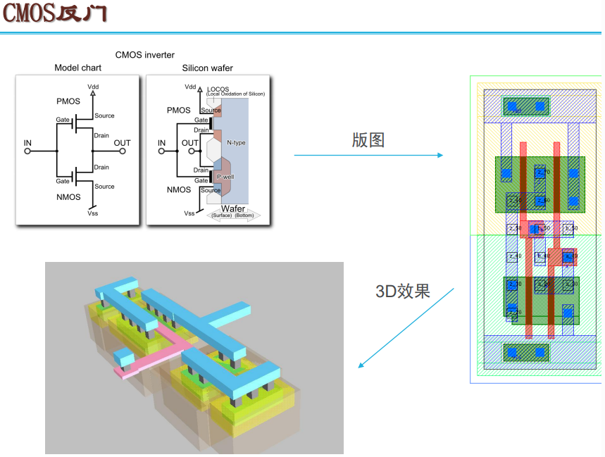

---

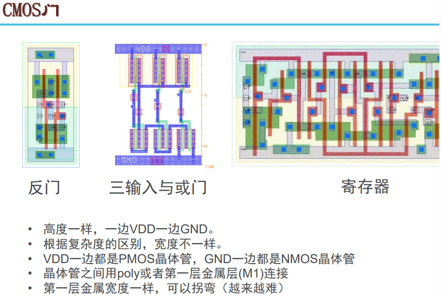

- **VDD -**  **电源正极（供电电压）** ​

  数字电路里就是**高电平电位**，相当于电路的 “火线”

  所有 CMOS 门、逻辑单元都需要从 VDD 取电，课件里顶层粗导线主要就是走 VDD 电源线

  对应你电路里的 `VCC`，FPGA / 芯片内部统一供电网络

- **GND -**  **接地、电源负极**​

  电路参考零电位，也就是**低电平**，相当于电路的 “地线”

  和 VDD 成对出现，<span data-type="text" style="background-color: var(--b3-card-success-background); color: var(--b3-card-success-color);">CMOS 电路必须同时接 VDD 和 GND 才能工作</span>

  相邻单元行（row）会共享 GND/VDD，减少布线、节省面积。

- **via -**  **通孔、过孔**​

  芯片内部有**多层金属布线层**（像楼房的不同楼层），每层金属线只能在本层走线

  **via 就是打通上下两层金属的 “通道 / 孔洞”** ，让信号、电源可以从一层导线连到另一层

  规则：不同金属层走线方向互相垂直（正交），靠 via 实现层与层互联

---

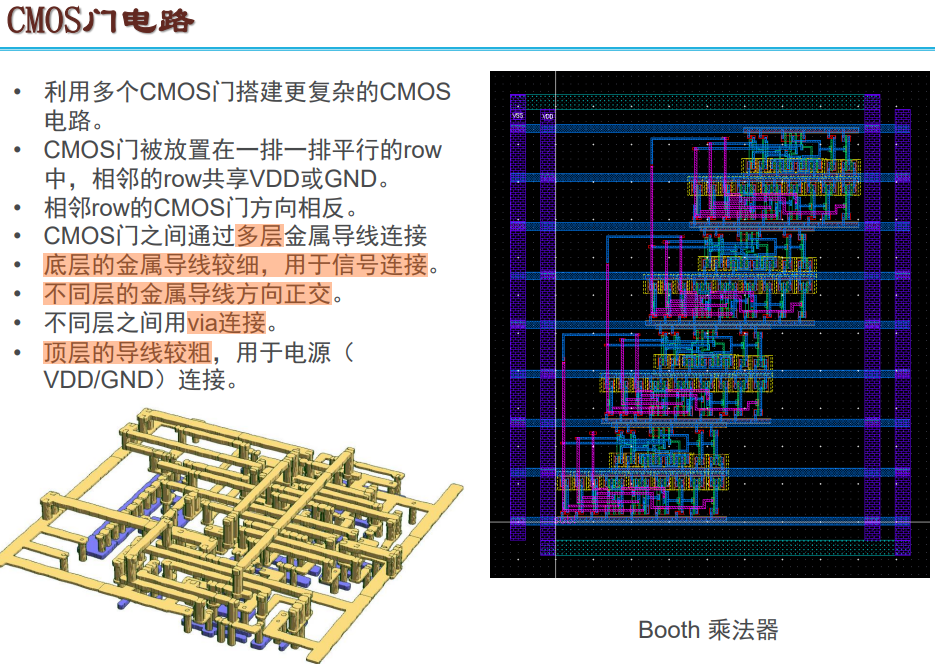

---

### CMOS 反、与非、或非、与、或门

**互补特性**数字电路里的 **CMOS 反相器** 就是一只 NMOS + 一只 PMOS 配对使用：

- 输入高：NMOS 通、PMOS 断 → 输出拉低
- 输入低：PMOS 通、NMOS 断 → 输出拉高

- <span data-type="text" style="background-color: var(--b3-card-success-background); color: var(--b3-card-success-color);">二者永远</span>**一只通、一只断**<span data-type="text" style="background-color: var(--b3-card-success-background); color: var(--b3-card-success-color);">。</span>

  ‍

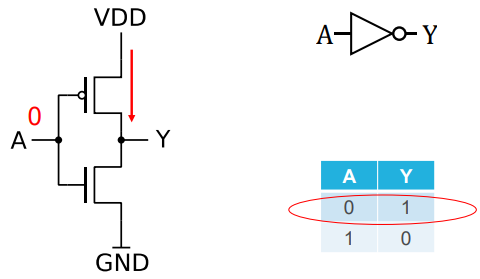

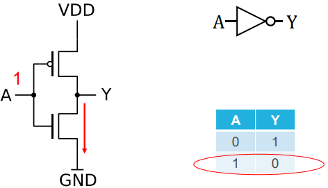

**CMOS 反门总结**

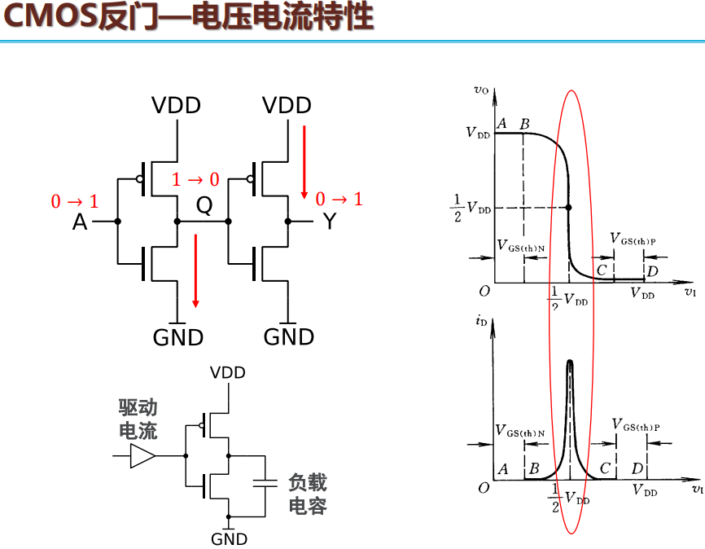

- **互补型结构**

  - **所有的CMOS门电路都是互补型结构**
  - <span data-type="text" style="background-color: var(--b3-card-success-background); color: var(--b3-card-success-color);">PMOS 和 NMOS 的结构一定是对应存在的</span> **（互补）**
  - VDD 接 PMOS，GND 接 NMOS
  - MOS 管的总数量一定是偶数
- **工作在恒流区**

  - 状态稳定（输入输出无变化）时电流极小
  - 状态改变时产生从VDD到GND的<span data-type="text" style="background-color: var(--b3-card-success-background); color: var(--b3-card-success-color);">瞬时大电流</span>
- **驱动和负载模型**

  - 驱动主要讨论电流供给能力，即给电容充电的强度
  - 负载主要是各门电路的门级到源极的等效电容
  - 驱动和负载决定了门的反应时间（transition time）

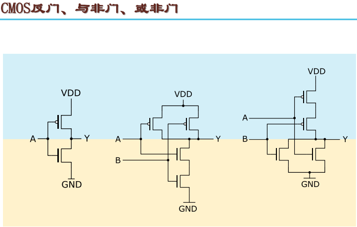​

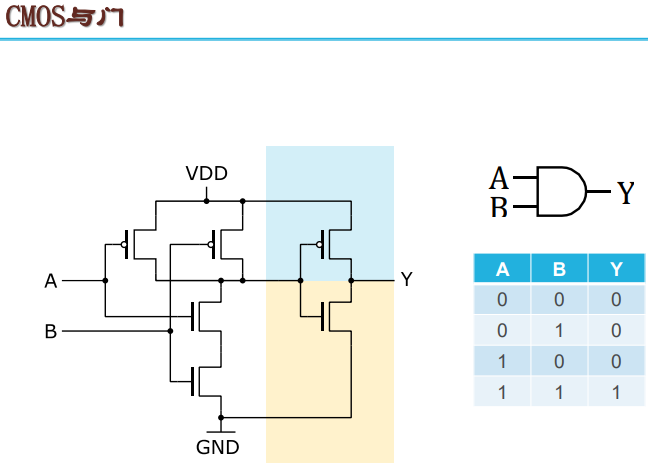

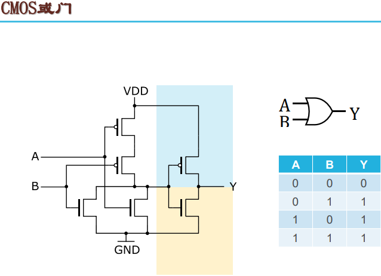

---

**补充关键点（数字电路必知）**

2. <span data-type="text" style="background-color: var(--b3-card-success-background); color: var(--b3-card-success-color);">关于 “源极 / 漏极”MOS 管结构对称，低压数字电路中 S/D 可以互换，</span>**电流方向也会跟着反过来**<span data-type="text" style="background-color: var(--b3-card-success-background); color: var(--b3-card-success-color);">，但</span>**导通的电平规则不变**<span data-type="text" style="background-color: var(--b3-card-success-background); color: var(--b3-card-success-color);">。</span>
3. 一句话速记

- NMOS：**高开，电流 D 到 S**
- PMOS：**低开，电流 S 到 D**

‍

### 其他 CMOS 门

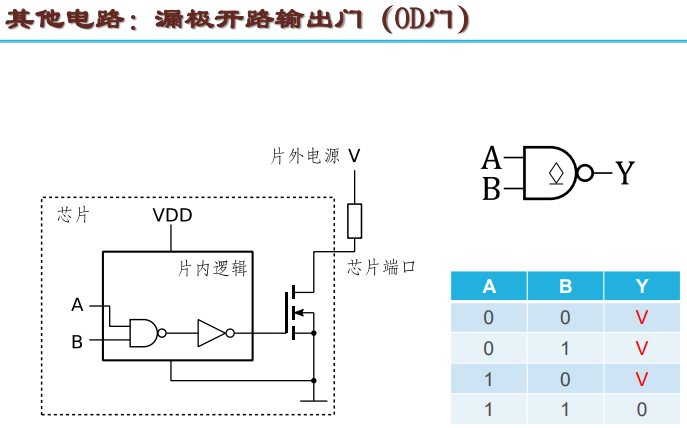

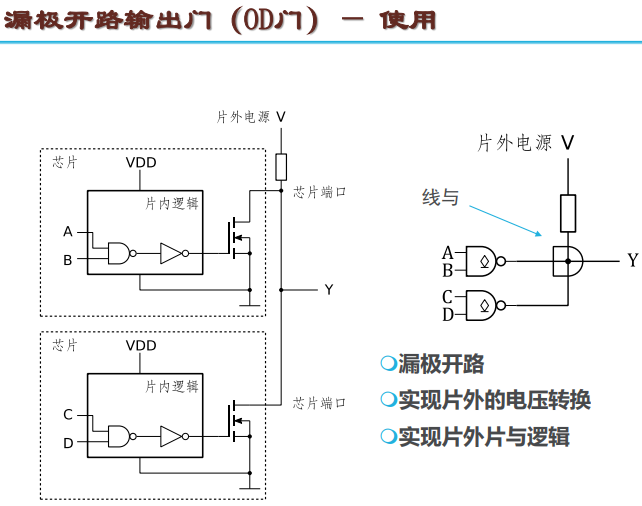

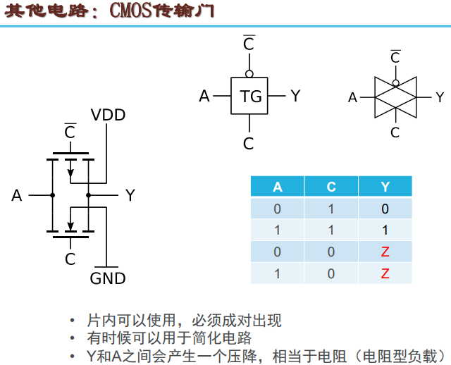

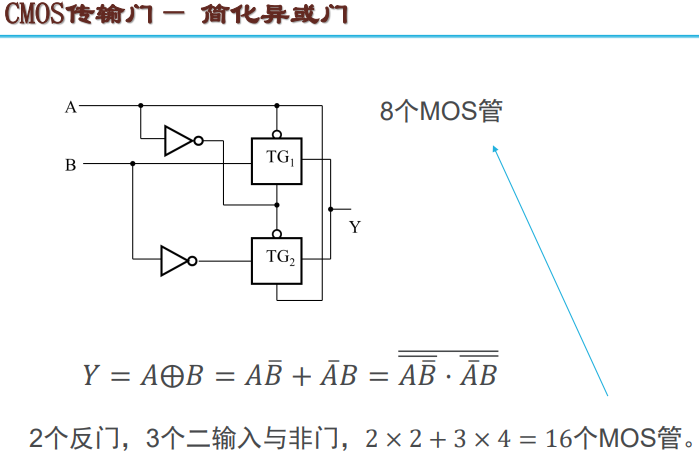

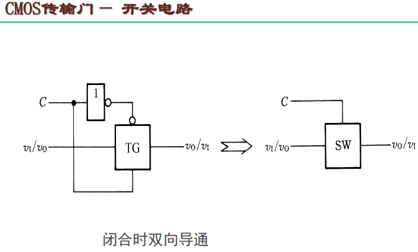

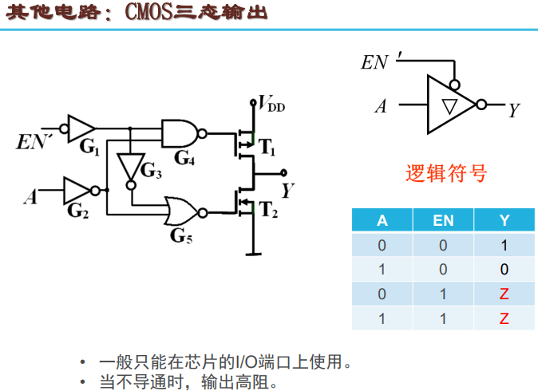

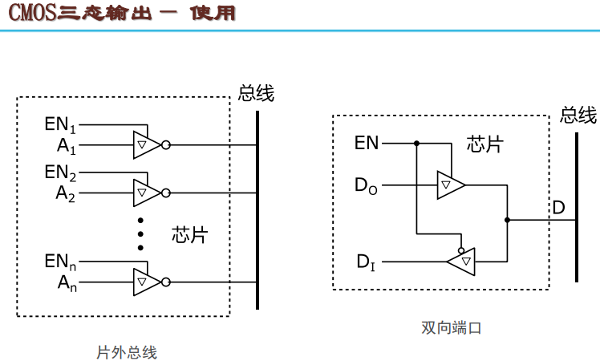

---

### CMOS集成电路模块系列

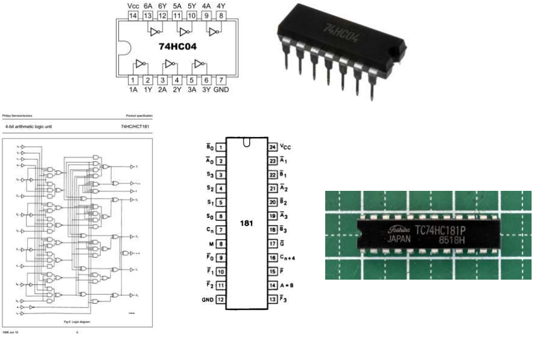

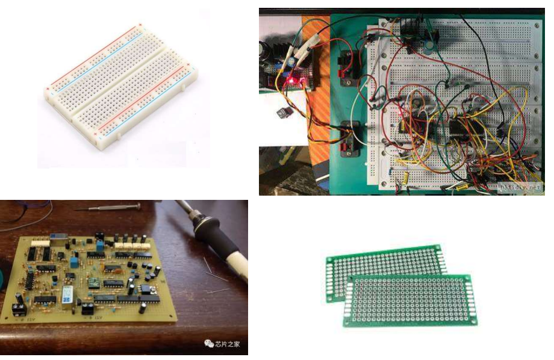

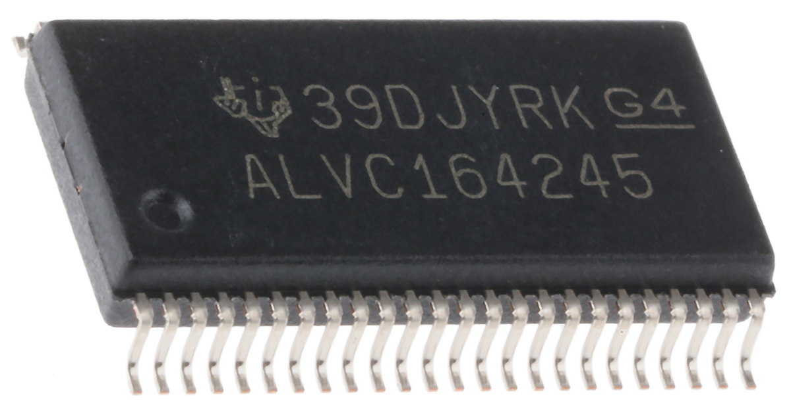

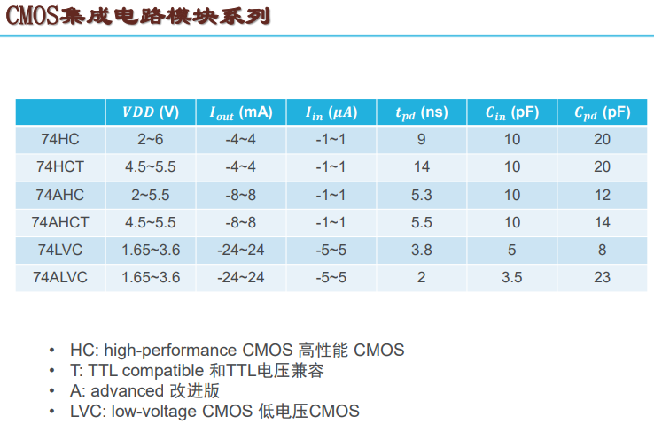​

‍

---

## 二极管

> 注意二极管不属于 CMOS
>
> 简单区分：
>
> 1. **二极管**：是**独立分立半导体器件**，基础单向导电元件，和 CMOS 是不同范畴。
> 2. **CMOS**：是**集成电路（IC）** ，由大量**MOS 场效应管**组合而成的电路工艺 / 电路类型。

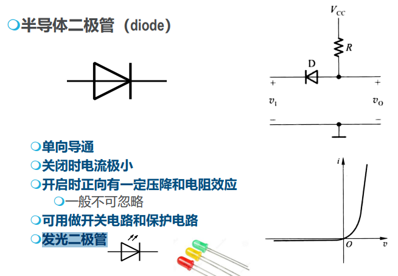

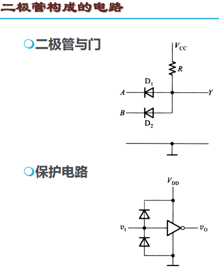

---

## 三极管

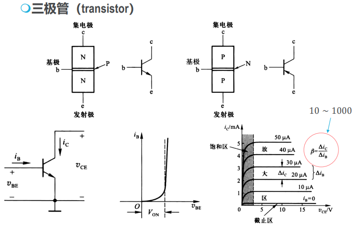

‍

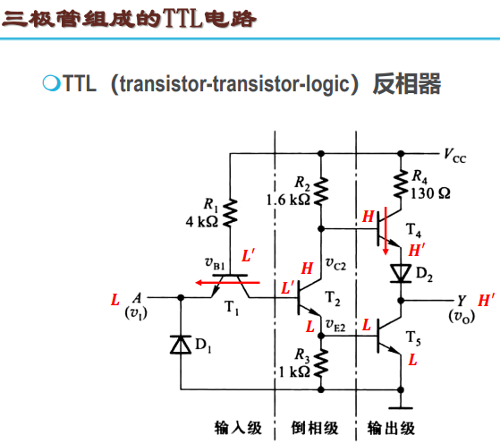

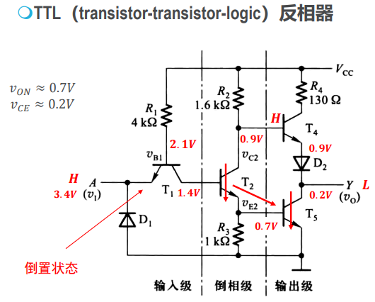

---

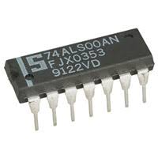

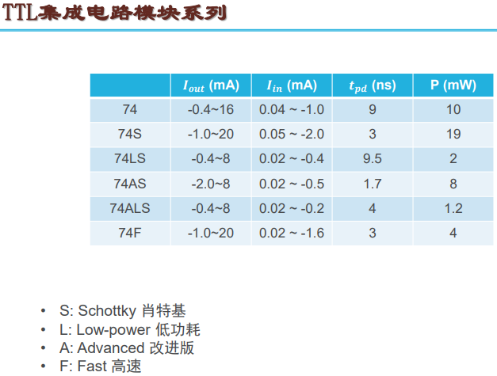

---

# 🧀 数字电路

> 参考资料：https://wsong83.github.io/supervision/digitalcircuit2022/4a.pdf

- **组合逻辑电路** Combinational Logic：在任意时刻，电路的输出**仅**<span data-type="text" style="background-color: var(--b3-font-background11);">决定于</span>**该时刻**<span data-type="text" style="background-color: var(--b3-font-background11);">的输入</span>，与电路原来的状态**无关**

  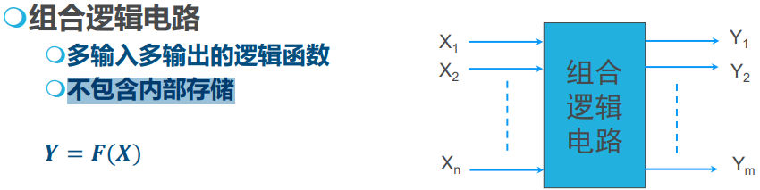

- **时序逻辑电路** Sequential Logic：电路的输出**不仅**<span data-type="text" style="background-color: var(--b3-font-background9);">受</span>**该时刻**<span data-type="text" style="background-color: var(--b3-font-background9);">输入的影响，还受电路</span>**原来状态**<span data-type="text" style="background-color: var(--b3-font-background9);">的影响（包含内部存储）</span>

‍

## 使能

**通俗讲：使能端是什么**

**使能**<span data-type="text" style="background-color: var(--b3-font-background8);"> </span> **=** <span data-type="text" style="background-color: var(--b3-font-background8);"> </span>**总开关**控制整个模块能不能干活：

- 使能**有效**：芯片**正常工作**，能根据地址选数据输出
- 使能**无效**：模块**直接关闭**，输出固定一个电平，不理输入、地址信号


后续章节里面的 74HC153 里 S\_1  S\_2 分别是**第一路、第二路 4 选 1 的独立总开关**，<span data-type="text" style="background-color: var(--b3-card-error-background); color: var(--b3-card-error-color);">标注带一撇代表</span>**低电平有效**<span data-type="text" style="background-color: var(--b3-card-error-background); color: var(--b3-card-error-color);">。</span>

‍

**使能端的通用作用:**

1. **分时工作**：多个芯片共用总线，同一时间只打开一片，避免信号打架；
2. **开关控制**：想用哪一路就打开哪一路，不用的屏蔽输出；
3. **级联扩展**：多片 153 拼 8 选 1、16 选 1 时，靠使能分片选中；
4. **断电屏蔽**：系统复位时拉高使能，让输出稳定不乱跳。

---

## 低有效含义

比如对于 74HC153 

- S=0（低电平）→ 打开，通道正常运行
- S=1（高电平）→ 关闭，通道停止工作

---

## 组合逻辑电路

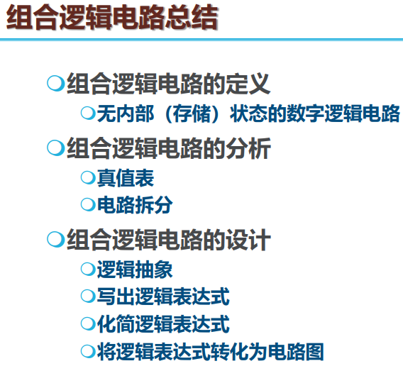

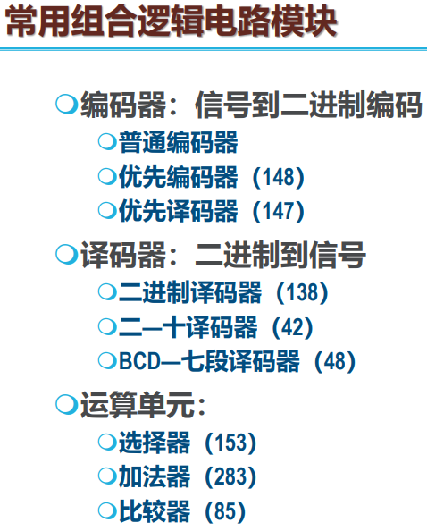

---

### 编码器

> 资料来源：
>
> https://wsong83.github.io/supervision/digitalcircuit2022/4a.pdf

---

#### 普通编码器

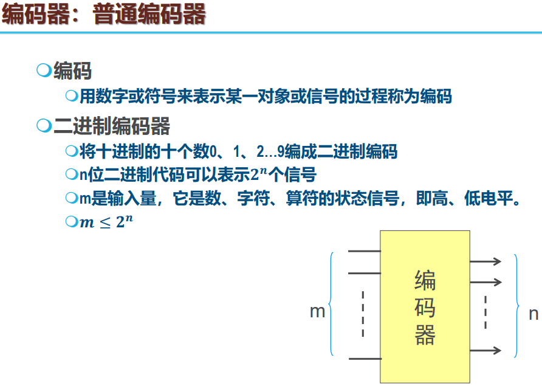

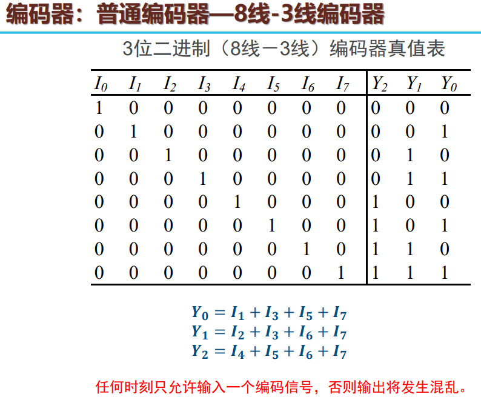

---

#### 优先编码器（148）

> **优先编码器**<span data-type="text" style="background-color: var(--b3-font-background11);"> </span> **=** <span data-type="text" style="background-color: var(--b3-font-background11);"> </span>**多按钮智能判断器**
>
> - <span data-type="text" style="background-color: var(--b3-font-background11);">输入端：接 </span>**N 个按键**<span data-type="text" style="background-color: var(--b3-font-background11);">（比如 8 个按键）</span>
> - 每个按键：**按下**  **=**  **1，松开**  **=**  **0**
> - 功能：
>
>   - **只认****优先级最高的那个按下的键**
>   - 不管同时按多少个
>   - <span data-type="text" style="background-color: var(--b3-font-background11);">输出</span>永远是 **优先级**​**最高****那**​**一个****的编号**
>
>      **（比如输出为所按下的，优先级最高的那个按钮，比如 7、6、1号按钮同时按下，输出为 “7号按钮按下了，屏蔽其他低优先级按钮按下的信息”）**

【注意】优先编码器里是<span data-type="text" style="background-color: var(--b3-font-background8);">低电平有效</span>，这是因为芯片工业设计历史原因（74 系列 TTL 老芯片）：

- 老 TTL 芯片低电平带载能力更强；
- 按键直连 GND，外围电路极简；
- 高电平噪声不易误触发，抗干扰好；
- 适配与非门为主的内部逻辑，节省门电路。

‍

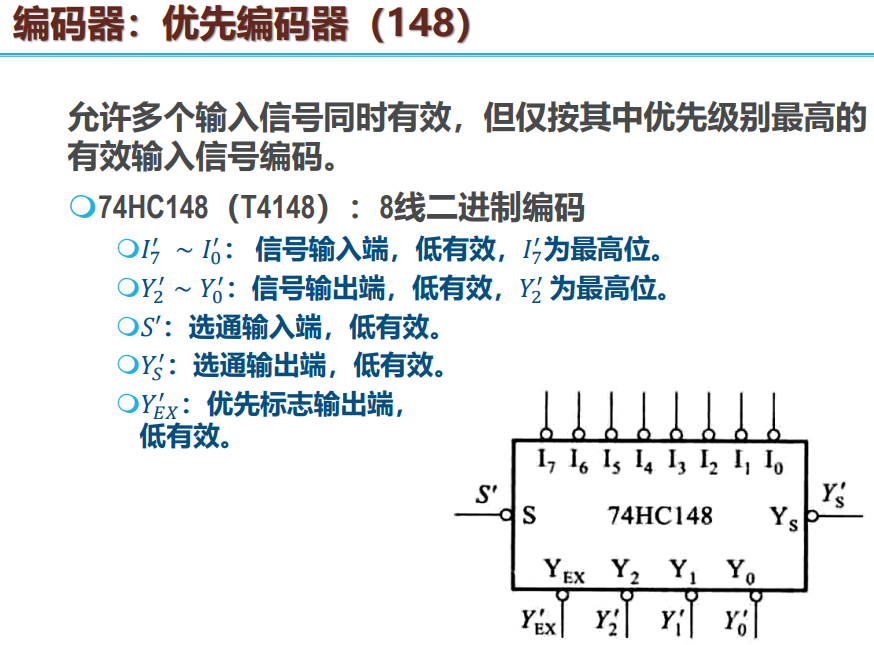

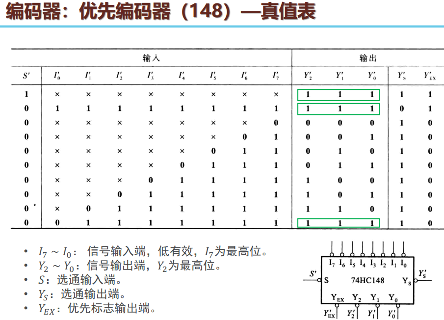

---

**一、基础概念**

优先编码器属于**组合逻辑**（<span data-type="text" style="background-color: var(--b3-font-background11);">无时钟、无寄存器，输入一变输出立刻变</span>）  
普通编码器：同一时间**只允许1路输入有效**，多信号同时输入会出错；  
优先编码器：给每一路输入设定**优先级**，多路同时有效时，只响应**优先级最高**的那一路，屏蔽低位信号。

‍

**引脚通用定义（以8输入3输出 8-3优先编码器为例）**

1. **输入**：`I7~I0`，**高电平代表信号有效**；优先级：**I7 &gt; I6 &gt; … &gt; I0**
2. **输出**：3 位二进制编码 `Y2 Y1 Y0`，输出有效输入对应的二进制编号（**I7  或者 I6 或者 I5 ...或者... I0**）
3. 扩展引脚（可选）

    - EI：使能输入；EO：使能输出（级联多片）
    - GS：群有效标志，只要有输入有效就置1

---

**二、举最简例子：8输入优先编码器真值表**

|有效输入|Y2 Y1 Y0|含义|
| ---------------------------------------------------------------------| -----------------------------------------------------------------| ------------|
|I7=1（不管其他I6~I0）|111|最高优先级|
|I7=0，I6=1|110|次一级|
|I7=0,I6=0,I5=1|101|…|
|……|……|……|
|I7~I1全0，<span data-type="text" style="background-color: var(--b3-font-background8);">仅I0=1</span>|<span data-type="text" style="background-color: var(--b3-font-background8);">000</span>|最低优先级|
|<span data-type="text" style="background-color: var(--b3-font-background8);">全部I=0</span>|<span data-type="text" style="background-color: var(--b3-font-background8);">000</span>，GS=0|无输入|

**这里有一个歧义问题：**

- **输入 I0 有效时，编码输出** **​`000`​**​ **；**
- **所有输入全部无效（I7~I0 全 1）** ，编码输出也是 `000`。  
  只看 3 位输出，分不清：到底是**I0 按下**，还是**一个按键都没按**，这就是**0 编码歧义**

**解决：？**

‍

哪怕 `I7、I3、I0` 同时为1，电路只识别I7，输出111

---

**三、和普通编码器核心区别**

1. 普通编码器：多输入同时有效（比如8个按钮同时按下） → 输出编码混乱、错误；
2. **优先编码器：内置优先级规则，多信号共存自动选最高级，工业、按键场景必备。**

---

**四、典型实际用途**

1. <span data-type="text" style="background-color: var(--b3-font-background7);">键盘按键识别：多个按键一起按下，只识别优先级最高键；</span>
2. 中断请求调度：多路中断信号同时触发，CPU先处理高优先级中断；
3. 总线请求仲裁：多个设备抢总线，高优先级设备优先占用。

---

**五、Verilog极简模型（组合逻辑写法）**

```verilog
module priority_encoder8(
    input [7:0] I,
    output reg [2:0] Y
);

// 意思：只要任意一个输入信号(input)发生变化，就立刻执行一遍大括号里的代码。
// @ = 当…… 变化时
// * = 所有输入信号
// 它是组合逻辑专用（没有时钟，没有寄存器）
always @(*) begin // 组合逻辑，星号敏感列表
    if(I[7]) Y = 3'b111;
    else if(I[6]) Y = 3'b110;
    else if(I[5]) Y = 3'b101;
    else if(I[4]) Y = 3'b100;
    else if(I[3]) Y = 3'b011;
    else if(I[2]) Y = 3'b010;
    else if(I[1]) Y = 3'b001;
    else Y = 3'b000;
end
endmodule
```

**这里****​`if-else`​**​**嵌套本身就自带优先级，完美对应优先编码器逻辑**<span data-type="text" style="background-color: var(--b3-font-background11);">，全程</span>**没有时钟**<span data-type="text" style="background-color: var(--b3-font-background11);">、</span>**没有reg时序赋值**<span data-type="text" style="background-color: var(--b3-font-background11);">，</span>**纯组合逻辑**

‍

> 关于这段代码的 QA
>
> Q：Verilog中的代码块（if-else）是**硬件级并行运行**的，如果同时输入多路信号不是会造成**同时**多个 else if 语句被执行吗
>
> ‍
>
> A：
>
> **硬件门电路层面工作原理**
>
> 内部靠**逐级屏蔽逻辑**实现优先级：

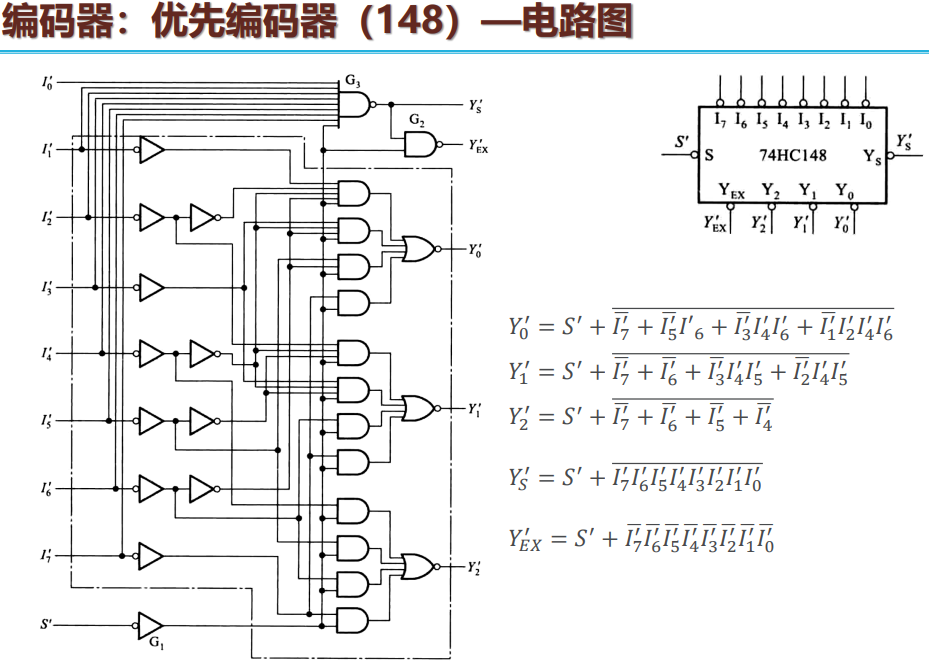

1. 最高位 I7 通路**不**被任何信号屏蔽  
    只要 I7=1，直接输出 111，同时封锁下方所有 I6~I0 的传输通路；
2. 只有  I7=0 时，I6 的信号才允许进入判断电路；

    若此时 I6=1，输出 110，并屏蔽更低的 I5~I0；

    *以此层层向下递推；*
3. 只有高位全部为 0，低位的请求才会被响应。  
    简单理解：高位有请求就直接 “盖住” 所有低位，低位永远抢不过高位。

---

#### 优先编码器（147）

- 10线到4位二进制编码
- 没有编码歧义问题（$𝟐^𝟒$ \> 𝟏𝟎）

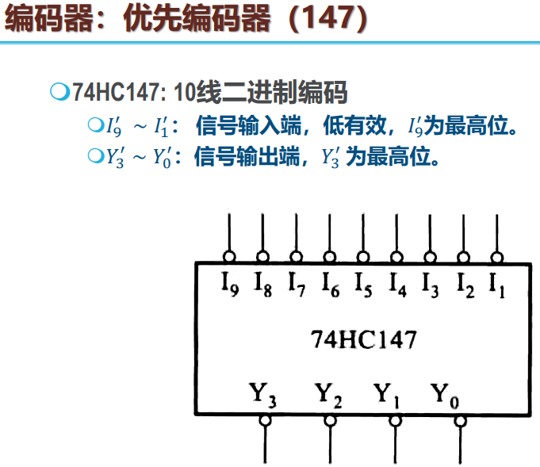

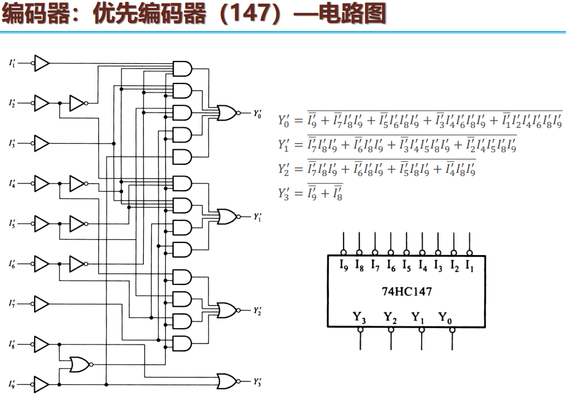

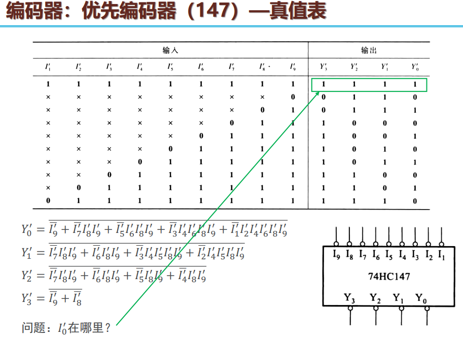​

**一、先说 74147 是什么**

它是**10 转 BCD 优先编码器**，对应数字 0\~9 十个数字，用来识别按键 0、1、2……9。但是芯片物理引脚只引出了 I1~I9 个输入脚，**压根没有单独的 I0 引脚**<span data-type="text" style="background-color: var(--b3-font-background7);">。</span>

**二、数字 0 怎么表示？**

1. 按下按键 1\~9 任意一个：对应输入脚<span data-type="text" style="background-color: var(--b3-font-background11);">变低</span>，芯片输出对应数字的 BCD 反码；
2.  I1~I9 全部都是高电平（1 到 9 一个键都没按），此时芯片自动判定当前数值是**0**。  
    简单记：**没按任何键**  **=**  **代表数字 0**，所以不需要单独拉一根 I0 引脚。

‍

#### 拓展编码器

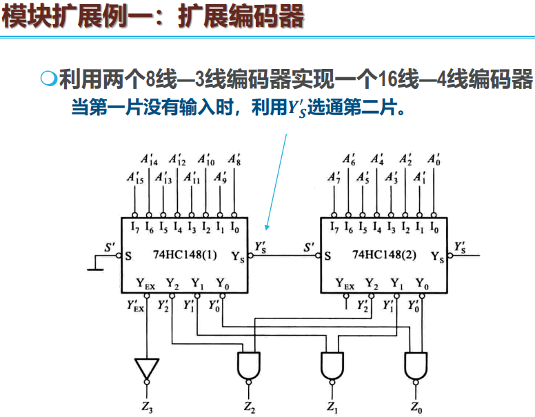

‍

---

### 译码器

#### 二进制译码器（138）

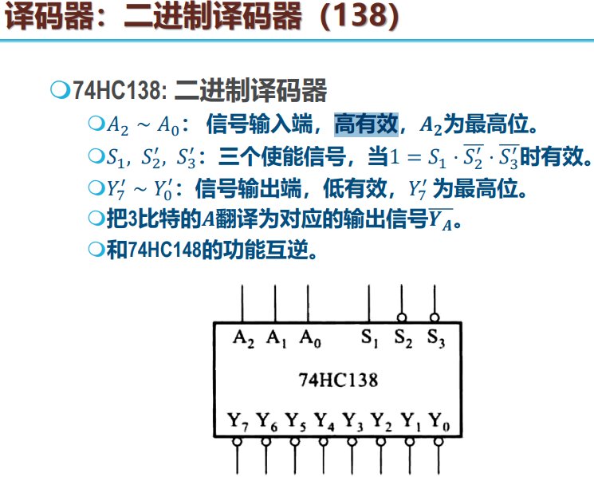

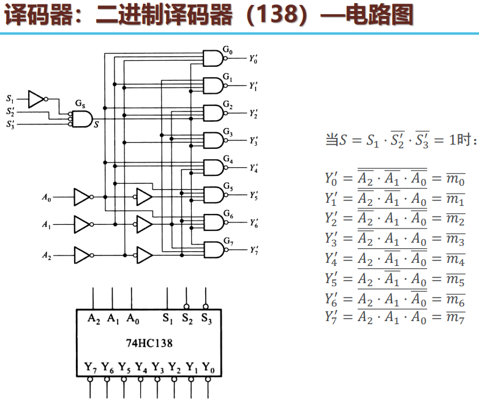

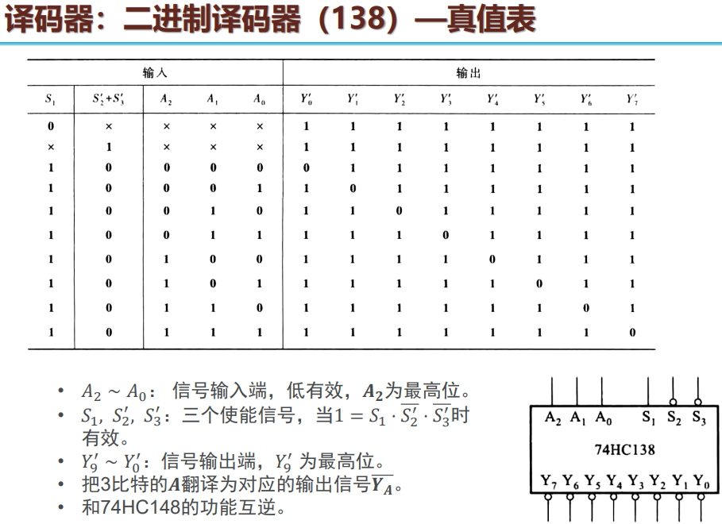

---

#### 二—十译码器（42）

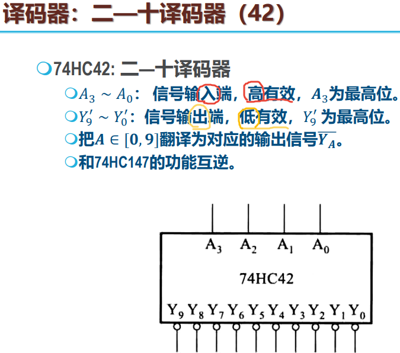

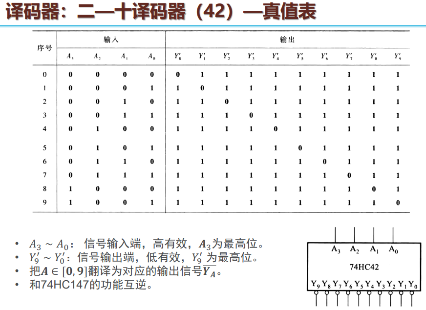


---

#### 7段LED译码器（48）


---

#### 拓展译码器

​

---

#### 译码器总结

**二进制译码器**

- 138：将3比特二进制信号变成8路信号

- 42：将4比特二进制BCD信号变成10路信号

‍

**7段LED译码器（48）**  将二进制BCD信号翻译为对应LED控制信号

**译码器：**  将<span data-type="text" style="background-color: var(--b3-font-background11);">二进制信号</span>翻译为<span data-type="text" style="background-color: var(--b3-font-background11);">其他信号</span>的模块<span data-type="text" style="background-color: var(--b3-font-background11);">都</span>可称为<span data-type="text" style="background-color: var(--b3-font-background11);">译码器</span>

---

## 选择器 双4选1数据（153）


---

​

​

---

## 加法器

### 1位<span data-type="text" style="background-color: var(--b3-card-error-background); color: var(--b3-card-error-color);">半</span>加器

​

---

### 1位<span data-type="text" style="background-color: var(--b3-card-error-background); color: var(--b3-card-error-color);">全</span>加器

​

### 超前进位（并行）多位加法器

​


---

## 比较器


---

# 🧀 寄存器

> 参考资料：https://wsong83.github.io/supervision/digitalcircuit2019/5.pdf

回顾一下之前的知识：

数字电路分为：

- **组合逻辑电路 Combinational Logic：** 在任意时刻，电路的输出**仅**决定于该时刻的输入，与电路**原来**的状态**无关**
- **时序逻辑电路 Sequential Logic：** 电路的输出**不仅**受该时刻输入的影响，**还受**电路原来状态的影响（包含内部存储）。  ****  **寄存器是数字电路使用的最多的存储电路**

‍

## 半导体存储电路

**寄存器（register）**

- 锁存器（latch），寄存器（register）
- 高速电路，**无**读写限制，用于时序逻辑电路的设计
- 门电路的**基本单元**

‍

**静态随机存储器（SRAM：Static Random Access Memory）**

- 缓存，片上内存
- 高速电路，**面积小**，单一时刻只能读写一个数据，用于在片上存储**大量**数据

‍

**动态随机存储器（DRAM：dynamic random access memory）**

- 片内内存，片外内存
- 速度较低，面积很小，读写带宽大，地址受限

‍

**非易失存储器（non-volatile memory）**

- 掉电不丢失内容的存储器
- 片上只读内存（ROM）
- 片外可编程ROM（Flash）

---

## 存储单元

以下是逻辑电路里三类存储单元详细对比讲解

<span data-type="text" style="background-color: var(--b3-card-success-background); color: var(--b3-card-success-color);">三者核心作用都是</span>**保存 0/1 二进制状态**<span data-type="text" style="background-color: var(--b3-card-success-background); color: var(--b3-card-success-color);">，区别在于</span>**什么时候锁存、靠什么信号控制、触发方式**<span data-type="text" style="background-color: var(--b3-card-success-background); color: var(--b3-card-success-color);">，同步时序电路以寄存器为主。</span>

---

### 锁存器（Latch，电平型存储）

**1. 定义**

电平控制型状态保持电路，依靠**控制端电平高低**<span data-type="text" style="background-color: var(--b3-card-success-background); color: var(--b3-card-success-color);">决定</span>**透明 / 锁存**<span data-type="text" style="background-color: var(--b3-card-success-background); color: var(--b3-card-success-color);">两种模式。</span>

- 控制端**高**电平（高有效锁存器）：电路**透明直通**，输入是什么，输出立刻跟着变；
- 控制端变**低**电平：立刻**锁住此刻的值**，**之后输入怎么变，输出都不再改动。**

  低有效锁存器逻辑相反：低电平直通，高电平锁存。

‍

**2. 工作阶段**

1. 透明期：控制电平有效 → 输入直通输出，**无存储效果**
2. 锁存期：控制电平无效 → 冻结输出，保存之前的数值

‍

**3. 特点**

1. 属于**异步器件**，没有时钟沿概念，只认持续电平；
2. 电平有效期间输入变化会直接渗透到输出，容易产生毛刺、竞争冒险；
3. 不能直接大规模搭同步时序电路，多用在接口、电平缓冲、CPU 内部流水线暂存；
4. 结构简单，门电路数量少，延迟小。

‍

举例：SR 锁存器、D 锁存器

D 锁存器：G\=1 直通，G\=0 锁存 D 的值。

‍

---

### 触发器（Flip-flop，边沿触发基础存储）

**1. 定义**

在锁存器基础上改良，**只识别信号跳变沿**，仅在一瞬间更新状态，其余全程保持数值。触发沿分两种：

- 上升沿（0→1 瞬间）
- 下降沿（1→0 瞬间）

**2. 底层结构**

一个触发器内部是**两级 D 锁存器**​**级联**：第一级主锁存器在时钟低电平接收数据，第二级从锁存器在时钟上升沿瞬间传递数值，平时全部锁死隔绝输入干扰。

**3. 关键特性**

1. 只在跳变极短一瞬间采样输入，其余时间完全隔离输入变化，不会出现透明穿透；
2. 自带抗毛刺能力，时序稳定性远强于单纯锁存器；
3. 属于时序核心基础单元，是**构成寄存器的最小单元**；
4. 可搭配异步置位（Set）、异步复位（Reset）引脚，随时强制输出 1 或 0，不受时钟约束。

---

### 寄存器（Register，标准同步时序存储）

**1. 定义**

**带时钟沿触发的触发器**​**封装单元**，工业、FPGA、数字芯片标准叫法：单个边沿 D 触发器就是 1bit 寄存器；多个触发器并排组成多位寄存器（如 8 位、32 位寄存器）。*课本原话：寄存器 = 沿触发触发器*

**2. 同步时序里的定位**

同步电路所有模块共用同一个系统时钟，所有寄存器统一在时钟上升 / 下降沿同时更新数值：

1. 时钟没到沿：所有寄存器保持旧状态，电路稳定；
2. 时钟跳变沿瞬间：统一采样输入，同步更新输出；
3. 全程不会出现锁存器那种 “透明直通” 的风险。

**3. 实际使用场景**

1. FPGA、CPU、MCU 内部全部大量使用寄存器；
2. 计数器、状态机、移位寄存器、缓存、流水运算单元全部依靠寄存器搭建；
3. 复位信号多设计为同步复位 / 异步复位，适配系统上电初始化。

---

**三者分层从属关系（必记）**

1. 最基础：锁存器（电平控制）
2. 锁存器叠加构成：触发器（边沿触发）
3. 触发器标准化封装：寄存器（同步电路主力）

> 寄存器本质就是标准化、用于时钟同步场景的边沿触发器。

‍

**横向对比表**

|器件|控制方式|透明穿透|同步 / 异步|主流用途|
| --------------| -------------------| ----------------------| --------------| ----------------------------------|
|锁存器 Latch|电平高低|有效电平期间完全直通|异步|高速缓存、模拟接口、底层单元搭建|
|触发器 FF|上升 / 下降跳变沿|仅瞬间采样，其余隔离|可同步可异步|存储最小单元，搭建寄存器|
|寄存器 Reg|统一时钟沿|全程无透明期|标准同步|FPGA、CPU、时序状态机、计数器|

## 六、易错区分点

1. 很多人混淆：锁存器≠触发器  
    锁存看**一段电平**，触发器只看**一瞬间跳变**；

    1. Verilog 里如果组合逻辑漏写 else、没给 reg 赋初值，会被 Vivado 综合成锁存器（bug 源头）；工程同步时序全部要用寄存器（边沿触发器）；
    2. 74 系列芯片：74LS373 是 D 锁存器，74LS374 是 8 位寄存器（8 个上升沿 D 触发器），直观对比两者硬件差异。

## 一句话总结背诵

锁存器电平控、触发器沿触发、寄存器就是时钟同步专用的边沿触发器，同步时序电路全都靠寄存器保存状态。

‍

---

# 🧀 数理逻辑

## 偶校验使用多于奇校验的核心原因

**1. 全 0 数据时偶校验天然合法（最关键）**

一串数据全是**0**：

- **偶校验**：数据位 1 的个数 \= 0（偶数）→ 校验位填 0，整体合法；
- **奇校验**：数据位 1 的个数 \= 0（偶数），需要校验位填 1 凑奇数；  
  **总线、空闲线路常态就是全 0 电平**，偶校验空闲时校验位为 0，和线路静默电平一致，硬件更省事、无额外电平开销。

**2. 硬件电路实现更简单**

- 偶校验：所有数据位**异或**就是校验位（\\(P\=D\_1\\oplus D\_2\\oplus\\dots\\oplus D\_n\\)）；  
  全部输入 0，异或结果 \= 0，适配空闲状态；

- 奇校验：在偶校验结果基础上还要**再取反一次**，多一级非门，芯片成本、延时更大。

**3. 区分「无数据」和「有效全 0 数据」**

通信链路空闲没有数据传输时，线上持续全 0：

- 偶校验：空闲帧校验位 \= 0，和合法全 0 数据编码一致，不用额外特殊标记空闲；
- 奇校验空闲全 0 时校验位强制为 1，空闲电平与有效全 0 数据编码不一样，需要额外逻辑区分空帧 / 有效帧。

**4. 故障容错小优势：全线路卡死恒 1 故障**

若线路故障所有位永久变成**1**：设n位数据：

- n为偶数：全 1 个数 \= 偶数，偶校验误判正确；
- n为奇数：全 1 个数 \= 奇数，奇校验误判正确；  
  但**工程上全 0 故障远多于全 1 故障**，偶校验受益场景更多。

‍

补充：奇校验什么时候用？

少数场景（早期串口、部分工控）用奇校验，目的是**强制一帧至少出现一个 1 电平**，避免长时间全 0 造成接收端时钟失锁；但现在时钟同步技术成熟，该优势消失，偶校验成为主流。

一句话总结

**常态线路全 0 是工程常态，偶校验全 0 不用改校验位、硬件少一级反相器，成本更低，所以使用更广。**

‍

# 🧀 数电模电

## 与或非门


**缓冲器**


|**輸入**<br />A|**輸出**<br />BUF(A)|
| -----| ----------|
|0|0|
|1|1|

三角符号表示为缓冲器电路，缓冲器电路产生传输函数，但**不产生逻辑运算**，其输出二进制值等于输入二进制值，带电路用于**功率放大**，并等同于两个非门的级联

‍

**非门（反相器：输出加小圆圈○）** 

符号：三角形 + 输出端小圆圈

- 三角：代表**信号放大、缓冲、通路**（早年电子管放大器就是三角示意）；
- **小圆圈○是全世界统一标记：取反 / 低有效 / 非**。

> 只要引脚画圈 \= 电平翻转（0 变 1、1 变 0），所有芯片引脚通用这个规则。

输入→三角→○→输出 \= 输入取反。

‍

**与门：输入端平直、输出圆弧**

符号：左侧几根直线输入，右侧半圆凸起历史来源：**早期继电器串联**  **=**  **与逻辑**

- 串联开关：所有开关闭合（全 1）才导通；  
  画图时把串联汇聚处画成**圆弧**，表示 “全部输入凑在一起才能导通”。逻辑：全 1 出 1，有 0 出 0。

‍

**或门：输入端凹进去、输出尖三角**

符号：输入是弧形凹口、输出尖角来源：**早期继电器并联**  **=**  **或逻辑**

- 并联开关：任意一个闭合就导通；  
  输入端做成分叉凹形，代表多路信号**并联汇合**，任意一路通就有输出。逻辑：有 1 出 1，全 0 出 0。

---

## 激励波形

<span data-type="text" style="background-color: var(--b3-card-success-background); color: var(--b3-card-success-color);">用来驱动或测试系统的输入信号（用来“输入到系统中，让系统产生响应”的信号）</span>

> **激励波形**  **=**  **用来“喂给系统看反应”的输入信号**

也可以理解为：

- 你主动生成或提供的信号
- 用来“激活/驱动/测试”电路或系统行为

**激励波形的常见来源**在工程里一般有三类：

① 外部真实信号（最常见）

② FPGA或系统内部生成的测试信号

③ 仿真里的信号（testbench）

比如 Verilog 里：

```v
initial begin
    a = 0;
    #10 a = 1;
    #10 a = 0;
end
```

这里 a 的变化就是激励波形

---

## 发射极耦合逻辑（ECL）

> ECL 常常用于实现 wor

发射极耦合逻辑（Emitter-Coupled Logic，简称 ​**ECL**）是一种：

> **以双极型晶体管（BJT）差分对为核心、通过“电流切换”而不是“饱和导通”来实现逻辑运算的**​**高速****数字电路逻辑体系**

它的核心特点一句话概括：

> **不让晶体管进入饱和区，用“电流在两条支路之间切换”来表示 0 和 1**

‍

**二、为什么叫“发射极耦合”**

ECL 的基本结构是一个差分对：

- 两个晶体管的<span data-type="text" style="background-color: var(--b3-card-success-background); color: var(--b3-card-success-color);"> </span>**发射极****连在一起（耦合）**
- 通过恒流源提供电流
- **电流**在两个晶体管之间“分流”

```v
        Vcc (0V左右，甚至负电源)
           |
          Rc
        |     |
       Q1     Q2
        |     |
         \   /
          \_/
           |
         恒流源
           |
          Vee (-5.2V)
```

👉 两个输入控制 Q1/Q2 谁导通  
👉 电流“流向哪边”就是逻辑状态

‍

**三、ECL如何表示0和1（关键思想）**

ECL不是像CMOS那样“高电平\=1，低电平\=0”，而是：

> **用电压差 +**  **电流****方向表示逻辑**

典型情况：

|状态|Q1|Q2|输出|
| -----------| --------| --------| -------|
|A \> B|Q1导通|Q2关闭|输出1|
|A \< B|Q1关闭|Q2导通|输出0|

‍

**四、ECL的核心特点（非常重要）**

**① 超高速**

> 晶体管不进入饱和区 → 没有“存储电荷延迟”

CMOS / TTL：有电荷存储 → 翻转慢

**ECL：纯**​**电流****切换 → 极快  👉 早期可做到 GHz 级别**

---

**② 电压摆幅很小**

典型逻辑摆幅：约 **0.8V 或更小**

对比：

- CMOS：0 → 1（1V\~3.3V）
- ECL：电压变化很小

👉 所以速度快，但<span data-type="text" style="background-color: var(--b3-card-error-background); color: var(--b3-card-error-color);">抗噪声</span>**弱**

---

**③ 永远不饱和，** 这是ECL最关键的设计思想：

> 晶体管始终工作在放大区，而不是开关饱和区

---

**④ 功耗**​**恒定****且较**​**高**

- 恒流源一直在工作
- **电流不会“关闭”(因为是通过电流判断的，而不是电压)**

👉 即使不切换也在耗电

---

**五、ECL为什么在历史上很重要**

ECL曾经在这些领域非常关键：

- 超高速计算机
- 军事雷达
- 高速ADC前端
- 示波器前端放大器
- 核物理测量系统

👉 在 CMOS 未成熟前，ECL是“最快逻辑”

‍

**六、为什么 ECL 能实现“线或(WOR)结构”**

**① wor（wired-OR，线或）是什么**

“线或”是一种**不用额外门电路，而是直接把**​**多个****输出“** **硬连在一起** **”** **实现** **OR**  **逻辑的方式**。

典型特征：

- **多个输出端直接连接到同一条线上**
- 只要有一个为“有效状态”，总线就被拉到该状态
- 常见于开集电极 / 开漏结构

```v
输出A ─┐
        ├── 总线（wired line OR）
输出B ─┤
        ├── 输出结果
输出C ─┘
```

在 ECL / 开射极结构中：

- 有效输出 \= 拉低或改变电流路径
- 无效输出 \= 高阻或不影响总线

👉 结果就是：

> **多个输出可以“共享一条线”，形成 OR 逻辑**

---

‍

## 反馈路径

反馈路径（Feedback Path）指的是：

> **系统输出的一部分被“**​**回送****到输入端”，参与下一步或当前的控制/计算过程的信号通路**
>
> *反馈的思想也就是现代控制论的基础思想*

简单一句话：

> **输出 → 回到输入 → 影响下一步行为的那条路径，就是反馈路径**

在没有反馈的系统中，信号是单向流动的：输入经过组合逻辑或处理后得到输出，输出就结束了，不再影响后面的行为。但一旦**引入反馈，系统就变成“有记忆”的结构，因为当前输出会在下一时刻重新参与输入计算。**

没有反馈：

```v
输入 → 系统 → 输出
```

**有反馈：**

```v
      ┌────────────┐
      ↓            │
输入 → 系统 → 输出 │
      ↑            │
      └────反馈────┘
```

👉 输出不再“结束”，而是参与下一轮决策

‍

在电路中，最典型的反馈例子是**寄存器**或**状态机**。比如 FPGA 里的 `a <= a + 1;`，这里的 a（当前输出状态）会在下一拍作为输入参与计算，本质上就是一个反馈路径。**再比如**​**触发器** **，它把当前状态 Q** **回送****到逻辑输入，使系统能“保持状态”。**

反馈路径的意义在于它让系统从“静态计算”变成“动态系统”。没有反馈时，系统只是函数映射；**有反馈后，系统开始具备时间维度上的行为，比如计数、滤波、锁相、控制等。** 

‍

利用**负反馈（Negative Feedback）** 输出抑制输入误差：

例子：

- 运放
- PLL
- 电源控制

‍

在示波器系统里，反馈路径也很常见。比如触发系统会根据采样结果决定是否开始采集，这个“触发状态”会反过来控制采样流程；FIFO缓存也依赖“满/空状态”反馈来控制写入和读取；PLL则通过输出时钟反馈调整自身相位和频率。

一句话总结就是：反馈路径就是“输出参与未来输入计算”的通路，它让系统具备状态和自适应能力，而不是一次性计算结构。

---

‍

# 编码

## 雷格码

>  https://zh.wikipedia.org/zh-tw/%E6%A0%BC%E9%9B%B7%E7%A0%81
>
> https://wsong83.github.io/supervision/digitalcircuit2022/1.pdf

## 格雷碼能避免訊號傳送錯誤的原理

傳統的二進位系統例如數字3的表示法為011，要切換為鄰近的數字4，也就是100時，裝置中的三個位元都得要轉換，因此於未完全轉換的過程時裝置會經歷短暫的，010,001,101,110,111等其中數種狀態，也就是代表著2、1、5、6、7，因此此種數字編碼方法於鄰近數字轉換時有比較大的誤差可能範圍。格雷碼的發明即是用來將誤差之可能性縮減至最小，編碼的方式定義為每個鄰近數字都只相差一個位元，因此也稱為最小差異碼，可以使裝置做數字步進時只更動最少的位元數以提高穩定性。 數字0～7的編碼比較如下：

十進位 　 格雷碼　二進位

```
0  　　 000    000
1  　　 001    001
2   　　011    010
3   　　010    011
4   　　110    100
5   　　111    101
6   　　101    110
7   　　100    111
```


用於偵測旋轉角度的絕對型[旋轉編碼器](https://zh.wikipedia.org/wiki/%E6%97%8B%E8%BD%89%E7%B7%A8%E7%A2%BC%E5%99%A8 "旋轉編碼器")，使用3位元的鏡射式格雷碼


單軌格雷碼編碼器

---

## PAM-N 编码

**把PAMN最本质压缩成一句话**

> **PAMN**  **=**  **用** **N 个电压电平****表示**  **log₂(N) bit**  **信息的映射方式**

- PAM4 \= 4个电平 → 2bit
- PAM8 \= 8个电平 → 3bit

‍

👉 比如 PAM4，用 **4 种**电压表示 **4 种值**， **“电压值 ↔ 2bit信息”的一一**​**映射关系**

‍

例如使用 **4 种不同的电压**分别表示 **4 种不同的 2bit** ：

- -3V → 00
- -1V → 01
- +1V → 10
- +3V → 11

**关键工程细节（非常重要）**

真实系统里不会“刚好等于 -1V / +1V”，而是<span data-type="text" style="background-color: var(--b3-card-success-background); color: var(--b3-card-success-color);">电压是连续的 + 带噪声的</span>

比如本来应该是 +1V：*0.92V    1.05V    1.18V*

所以 FPGA/接收端做的事情不是“等于判断”，而是**落在哪个区间（threshold slicing）：** 

例如：

- \< -2V → 00
- -2V \~ 0V → 01
- 0V \~ 2V → 10
- 2V → 11

‍

**举个真实例子**

假设数据是：

```v
1 byte = 11 01 00 11
```

进入PAM4后：

```v
11 | 01 | 00 | 11
```

映射成电平：

```v
+3V | -1V | -3V | +3V
```

<span data-type="text" style="background-color: var(--b3-card-success-background); color: var(--b3-card-success-color);">👉 </span>**发送的是“** **连续电压波形** **”，不是“4次传输包”。** 

**注意**<span data-type="text" style="background-color: var(--b3-card-success-background); color: var(--b3-card-success-color);">PAMN</span>**不是**<span data-type="text" style="background-color: var(--b3-card-success-background); color: var(--b3-card-success-color);">协议，不是ADC芯片的功能，而是一种“</span>**电压分级表达信息的方法**<span data-type="text" style="background-color: var(--b3-card-success-background); color: var(--b3-card-success-color);">”。</span>


---

‍

**QA：为什么工程上宁愿用PAM4，也不继续用更稳定的NRZ？** 

**一、核心结论:** 工程上用 PAM4，不是因为它更“稳定”，而是因为在“**带宽受限的物理通道里，它比 NRZ**  **更省频率****资源**

一句话：**NRZ是在“拼速度极限”，PAM4是在“用电平换带宽”**

---

**二、先看NRZ的问题：为什么不够用了**

NRZ（0/1）本质是：

> 1个符号 \= 1 bit

所以要提高速率**只能**：

> 提高符号率（频率）

但问题来了：

当你想从 25Gbps → 100Gbps：

NRZ必须把时钟提高4倍

但物理链路**不**允许：

- PCB走线损耗严重
- 高频衰减严重
- 串扰增加
- 眼图变窄
- 时钟抖动放大

👉 结果：**NRZ在高速下“越跑越难看清”**

---

**三、PAM4的核心思路：不加频率，加信息密度**

PAM4做了一件很关键的事：**不****提高时钟频率，而是**​**提高** **“每个符号携带的**​**信息量** **”**


从：

- NRZ：1 bit / symbol

  变成
- PAM4：2 bit / symbol

```v
同样 50 Gbaud：
NRZ  = 50 Gbps
PAM4 = 100 Gbps
```

👉 直接翻倍吞吐

---

**四、关键交换逻辑（工程本质）**

你可以把它理解成一个“交换问题”：

|项目|NRZ策略|PAM4策略|
| --------------| ----------------------------------------------------------------------------------------------------------------------------------------------------------------------------------------------------------------------| ---------------------------------------------------------------------------------------------------------------------------------------------------------------------------------------------------------------------------------------------------------------------------------------------------------------------------------|
|核心思路|用<span data-type="text" style="background-color: var(--b3-card-success-background); color: var(--b3-card-success-color);">更高</span>**时钟频率**提升带宽|用<span data-type="text" style="background-color: var(--b3-card-success-background); color: var(--b3-card-success-color);">更多</span>**电平**提高**单**符号信息量|
|本质交换|速度（频率）换带宽|信息密度（电平数）换带宽|
|带宽提升方式|提高符号速率（baud rate）|提高每符号bit数（2bit/符号）|
|对信道要求|需要更高频带宽|频率压力较小，但要求线性更好|
|信号质量影响|**高频损耗严重，眼图变窄**|**电平间距变小，抗噪声变差**|
|主要问题|PCB损耗、ISI、带宽瓶颈|噪声敏感、误码率上升|
|接收复杂度|相对简单（比较器/时钟恢复）|复杂（ADC + DSP + 均衡）|
|工程代价|高频设计难度极高|数字处理复杂度显著提升|
|适用阶段|低\~中速高速链路|超高速（56G/112G/224G+）|

‍

**QA：ADC为什么必须上**

因为必须知道“到底是0.92V还是1.08V”

比较器做不到，只能判断：***大于/小于某个点***

但 PAM4需要：***在4个电平之间精确“定位”***

所以必须<span data-type="text" style="background-color: var(--b3-card-success-background); color: var(--b3-card-success-color);">👉 </span>**ADC**<span data-type="text" style="background-color: var(--b3-card-success-background); color: var(--b3-card-success-color);"> </span> **=** <span data-type="text" style="background-color: var(--b3-card-success-background); color: var(--b3-card-success-color);"> </span>**把模拟电压数字化**

**QA：为什么必须DSP（数字信号处理）**

因为真实信号已经变形：

- ISI（码间干扰）
- 高频衰减
- 抖动（jitter）
- 眼图闭合

所以 ADC采样后还不够，还要使用 DSP ：

**① 均衡（EQ）** 把失真的信号“拉回理想形状”

**② 判决（slicing）** 判断属于哪一层电平

**③ 时钟恢复（CDR）** 找符号边界

---

**五、为什么工程上更愿意选PAM4**

因为现实中：**提高(时钟)频率的成本，比提高电平的成本更高**

特别是在：56G → 112G → 224G SerDes，NRZ 已经接近物理极限

**PAM4的优势是：**

① 不需要更高带宽信道（通道频率不翻倍）

② 复用现有PCB/光模块能力（不用重新设计整个物理层）

③ 更适合芯片内部DSP化（ADC + DSP 可以补偿信号劣化）

---

**六、但PAM4不是“更好”，只是“**​**更划算** **”**

它的代价非常明显：

- 电平间距变小（噪声更敏感）
- **眼图变“糊”**
- 必须用均衡器（EQ）
- 必须用更高精度ADC
- 必须做复杂DSP


---

**八、为什么不是继续 PAM8 / PAM16？**

理论可以，但工程上不划算：

- 电平更密
- 噪声更致命
- 判决错误指数增长
- ADC精度要求暴涨

👉 PAM4是“工程最优折中点”


---

**九、一句话总结**

工程上选择 PAM4，是因为在物理带宽已经接近极限的情况下，它用“增加电平数”的方式替代“提高频率”，以更低的信道升级成本实现带宽翻倍，但代价是更高的噪声敏感性和更复杂的接收处理。

---

‍

# FPGA #TODO#​

## 简介

FPGA内部主要三块：可编程的逻辑单元、可编程的连线和可编程的IO模块。

‍

# 🧀 信号

---

## 复位信号

复位信号平时是高电平，下拉才是表示触发（电平从 1置为0）

**复位信号平时保持 1（高电平），拉低变成 0（低电平）时**  **=**  **复位触发！**

这种就叫：**低电平复位（active low）**

‍

**为什么平时是 1，下拉 0 才复位？**

因为 FPGA / 单片机 / 芯片行业**通用标准**就是：

- **高电平 1**  **=**  **正常工作**
- **低电平 0**  **=**  **复位生效**

名字叫：**低有效复位（Active Low Reset）**

你可以理解成：

- 平时：开关**松开**（1）→ 电路正常跑
- 复位：开关**按下**（0）→ 电路立刻清零重启

---

```verilog
always @(posedge clk or negedge rst_n)
```

这里的 `negedge rst_n` 意思就是：

**当 rst_n 从 1 → 0 下降的瞬间（下降沿），触发复位！**

---

最直观的电平变化

```
平时工作：rst_n = 1
复位触发：rst_n = 0 （下拉）
复位结束：rst_n = 1 （恢复高电平）
```

---

**为什么名字带个**  **​`_n`​**​ **？**

​`rst_n`​​<span data-type="text" style="background-color: var(--b3-card-success-background); color: var(--b3-card-success-color);"> 里的 </span>**n**<span data-type="text" style="background-color: var(--b3-card-success-background); color: var(--b3-card-success-color);"> </span> **=** <span data-type="text" style="background-color: var(--b3-card-success-background); color: var(--b3-card-success-color);"> </span>**negative（低电平有效）** 

- ​`rst`   \= 高电平复位
- ​`rst_n` \= 低电平复位（工程 99% 都用这个）

‍

---

# Verilog HDL

> 参考资料（待学习）：
>
> https://wsong83.github.io/supervision/digitalcircuit2022/4b.pdf
>
> https://wsong83.github.io/supervision/digitalcircuit2022/4e.pdf

‍

‍

# Vivado

## Tcl 是什么

**Tcl**  **=**  **Tool Command Language（工具命令语言）**

一句话：**它是给 FPGA / 芯片设计工具（比如 Vivado）用的脚本命令语言，相当于 Vivado 的 “官方指令系统”** 。

---

**它是干嘛的？**

你在 Vivado 里点鼠标做的所有操作：

- 新建工程
- 添加文件
- 综合
- 布局布线
- 生成比特流

**背后全都是 Tcl 命令在执行。**

你也可以直接写 `.tcl` 脚本，让工具**自动跑完整流程**，不用手动点鼠标。

---

**为什么 Vivado 要 “基于原生 Tcl”？**

因为：

1. **自动化**：一键跑整个 FPGA 流程，不用人工点半天
2. **批量处理**：一次跑 10 个工程、改 100 个参数
3. **跨平台统一**：Xilinx 所有工具（Vivado、Vitis、SDK）都用同一套 Tcl
4. **方便集成**：和公司内部设计流程自动对接

‍

## SDC 和 XDC 是什么

>  设计人员可以使用Vivado设计套件中逻辑综合工具输出的约束 SDC或XDC

**XDC**  **=**  **Xilinx Design ConstraintsXilinx 自家专用的约束格式（基于 SDC 扩展）**

XDC \= **完整支持 SDC** + **Xilinx 自家额外约束**比如：

- FPGA 物理引脚绑定
- 电平标准（LVCMOS、DIFF\_HSTL）
- 配置比特流相关约束
- 器件专属时序规则

**XDC 是 Vivado 默认、最推荐的约束格式。**

```sdc
# SDC 只管：时序、时钟、延迟、例外
# 不管引脚绑定、电平标准。

# 1. 定义时钟：50MHz 时钟
create_clock -name clk -period 20 [get_ports clk]

# 2. 输入延迟：数据在时钟后 2ns 到达
set_input_delay -clock clk 2 [get_ports data_in]

# 3. 输出延迟：数据需要在时钟前 1.5ns 准备好
set_output_delay -clock clk 1.5 [get_ports data_out]

# 4. 伪路径（不需要时序检查）
set_false_path -from [get_clocks clk] -to [get_ports rst_n]
```

---

**XDC**  **=**  **Xilinx Design ConstraintsXilinx 自家专用的约束格式（基于 SDC 扩展）**

XDC \= **完整支持 SDC** + **Xilinx 自家额外约束**比如：

- FPGA 物理引脚绑定
- 电平标准（LVCMOS、DIFF\_HSTL）
- 配置比特流相关约束
- 器件专属时序规则

**XDC 是 Vivado 默认、最推荐的约束格式。**

```sdc
# ==============================
# 第一部分：时序约束（和 SDC 完全一样）
# ==============================
create_clock -name clk -period 20 [get_ports clk]
set_input_delay -clock clk 2 [get_ports data_in]
set_output_delay -clock clk 1.5 [get_ports data_out]
set_false_path -from clk -to rst_n

# ==============================
# 第二部分：物理约束（SDC 没有，XDC 独有）
# ==============================
# 引脚绑定
set_property PACKAGE_PIN U12 [get_ports clk]    ;# 时钟接 FPGA 引脚 U12
set_property PACKAGE_PIN V14 [get_ports data_in]
set_property PACKAGE_PIN T15 [get_ports data_out]

# 电平标准
set_property IOSTANDARD LVCMOS33 [get_ports clk]
set_property IOSTANDARD LVCMOS33 [get_ports data_in]
set_property IOSTANDARD LVCMOS33 [get_ports data_out]
```

---

**他们用来干嘛：**

FPGA 工具（Vivado）在综合、布局布线时，**必须知道你的要求**：

- 时钟要跑多快？
- 信号延迟不能超过多少？
- 哪些路径不用严格时序？
- 引脚接哪里？

**不写约束 → 工具不知道怎么优化 → 时序不满足 → 板子跑不起来。**

‍

**一句话看清区别**

- **SDC**  **=**  **只写时序（时钟、延迟）**
- **XDC**  **=**  **SDC 时序 + FPGA 引脚 / 电平 / 物理约束**
- **Vivado 只认 XDC，不认纯 SDC**（必须转成 XDC）

‍

## Vivado 系统级设计流程

Vivado系统级设计流程如下所述。

### 1. **RTL 设计**

**RTL 就是你写的 FPGA 代码（Verilog / VHDL），用来描述硬件电路 “长什么样、怎么工作”。**

- Verilog 文件（`.v`）
- VHDL 文件（`.vhd`）
- SystemVerilog 文件（`.sv`）

**这些全部叫 RTL 代码。**

RTL 的全称：**Register Transfer Level（寄存器传输级）** 不用记全称，**你只需要记住：RTL**  **=**  **硬件描述代码**。

**RTL**  **=**  **FPGA 的源代码**就像：

- C 代码是给 CPU 跑的
- **RTL 代码是给 FPGA 生成电路的**

---

**用生活比喻最清楚**

你要做一个 FPGA 功能，比如：

- 点灯
- 串口通信
- 图像处理

你不能直接画电路图，所以用**代码描述电路**。

**RTL**  **=**  **用文字描述电路结构** Vivado 看到 RTL 代码，就会自动帮你**生成真实的硬件电路**。

---

给你看一段**真正的 RTL 代码**（Verilog）

```verilog
// 1. 定义电路模块：名字叫 led
// 【硬件对应】：一个独立电路盒子
// 就像一个芯片，有输入脚、输出脚
// 你写 RTL，就是在画这个盒子内部结构
module led(
    input   clk,        // 外部输入【硬件对应】：1 根时钟输入引脚,外部晶振送 50MHz 方波,FPGA 所有电路跟着这个节拍同步动
    output  reg led     // 外部输出：接 LED 灯;【硬件对应】：1 位输出寄存器 + 1 个输出引脚接外部 LED
);

// 2. 内部元件：32位计数器寄存器：存计数值（Register 寄存器，RTL 里的 R）
reg [31:0] cnt; // 硬件对应：32 个触发器串起来 = 32 位计数器

// 3. 时序逻辑：时钟上升沿触发（所有电路同步工作）
// always @(posedge clk)
// 一直监听时钟信号，每当 clk 出现一次上升沿（0→1），就执行一次 begin 到 end 之间的所有语句。
// always - 一直监听、持续运行（硬件电路是一直通电工作的，不是执行一次就停）用来描述硬件行为，不是软件里的循环！要么写时序逻辑（带时钟），要么写组合逻辑（不带时钟）
// @ - 含义：当…… 发生时；作用：指定 “触发条件”，只有满足条件，后面的代码才执行
// posedge - 全称：positive edge → 上升沿；对应硬件：时钟信号的上升沿（FPGA 最常用）反义词：negedge（下降沿，1→0，很少用）
// clk - clock 时钟信号; 【对应硬件】：FPGA 外部晶振（比如 50MHz），给整个电路提供统一 “节拍”
always @(posedge clk) begin // 【硬件对应】：所有电路同步触发，时钟每跳一下（上升沿），下面所有电路同时动一下，这是硬件并行！
    cnt <= cnt + 1;                // 计数器 +1（加法器电路）；每次时钟来，计数器 +1；加法器是组合逻辑
    if(cnt == 10000000) begin      // 比较器电路：判断是否数到 1000万；【硬件对应】：数字比较器；数到 1000 万 就输出一个信号，触发后面动作
        led <= ~led;               // LED 翻转（非门电路），0 变 1，1 变 0；LED 亮 ↔ 灭 翻转
        cnt <= 0;                  // 计数器归零，重新开始数；【硬件对应：清零电路
    end
end

endmodule
```

初学者必须记住 3 个关键点

1. **这是时序逻辑，对应硬件触发器（寄存器）**

    - 里面赋值必须用 `<=`（非阻塞赋值）
    - <span data-type="text" style="background-color: var(--b3-card-success-background); color: var(--b3-card-success-color);">输出信号必须定义成 </span>`reg`​​<span data-type="text" style="background-color: var(--b3-card-success-background); color: var(--b3-card-success-color);"> 型</span>
2. **代码是并行的，不是顺序执行**

    - ​`begin...end`​​<span data-type="text" style="background-color: var(--b3-card-success-background); color: var(--b3-card-success-color);"> 里的所有操作，</span>**在同一个时钟沿同时完成**
3. **FPGA 所有同步电路都靠这个语法实现**

    - 计数器、LED 闪烁、按键消抖、串口、屏驱动…… 全用它

‍

---

再总结一遍（新手必记）

- **RTL**  **=**  **你写的 Verilog / VHDL 代码**
- RTL 描述**硬件电路**
- Vivado 读取 RTL → 生成电路 → 烧进 FPGA
- **RTL 设计**  **=**  **FPGA 最核心的开发工作**

---

**三层转化逻辑（代码→电路→FPGA 芯片，三步看懂 RTL）**

**第 1 层：RTL 源代码（你写的.v 文件）**

> **RTL 本质：用文字描述：有寄存器、有导线、数据怎么在寄存器之间传递**软件 C 语言：描述**步骤、顺序执行**；RTL 语言：描述**硬件元器件和连线、并行同时工作**。

‍

**第 2 层：Vivado 综合→翻译成门电路（RTL 翻译成实际硬件原理图）**

上面代码综合后变成三类硬件：

1. **32 位寄存器堆 cnt**：存计数值（Register 寄存器，RTL 里的 R）
2. **1 位寄存器 led**：控制 LED 亮灭
3. **加法器、比较器、各种金属连线**（Transfer 数据传输，RTL 里的 T）

> RTL 全名：**寄存器传输级 Register Transfer Level**，就是专门描述「寄存器 + 数据在寄存器间传输」的硬件层级。软件是一行一行顺序跑，**硬件所有电路同一时钟一起运算、并行运行**。

‍

**第 3 层：布局布线→映射进 FPGA 内部物理资源**

FPGA 内部是海量预制好的：CLB 逻辑单元、查找表 LUT、触发器 FF、内部金属走线：Vivado 把上面生成的加法器、寄存器，**拆分、摆放、布线到 FPGA 真实硅片资源上**。再配合你写的**XDC 约束**：`set_property PACKAGE_PIN U1 [get_ports led]`把 led 信号绑定到 FPGA 芯片物理引脚 U1，引脚外接 LED 灯。

FPGA 开发人员可以指定 **RTL** 源文件来创建工程，并将这些源文件用于RTL代码开发、分析、综合和实现。Xilinx提供了一个推荐的RTL和约束模板库，以确保RTL和XDC以最佳方式与Vivado设计套件一起使用。Vivado综合和实现支持多种源文件类型，包括Verilog、 VHDL、SystemVerilog和XDC。

‍

### Verilog 同步电路的所有触发方式

我给你整理**最常用、FPGA 工程里真正会用到**的同步触发方式，不讲花里胡哨的，全部是实战能用的。

同步电路 \= **靠时钟统一节拍**工作的电路，所有触发方式都围绕**时钟**展开。

---

**1. 最基础：只由时钟上升沿触发**

```verilog
always @(posedge clk)
```

**用途**：绝大多数同步电路（计数器、LED、状态机、数据处理）。

---

**2. 时钟上升沿 + 复位信号（最常用！90% 工程都用）** 

这是**FPGA 标准写法**，几乎所有模块都必须加复位。

1. **同步复位（只在时钟沿复位）**

    ```verilog
    always @(posedge clk)
    if(rst_n == 0)  // 复位
    else            // 正常工作
    ```

    特点：复位必须等**下一个时钟沿**才生效。

‍

2. <span data-type="text" style="background-color: var(--b3-card-success-background); color: var(--b3-card-success-color);"> 异步复位（工程最推荐 | </span>**FPGA 最标准、最稳定的写法**<span data-type="text" style="background-color: var(--b3-card-success-background); color: var(--b3-card-success-color);">）</span>

    ```verilog
    always @(posedge clk or negedge rst_n)
    if(rst_n == 0)  // 立刻复位
    else            // 正常工作
    ```

    ​`posedge clk`：时钟上升沿工作

    ​`negedge rst_n`：复位一拉低**立刻复位**，不等时钟<span data-type="text" style="background-color: var(--b3-card-success-background); color: var(--b3-card-success-color);">（复位信号平时保持 1（高电平），拉低变成 0（低电平）时 = 复位触发！）这种就叫：</span>**低电平复位（active low）** 

    > 【QA】**为什么平时是 1，下拉 0 才复位？**
    >
    > 因为 FPGA / 单片机 / 芯片行业**通用标准**就是：
    >
    > - **高电平 1**  **=**  **正常工作**
    > - **低电平 0**  **=**  **复位生效**
    >
    > 名字叫：**低有效复位（Active Low Reset）**
    >
    > 你可以理解成：
    >
    > - 平时：开关**松开**（1）→ 电路正常跑
    > - 复位：开关**按下**（0）→ 电路立刻清零重启
    >

‍

3. 时钟下降沿触发

    ```verilog
    always @(negedge clk)
    ```

    很少用，一般用于**外部接口采样**（如 DDR、部分串口）。

‍

4. 多时钟触发（不推荐初学者用）

    ```verilog
    always @(posedge clk1 or posedge clk2)
    ```

    ⚠️ 不推荐！会产生**跨时钟域问题**，新手不要用。

‍

5. 组合逻辑触发（不是同步，但必须知道）

    它**不靠时钟**，只要输入变就立刻更新：

    ```verilog
    always @(*)  // 所有输入变化都触发
    ```

    用途：**组合逻辑、条件判断、数据选择**。

‍

**总结：同步电路真正能用的只有 3 种**

1. ​`always @(posedge clk)` —— 纯时序
2. ​`always @(posedge clk or negedge rst_n)` —— **时序 + 异步复位（工程首选）**
3. ​`always @(negedge clk)` —— 下降沿（极少用）

‍

‍

---

### 2. IP设计与系统级设计集成

> Vivado 设计套件提供了一个环境，可以配置、实现、验证和集成 IP，将其作为一个独立模块或系统设计中的上下文。IP 可以包含逻辑、嵌入式处理器、数字信号处理器（DSP）模块或基于C的DSP算法设计。

**通俗解释**

- **IP**  **=**  **预先做好、可以直接用的功能模块**（像电子元件库里的 “成品芯片”）
- Vivado 工具就是管理这些 IP 的平台

  - 你可以**配置**它（改参数）
  - **例化**它（放进你的电路）
  - **仿真 / 验证**它（测功能）
  - **集成**它（拼成大系统）
- IP 功能非常多：

  - 简单逻辑（计数器、PWM、UART）
  - 处理器（Zynq 里的 ARM）
  - DSP 运算（乘法、滤波）
  - C 语言写的算法（直接转硬件）

**对你的意义**你不用自己从零写复杂电路，直接拖一个 IP 就能用。

> 自定义IP按照IP-XACT协议进行封装，并且通过Vivado IP Catalog（IP目录）提供。IP目录为IP的配置、例化和验证提供了对IP的快速访问。 Xilinx IP利用AXI4互联标准实现更快的系统集成。现有的IP可以以RTL或网表格式在设计中使用。

- **IP-XACT**：一个标准格式，让所有 IP 长得一样、方便工具识别
- **封装**：把你写的 Verilog 代码打包成一个 “可配置模块”
- **IP Catalog（IP 目录）** ：Vivado 里的 “IP 商店 / 元件库”

  - Xilinx 官方 IP
  - 你自己做的自定义 IP
  - 第三方 IP  
    全部放在这里统一管理。

‍

‍

### IP 子系统设计

Vivado IP 集成器（IP Integrator）环境使 FPGA 开发人员能够使用ABA AXI4互联协议将各种IP拼接到IP子系统中。开发人员可以使用块设计类型界面配置和连接 IP， 并通过绘制类似于原理图的 DRC 来轻松连接整个接口。

与传统基于 RTL 的连接相比，使用标准接口连接 IP 可以节约时间。Vivado 提供了连接自动化及一组 DRC，以确保正确的 IP 配置和连接。块设计可以在设计工程中使用，也可以在其他工程之间共享。Vivado IP 集成器环境是嵌入式设计的主要接口和Xilinx评估板接口。

‍

**IO和时钟规划**

> Vivado IDE提供了一个IO引脚规划环境，可以将IO端口分配到特定的 FPGA 封装引脚或内部晶圆焊盘上，并提供表格，让开发人员设计和分析封装与 IO 相关的数据。存储器接口可以交互分配到特定的 IO 组中，以实现最佳数据流。

- **IO 引脚规划环境**  **=**  **Vivado 里的 “引脚绑定工具”**

  - 你代码里写的 `clk`、`led`、`rst_n` 只是**名字**
  - 必须告诉 FPGA：**这些名字对应芯片上哪个物理脚**
- **分配到特定 FPGA 封装引脚**  **=**  **硬件接线**

  - 比如：

    - ​`led[0]` → 芯片第 **U12** 脚
    - ​`sys_clk` → 芯片第 **F8** 脚
  - 不分配引脚，代码下载进去**完全不工作**
- **提供表格**  **=**  **引脚规划表 / XDC 约束**

  - 用表格或图形界面查看：

    - 哪些脚能用
    - 哪些脚是时钟脚
    - 哪些脚是专用引脚
- **存储器接口分配到特定 IO 组**

  - DDR、闪存这类高速信号**必须放在一组 IO**里
  - 保证速度最快、干扰最小

‍

> FPGA 开发人员可以使用 Vivado 引脚规划器中的视图和表格来分析器件与设计相关的 IO 数据。该工具还提供IO DRC和 同步开关噪声（Simulaneous Switch Noise，SSN）分析命令，以验证开发人员的IO分配。

- **分析 IO 数据**  **=**  **检查引脚合不合理**

  - 这个脚能不能输出
  - 这个脚是不是只能做输入
  - 电压标准对不对（3.3V / 1.8V）
- **IO DRC**  **=**  **引脚规则检查**

  - DRC \= Design Rule Check
  - 自动检查你分配的引脚**是否违反 FPGA 硬件规则**
  - 比如：

    - 不能把时钟信号随便绑在普通引脚上
    - 不能把差分信号绑错位置
- **同步开关噪声 SSN**<span data-type="text" style="background-color: var(--b3-card-success-background); color: var(--b3-card-success-color);"> </span> **=** <span data-type="text" style="background-color: var(--b3-card-success-background); color: var(--b3-card-success-color);"> </span>**同时翻转噪声**

  - 当**很多引脚同时 0→1** 时，会产生电源噪声
  - Vivado 会帮你检查：

    - 这样分配引脚会不会干扰太大
    - 会不会让 FPGA 不稳定

---

**Xilinx平台板支持**

在Vivado设计套件中，开发人员可以选择现有的Xilinx评估平台作为设计目标。

在平台板流程中，在目标板上实现的所有IP接口都是公开的，以便快速选择和配置设计中使用的IP。最终的IP配置参数和物理板约束，如IO标准和封装引脚约束，将在整个流程中自动分配和扩散。

---

**综合**

> Vivado综合执行整体RTL设计的全局或自顶向下的综合。

- **综合**  **=**  **翻译**  
  把你写的 Verilog 代码（RTL）翻译成 FPGA 真正能识别的**硬件电路（门电路、触发器）** 。
- **自顶向下**

  从顶层模块开始，一层层往下翻译整个电路。

> 但是，默认情况下， Vivado 设计套件使用脱离上下文（Out of Context，OOC）或自底向上的设计流程综合来自Xilinx IP目录的IP核和来自Vivado IP集成器的块设计。开发人员还可以选择将层次化RTL设计的特定模块综合为OOC模块。

**人话解释：**

- 不把 IP 当作顶层设计的一部分
- **单独提前把 IP 综合好**
- 生成好的电路文件（网表）
- 最后顶层设计直接 “拿来用”

**比喻：**

- 普通综合 \= **整栋楼一起建**
- OOC 综合 \= **先把门窗、楼梯预制好，最后装上去**

<span data-type="text" style="background-color: var(--b3-card-success-background); color: var(--b3-card-success-color);">OOC 独立综合 = 提前把 IP 编译好，顶层直接调用，更快更稳定。</span>

> 该OOC流程使开发人员在顶层设计的上下文之外或独立于顶层设计的情况下，综合、实现和分析层次化设计、IP核或块设计。

**解释**

- IP 不用跟着顶层每次重新综合
- 可以**单独综合 IP**
- 可以**单独查看 IP 电路**
- 可以**单独修改 IP**
- 不影响顶层整体工程

**好处：模块化、独立、不互相干扰。**

‍

‍

> OOC综合的网表在顶层实现期间被保存和使用，以保留结果并减少运行时间OOC 流程是支持分层团队设计、综合和实现IP 与 IP 子系统，以及管理大型复杂设计模块的有效技术。

**解释**

- IP 只综合**一次**
- 下次修改顶层，IP 不用重新综合
- **综合速度大幅变快**

- 多人分工做不同模块
- 每个人独立综合自己的 OOC 模块
- 最后拼在一起
- 适合大项目、大工程

> Vivado 设计套件也支持使用第三方的综合网表，包括EDIF或结构化Verilog。但是，来自Vivado IP目录中的IP核应使用Vivado综合工具进行综合，基本不支持使用第三方综合工具进行综合（对这一要求也有例外，如 7 系列FPGA中的存储器）

- 别人用别的工具生成的电路，Vivado 可以用
- **但 Xilinx 官方 IP 必须用 Vivado 自己综合**
- 不能用第三方工具综合官方 IP（除了少数存储器）

---

**设计分析与仿真**

Vivado 设计套件允许开发人员在设计过程的每个阶段中分析、验证和修改设计。开发人员可以进行设计规则和设计方法检查、逻辑仿真、时序和功耗分析，以提高电路性能。该分析可以在RTL详细分析、综合和实现之后运行。

**布局和布线**

当综合的网表可用时，Vivado 提供了优化、布局和布线网表到目标器件资源 上的所有功能。对于具有挑战性的设计，Vivado IDE 也提供了高级布图规划功能，以帮助提高实现结果。其中包括将特定逻辑约束到特定区域的能力，或者手工布局特定设计元素，以及修复它们以供后续实现运行的能力。

---

**硬件调试和验证**

> 当实现后，可以使用 Vivado 逻辑分析仪或在独立的 Vivado LabEdition 环境中对器件进行编程和分析。

**一句话总结：** 代码下板后不工作、不知道内部信号是什么 → 用 Vivado 自带的**逻辑分析仪**看 FPGA 内部信号，这就叫**硬件调试**。

- **实现后** \= 综合 + 布局布线完成，生成了下载文件
- **Vivado 逻辑分析仪** \= FPGA 内部的示波器（叫 **ILA**）
- **Vivado LabEdition** \= 专门用来调试、不用编译的轻量工具
- **对器件编程和分析** \= 把程序下板，同时看内部信号

大白话：

板子跑起来了，你能**实时看里面的信号波形**，像示波器一样。

‍

> 调试信号可以在 RTL 设计中识别，或者在综合中插入，并在整个流程中进行处理。

- **调试信号** \= 你想观察的信号（clk、rst、led、cnt 等）
- **RTL 中识别** \= 写代码时就标记好 “我要观察这个信号”
- **综合中插入** \= 编译时再选择要抓哪些信号
- **整个流程处理** \= 工具自动把这些信号连到调试器

大白话：

你想看哪个内部信号，工具就能帮你抓出来。

> 开发人员可以使用工程变更指令（Engineering Change Order，ECO）将调试核添加到RTL源文件、综合后的网表核实现后的设计中。

- **ECO（工程变更指令）**  \= 不用重新完整编译，快速修改电路
- **调试核** \= ILA 调试器
- **添加到 RTL / 网表 / 实现后设计** \= 任何阶段都能加调试功能

大白话：

就算你已经快编译完了，也能**临时加调试功能，不用重头编译**。

> 开发人员还可以修改连接到调试探针的网络，或将内部信号布线到封装引脚，以进行外部探测的ECO流程。

- **调试探针** \= 逻辑分析仪的 “探头”
- **布线到封装引脚** \= 把内部信号引到芯片引脚
- **外部探测** \= 用真实示波器测

大白话：

你可以：

- 用**内部逻辑分析仪（ILA）** 看信号
- 或者把信号引到引脚，用**真实示波器**看

---

**加速的内核流**

Xilinx Vitis 统一平台软件将加速用例引入 Vivado 流程中。在这种设计方法中，Vivado 用于创建一个平台，该平台由 Vitis 软件平台消耗，以添加加速的内核。硬件设计由平台和加速器组成。在这种情况下，最终的比特流由 Vitis 软件平台创建，因为在Vivado中看 不到完整的设计。

‍

嵌入式处理器设计

创建嵌入式处理器设计时需要一个稍微不同的工具流。因为嵌入式处理器需要软件有效启动引导和运行，所以软件设计流程必须与硬件设计流程一致。硬件和软件 流程之间的数据交换以及跨越这两个域之间的验证至关重要。创建嵌入式处理器硬件设计涉及 Vivado IP集成器。在Vivado IP集成器块设计中，开发人员可以例化、配置和组装处理器核及其 接口。Vivado IP集成器强制执行基于规则的连接并提供设计帮助。通过实现编译后，将硬件设 计导出到Xilinx Vitis用于软件的开发和验证。仿真和调试功能允许开发人员跨越两个域的仿真和 验证设计。Vitis设计套件是Xilinx的统一软件套件，包括Xilinx平台上所有嵌入式应用程序和加 速应用程序的编译器。Vitis 支持使用更高级的语言进行开发，利用开源的库，并支持特定域的 开发环境。

（12）使用 odel Composer进行基于模型的设计。 odel Composer是一种基于模型的图形设计工 具，可以在 athWorks ATLAB 和 Simulink 产品中进行快速设计，并通过自动代码生成加速到 Xilinx器件产品的途径。

（13）使用System Generator进行基于模型的设计。System Generator工具作为Vivado设计套件的 一部分，可用于实现DSP功能。独立使用System Generator工具创建DSP功能，然后将System Generator设计封装到Vivado IP目录中的IP模块中。从这里生成的IP可以作为子模块例化到Vivado 设计中。

 （14）基于 C 的高水平综合设计。基于 C 的高水平综合（HLS）设计工具使 FPGA 开发人员使 用C、C++和System C描述设计中的各种DSP功能。开发人员可以使用Vivado HLS工具创建并验 证 C 代码。允许开发人员使用高级语言抽象算法描述、数据类型和规范等。开发人员可以使用 各种参数创建“假设”场景，以优化设计性能和器件区域。 HLS允许开发人员使用基于C的测试台和仿真直接从其设计环境中仿真生成的RTL。C到RTL综合 将基于C的设计转换为RTL模块，该模块可以作为更大的RTL设计的一部分被封装和实现。

（15）动态功能交换设计。动态功能交换设计（Dynamic Function Exchange，DFx）允许使用部 分比特流实时配置正在运行的 Xilinx FPGA 的一部分，从而改变正在运行的设计的特性和功能。 必须对可重新配置的模块进行正确规划，以确保它们按需要运行最大的性能。DFx 流程要求严 格的设计过程，以确保可重新配置模块被正确设计，从而在部分比特流更新期间实现无“毛刺”操 作。这包括减少进入可重新配置模块、布图规划器件资源和引脚布局的信号个数，以及遵守特 殊的 DFx DRC。还必须正确规划器件的编程方法，以确保正确配置IO引脚。

（16）分层设计。分层（Hierarchical Design，HD）设计流程使FPGA开发人员可以将设计划分 为更小、更容易管理的模块，以便独立处理。分层设计流程包括正确的模块接口设计、约束定 义、布图规划以及一些特殊的命令和设计技术。使用模块化的分层设计方法，可以独立于设计 的其余部分来分析模块，并且在自顶向下的设计中重用模块。设计团队可以对设计的特定部分 进行迭代，实现时间收敛和其他设计目标，并重用结果。Vivado 有多个功能可以实现分层设计 方法，如在顶层设计的上下文（OOC）之外综合逻辑模块。开发人员可以选择特定的模块或设 计层次结构的级别，并将它们综合为 OOC。模块级的约束可用于优化和验证模块性能。在实现 过程中，将应用模块设计检查点（Design Check Point，DCP）以建立顶层网表。这种方法也能帮 助减少顶层综合运行时间，并消除对已经完成模块的重新综合。
