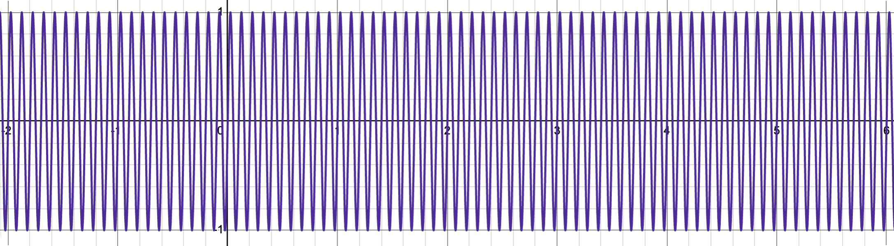
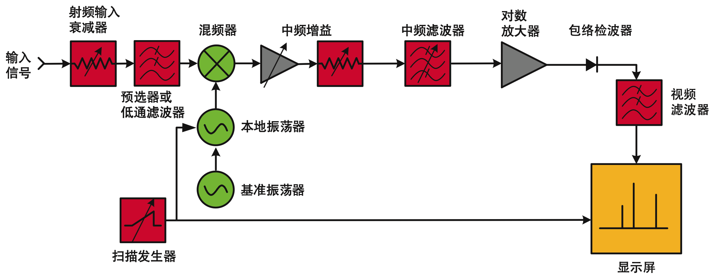

# 频谱分析仪学习笔记

# 实用工具

波形绘制计算器：https://www.desmos.com/calculator

如何理解声音的“谐波失真”？：https://zhuanlan.zhihu.com/p/617565407

‍

# `信号`​

## 频率

**==频率（Frequency）描述的是一个周期性变化“变化得有多快”==** 。最直观地说：

> 如果一个波形在 1 秒内完整重复了 10 次，那么它的频率就是 10 Hz。

这里的 Hz 叫赫兹（Hertz），定义就是：

$1\text{ Hz}=1\text{ 次/秒}$  

比如一个正弦波：$x(t)=\sin(2\pi ft)$ 里面的 $f$ 就是频率。

假设：**$f=1000\text{ Hz}$** **那么这个正弦波每秒完整振荡 1000 次**，

也就是：$1000\text{ Hz}=1\text{ kHz}$

频率和“周期”是互为倒数的。周期 $T$ 表示“完成一次完整变化需要多少秒”：

$\boxed{f=\frac{1}{T}}$或者：

$\boxed{T=\frac{1}{f}}$

例如，一个 1 kHz 的信号：$f=1000\text{ Hz}$

它的周期就是：$T=\frac{1}{1000}=0.001\text{ s}=1\text{ ms}$ 也就是说，每隔 1 ms，波形重复一次。

你可以把它画成这样：

```text
电压
 ↑
 |      /‾\        /‾\        /‾\
 |     /   \      /   \      /   \
 |____/     \____/     \____/     \____→ 时间
       <---->
          T
```

这里每一段 $T$ 就是一个周期。

---

频率越高，波形在同样时间里振荡得越快。

比如：

```text
低频：

/‾\________/‾\________/‾\____

高频：

/‾\/‾\/‾\/‾\/‾\/‾\/‾\/‾\
```

假设上面两个图都表示 1 秒钟：

- 第一个可能只有 3 次振荡 → 3 Hz
- 第二个可能有 20 次振荡 → 20 Hz

所以：

$\boxed{\text{频率越高} \Rightarrow \text{单位时间内重复次数越多}}$  

‍

在你目前学习的频谱分析仪里，频率尤其重要，因为频谱仪的横轴就是频率。

比如频谱仪显示：

```text
功率
 ↑
 |
 |                 ▲
 |                 │
 |                 │
 |_________________│________________→ 频率
                  1 GHz
```

这表示：

> 输入信号里存在一个 1 GHz 的频率成分。

而：

$1\text{ GHz}=10^9\text{ Hz}$  

也就是说，如果它是一个纯正弦波，它每秒振荡：

$1,000,000,000$ 次（10 亿）。

它的周期只有：

$T=\frac{1}{10^9} =10^{-9}\text{ s} =1\text{ ns}$  

所以：

$\boxed{1\text{ GHz的信号，一个周期只有1 ns}}$  

这对于理解射频特别重要。

---

常见的频率单位可以记住这一组：

- $1\text{ Hz}=1$ 次/秒
- $$
  1\text{ kHz}=10^3\text{ Hz}
  $$
- $$
  1\text{ MHz}=10^6\text{ Hz}
  $$
- $$
  1\text{ GHz}=10^9\text{ Hz}
  $$

例如：

$2.4\text{ GHz}=2.4\times10^9\text{ Hz}$

这也是 Wi-Fi、蓝牙等常见无线系统会涉及的频率量级。

---

还有一个你马上会遇到的概念叫**角频率**，写作：$\omega$  

它和普通频率 $f$ 的关系是：

$\boxed{\omega=2\pi f}$  

所以正弦波有两种常见写法：

$x(t)=A\sin(2\pi ft)$  

或者：

$x(t)=A\sin(\omega t)$  

它们是完全一样的，因为：

$\omega=2\pi f$  

区别只是单位不同：

$f:\quad \text{Hz}$  

而：

$\omega:\quad \text{rad/s}$  

你刚才看到的傅里叶变换：

$X(f)=\int_{-\infty}^{+\infty}x(t)e^{-j2\pi ft}dt$  

里面这个 $f$，本质上就是在问：

> “我拿一个频率为 $f$ 的正弦/复指数信号去和原信号比较，原信号里面到底含有多少这个频率？”

于是傅里叶变换把：

$\text{时间上的波形 }x(t)$  

转换成：

$\text{不同频率分别有多强 }X(f)$  

这也正好对应你之前理解的：

$\boxed{ \text{示波器：横轴是时间} }$

$\boxed{ \text{频谱仪：横轴是频率} }$  

所以对你现在来说，最核心的一句话就是：

> **频率表示一个周期性变化每秒重复多少次；单位是 Hz。**

而对于频谱分析仪：

> **频率告诉你“信号成分在哪里”，幅度或功率告诉你“这个频率成分有多强”。**

---

## 电磁波

### 传播理论

电磁波**不需要传统意义上的传播介质**。它本身就是随时间变化的电场和磁场，二者相互耦合，可以在真空中传播。

可以把它理解成：

$\text{变化的电场} \rightarrow \text{产生变化的磁场}$ $\text{变化的磁场} \rightarrow \text{产生变化的电场}$  

于是这种扰动可以不断向前传播。在真空中传播速度为：

$\boxed{c\approx3\times10^8\ \text{m/s}}$  

所以无线电波、可见光、X 射线，本质上都是电磁波，都可以穿过真空。

---

黑洞的情况则不是因为“没有传播介质”，也不是因为光速被降到了 0。

更准确地说：

> **黑洞事件视界是一个因果边界。视界以内，所有未来指向的光路都只能通向黑洞内部，无法到达外部宇宙。**

在广义相对论里，光沿着**零测地线（null geodesic）** 传播。强引力实际上是时空发生了弯曲。

可以粗略想象成：

```text
黑洞外：

光 → → → 可以朝外传播


事件视界以内：

        ↓
     所有未来方向
        ↓
      黑洞内部
```

不是光“动力不够”，而是：

> **时空结构本身已经没有一条“朝外且通向未来”的路径。**

---

一个很重要的点是：

$\boxed{\text{光在局部仍然始终以 }c\text{ 传播}}$  

即使在事件视界附近，一个自由下落的观察者局部测量光速，仍然得到 $c$。

所以不能理解成：

> 黑洞引力太大，把光速从 $c$ 减慢到 0。

更好的理解是：

> **光仍然以** **$c$** **前进，但时空被弯曲到使所有允许的“前进方向”最终都指向黑洞内部。**

---

常见的“逃逸速度超过光速”可以帮助入门，但只是牛顿力学类比。

事件视界常写成史瓦西半径：

$r_s=\frac{2GM}{c^2}$  

在这个半径以内，经典类比会说“逃逸速度大于 $c$”。

但广义相对论真正的解释是：

$\boxed{\text{事件视界改变的是因果结构，而不是给光施加阻力}}$  

所以可以总结为：

> **电磁波不需要介质，因为它是电磁场自身的传播；黑洞也不是“阻止电磁波传播”，而是事件视界以内的时空结构使任何光都不存在通向外界的未来路径。**

---

### 分类


|频段名称|英文缩写|英文全称|
| ----------| ----------| --------------------------|
|甚低频|VLF|Very Low Frequency|
|低频|LF|Low Frequency|
|中频|MF|Medium Frequency|
|高频|HF|High Frequency|
|甚高频|VHF|Very High Frequency|
|特高频|UHF|Ultra High Frequency|
|超高频|SHF|Super High Frequency|
|极高频|EHF|Extremely High Frequency|

可以按程度来记：

$\text{Low} \rightarrow \text{Medium} \rightarrow \text{High}$  

再往上就是：

$\text{Very High} \rightarrow \text{Ultra High} \rightarrow \text{Super High} \rightarrow \text{Extremely High}$

‍

|频段名称|英文缩写|频率范围|基本特性|主要应用|
| ----------| ----------| -------------------------------------------------------------------------------------------------------------| ---------------------------------------------------------------------------------------------------------------------------------------------| ---------------------------------------------------------------------------------------------------------------------|
|甚低频|VLF|3～30 kHz|主要是地波传播，有较好的衍射和透射海水的性能，稳定性和可靠性强|海岸和远航船舶/潜艇间通信、水上导航、固定业务、频率和时间信号，尤其用于国际性长距离无线电导航通信|
|低频|LF|30～300 kHz|主要是地波传播，有较好的衍射和透射海水的性能，稳定性和可靠性强|中程通信、地下通信、水上导航、固定业务，尤其用于国际性长距离无线电导航通信|
|**中频**|**MF**|**300～3000 kHz**|**主要是地波传播，稳定性和可靠性强**|**国内广播和导航、固定、移动业务，尤其用于中距离点对点广播和航海**|
|高频|HF|3～30 <span data-type="text" style="background-color: var(--b3-card-info-background); color: var(--b3-card-info-color);">M</span>Hz|主要是长距离天波通信，但容易受到电离层影响|导航、广播、固定、移动等业务，特别是远程或短程点对点通信、广播和移动通信|
|甚高频|VHF|30～300 <span data-type="text" style="background-color: var(--b3-card-info-background); color: var(--b3-card-info-color);">M</span>Hz|电离层散射通信一般为 30～60 MHz；人工电离层通信一般为 30～144 MHz；流星余迹通信一般为 30～100 MHz（40～80 MHz 较适合）|导航、电视、FM 广播、雷达、固定和移动业务；短距离和中距离点对点通信、LAN、广播（TV），以及与卫星/导弹等飞行目标通信|
|特高频|UHF|300～3000 <span data-type="text" style="background-color: var(--b3-card-info-background); color: var(--b3-card-info-color);">M</span>Hz|低容量微波中继系统（8～12 路）一般为 352～420 MHz；中等容量微波中继系统（120 路）一般为 1700～2400 MHz；对流层散射通信一般为 700～10000 MHz|导航、电视、雷达、固定、移动、空间、对流层散射业务；短距离和中等距离点对点通信、LAN、广播（TV）、卫星通信|
|超高频|SHF|3～30 **G**Hz|大容量微波中继系统（6000 路）一般为 3600～4200 MHz；大容量微波中继系统（2500 路）一般为 5850～8500 MHz|导航、电视、雷达、固定、移动、空间、航空业务；短距离和中等距离点对点通信、LAN、广播（TV）、移动/个人通信、卫星通信|
|极高频|EHF|30～300 **G**Hz|视距传播|导航、固定、移动、空间业务；短距离点对点、微蜂窝、LAN、移动/个人通信、卫星通信、重返大气层通信|
|红外线|—|300～4×10⁵ **G**Hz|热效应显著，具有一定的穿透性|遥控、热成像仪、医疗、红外制导导弹等|
|可见光|—|3.84×10⁵～7.69×10⁵ **G**Hz|由紫、蓝、青、绿、黄、橙、红等七色光组成，可被人眼感知|光学成像、遥感、通信等|
|紫外线|—|7.69×10⁵～3×10⁸ **G**Hz|具有显著的化学效应和荧光效应|杀菌、消毒、治疗皮肤病和软骨病、金属探伤等|
|X 射线|—|3×10⁸～5×10¹⁰ **G**Hz|具有较强的穿透性|CT 照相、治疗肿瘤等|
|γ 射线|—|约 10⁹ **G**Hz 以上|穿透力很强，对生物肌体的破坏力很强|医学上治疗肿瘤；工业中用于探伤或流水线自动控制|

‍

​

## 波长与频率关系

$\lambda=\frac{c}{f}$  

即：**频率越高，波长越短；频率越低，波长越长。**

||修正|
| ------------------------| ---------------------------------------------------------------------------------------------------------------|
|波长越短，传播距离越长|❌ 不一定。无线通信中通常是低频、长波长更容易绕射和远距离传播；高频更容易被遮挡、吸收|
|波长越短，能量越小|❌ 如果说单个光子的能量，正好相反：$E=hf$，频率越高、波长越短，光子能量越高|
|波长越短，穿透力越强|❌ 不能一概而论。RF 范围内通常低频更容易穿过建筑、土壤等；X 射线、γ 射线又因为物理机制不同而具有很强穿透能力|

‍

对于你现在学习的 **RF / 无线通信**，可以先形成这个直觉：

> **低频、长波长：更擅长“**​**==绕==**​ **”和传播。**   
> **高频、短波长：更擅长“**​**==定向==**​ **”和传输大量数据，但更怕遮挡。**

例如：

- 几百 MHz：==绕射==能力较好，覆盖范围容易做大。
- 2.4 GHz / 5 GHz：Wi-Fi 常用，5 GHz 通常比 2.4 GHz 更容易被墙体衰减。
- 毫米波，如 28 GHz：波长很短，方向性强，但人体、墙壁、雨水都可能造成明显衰减。

另外，“**信号能量**”和“频率”要区分语境。一个 100 MHz 信号完全可以比一个 10 GHz 信号功率大得多，因为射频系统中的实际信号功率主要还取决于**==振幅和发射功率==**；只有讨论单个光子时，才直接有：

$E=hf$

所以最简洁地记：

$\boxed{\text{频率高} \Leftrightarrow \text{波长短}}$  

但：

$\boxed{\text{传播距离、穿透能力不能只由波长单独判断}}$  

‍

# ​`采样理论`​

> 基于FPGA的频谱仪数字单元设计与实现 (NaN) (z-library.sk, 1lib.sk, z-lib.sk)

电信号有==时域==和==频域==两种描述方式，能够在示波器上显示出波形的为时域描述方式，这种描述方式以时间为横轴，纵轴表示电压或电流的大小。另一种方式为**频域**描述方式，这种方式得到的是**信号中含有的所有频率成分，以及每种频率成分信号量的大小**，时域与频域描述方式如图 2-1。

频域描述方式有时域描述方式不具备的优点，可以显示信号的**谐波分量**等，还可以根据信号占用的带宽滤除噪声，提高信号接收的信噪比

​

​

信号的**==时域==**描述方式和**==频域==**描述方式为傅里叶变换的关系：

$$
X(f)=F\{x(t)\}
=\int_{-\infty}^{+\infty}x(t)e^{-j2\pi ft}\,dt
$$

和

$$
x(t)=F^{-1}\{X(f)\}
=\int_{-\infty}^{+\infty}X(f)e^{j2\pi ft}\,df
$$

式（2-2）

其中，$F\{x(t)\}$ 为时域信号 $x(t)$ 的傅立叶变换，$F^{-1}\{X(f)\}$ 为频域信号 $X(f)$ 的傅立叶逆变换

---

‍

## RF、IF、基带

### RF: 射频 Radio Frequency

RF 是仪器输入端看到的原始**高频**信号。

例如：

$f_{RF}=2.4\text{ GHz}$  

可以写成：

$v(t)=A\cos(2\pi\cdot2.4\text{GHz}\cdot t)$

它可能来自：

- Wi-Fi
- 蓝牙
- 手机通信
- 雷达
- 信号发生器

对频谱分析仪来说，前面板的 **RF Input** 接收到的就是这种信号。

---

### IF：中频 Intermediate Frequency

> **MF 和 IF 中文都可能被翻译成“中频”，但它们不是同一个概念。**
>
> 区别在于：
>
> - **MF（Medium Frequency）** ：指的是**无线电频段分类中的中频 300 kHz～3 MHz（中频**​**频段** **）**
> - **IF（Intermediate Frequency）** ：指的是**射频系统超外差架构中的中间**​**==处理==**​**频率（中间**​**频率** **）**
>
> 虽然中文都叫“中频”，但英文含义不同。

RF 频率可能非常高，不方便直接处理，所以通过混频器把它搬到较低的固定频率。

例如：

$f_{RF}=2.4\text{ GHz}$  

本振：

$f_{LO}=2.3\text{ GHz}$

> 本振 LO 是 **Local Oscillator，本地振荡器**，它会产生一个==频率可控、较稳定的正弦信号，送入混频器。==
>
> 它的主要作用是和输入 RF 信号进行混频，把原本较高的射频信号“搬移”到较低、方便处理的 IF 或基带频率。例如：
>
> $2.4\text{ GHz RF} - 2.3\text{ GHz LO}=100\text{ MHz IF}$ 所以可以简单记成：
>
>> **LO 就是频谱仪内部用来“搬频”的参考信号源。**
>>

混频产生差频：

$f_{IF}=|f_{RF}-f_{LO}|$  

于是：

$f_{IF}=100\text{ MHz}$  

也就是：

```text
2.4 GHz RF
    ↓ 混频
100 MHz IF
```

这里需要注意：

> RF 和 IF 往往只是“载波所在频率不同”，信号携带的信息并没有因此消失。

为什么要 IF？

因为我们可以针对固定的：$100\text{ MHz}$  

设计性能很好的放大器、滤波器和 ADC，而不需要让这些模块直接覆盖几 GHz、几十 GHz。

---

### BB: 基带Baseband

**基带（Baseband）首先是一个“频率位置/信号表示”的概念，不是某一个特定硬件。** 

如果继续把 IF 或 RF 搬到接近：

$0\text{ Hz}$  

的位置，就得到了**==基带==**。

‍

例如，原本一个信号占据：

$2.39\text{ GHz}\sim2.41\text{ GHz}$  

中心频率：

$2.4\text{ GHz}$  

如果用：

$2.4\text{ GHz}$  

的 LO 做正交下变频，那么信号==**中心**==可以被搬到：

$0\text{ Hz}$  

附近，变成：

$-10\text{ MHz}\sim+10\text{ MHz}$  

这就是基带信号。

```text
原始 RF：

						        信号
						          ↓
						----------▲----------------------→ f
						        2.4 GHz


下变频之后：

      信号
        ↓
--------▲------------------------→ f
        0
      基带
```

这时候通常使用：

$I(t)+jQ(t)$  

表示信号，也就是你之前见过的 **IQ 数据**。

‍

当然，实际仪器里会有专门处理基带的硬件，例如：

- Mixer
- ADC
- DDC
- FPGA
- DSP

所以：

> **基带是“信号所处的位置/表示方式”，DDC、FPGA 等才是处理它的硬件。**

---

‍

**搬到 0 Hz，不会把信号“压没”**

这里最容易误解的是：

> “搬到 0 Hz”不是把整个信号所有频率都变成 0 Hz。

而是：

$\boxed{\text{把信号的中心频率搬到 0 Hz}}$  

例如原来的 RF 信号：

```
频率

        信号带宽
      ┌─────────┐
______│_________│__________
    2.39G     2.41G
          ↑
        2.4GHz
```

用 2.4 GHz 进行==下变频==，相当于所有频率都减去：

$2.4\text{ GHz}$  

于是：

$2.39G-2.4G=-10MHz$  

$2.40G-2.4G=0$  

$2.41G-2.4G=+10MHz$  

所以变成：

```
频率

       基带信号
      ┌─────────┐
______│_________│__________
    -10M       +10M
          ↑
         0 Hz
```

信号的**相对频率关系、带宽、幅度、相位、调制信息都还存在**。

只是整个频谱平移了：

$\boxed{f_{\text{baseband}}=f_{\text{RF}}-f_{\text{LO}}}$​

---

**如果真的是一个纯 2.4 GHz 正弦波呢？**

例如：

$x(t)=A\cos(2\pi\cdot2.4G\,t+\phi)$  

如果恰好用：

$f_{LO}=2.4\text{ GHz}$  

下变频，那么这个纯载波确实会被搬到：

$0\text{ Hz}$  

但它不是“消失”了。

在 IQ 基带中，它可能表现成一个固定的复数：

$\boxed{I+jQ=Ae^{j\phi}}$  

也就是说：

- 振幅 $A$ 还在
- 相位 $\phi$ 还在
- 只是它不再高速旋转了

你可以把它想象成：

> 原来一个指针每秒转 24 亿圈；现在你自己也跟着它以每秒 24 亿圈旋转，于是在你的参考系里，这个指针看起来静止了。

这就是下变频非常好的直觉。

所以最核心的一句话是：

> **DDC 不是把信号压成 0，而是把“中心频率”移到 0 Hz，让我们只处理它相对于中心频率的变化。**

这也是为什么频谱仪可以把几 GHz 的 RF 信号变成几十 MHz 的 IQ 数据，再交给 FPGA 做 FFT。

‍

---

**一个具体超外差频谱仪例子：**

假设频谱仪要观察一个：

$2.45\text{ GHz}$  

的信号。

‍

第一步，RF：

$\boxed{2.45\text{ GHz}}$  

进入频谱仪。

‍

然后假设 LO：

$2.35\text{ GHz}$  

混频：

$2.45-2.35=0.10\text{ GHz}$  

得到：

$\boxed{100\text{ MHz IF}}$  

然后**数字下变频 DDC** 再用：

$100\text{ MHz}$  

把它搬到：

$\boxed{0\text{ Hz附近的基带}}$  

所以整条链：

$\boxed{ 2.45\text{ GHz RF} \rightarrow 100\text{ MHz IF} \rightarrow 0\text{ Hz附近 Baseband} }$  

接下来 FPGA 就可以对基带 IQ 数据做：

$FFT$  

得到频谱。

---

### 为什么不直接处理 RF？

假设频谱仪最高要测：$26.5\text{ GHz}$

**如果直接 ADC 采 26.5 GHz 信号，对 ADC 采样率、模拟带宽、数据吞吐量的要求都会非常高**。

所以更常见的方法是：

$\boxed{\text{先把高频信号搬低，再数字处理}}$  

也就是：

```text
高频 RF
  ↓
Mixer
  ↓
较低 IF
  ↓
ADC
  ↓
IQ / Baseband
  ↓
FFT
```

---

三者最简单的记忆方式

|名称|英文|可以怎么理解|
| ------| ------------------------| ----------------------|
|RF|Radio Frequency|原始高频信号|
|IF|Intermediate Frequency|搬频后的中间频率|
|BB|Baseband|搬到 0 Hz 附近的信号|

可以把它想成搬家：

> **RF 是信号原来的地址，IF 是中转站，Baseband 是送到数字处理最方便的位置。**

信号的“内容”基本没变，主要变化的是它所在的**频率位置**。

---

# FT 傅里叶变换

> FT  - Fourier Transform

傅里叶变换用于在**时域**和**频域**之间转换信号表示。

### 1. 基本思想

一个复杂信号可以看作多个不同频率、不同幅度、不同相位的正弦/余弦信号叠加。

因此：

$\boxed{\text{时域信号} \xrightarrow{\text{傅里叶变换}} \text{频域成分}}$  

傅里叶变换相当于把复杂波形“==拆解==”，得到其中包含哪些频率，以及各频率成分的幅度和相位。

---

### 2. FT 傅里叶变换

连续傅里叶变换：

$X(f)=\int_{-\infty}^{+\infty}x(t)e^{-j2\pi ft}\,dt$  

方向为：

$\boxed{x(t)\rightarrow X(f)}$

**时域 → 频域**

其中：

- $x(t)$：时域信号
- $X(f)$：频域信号
- $f$：频率
- $\boxed{j=\sqrt{-1}}$ , 它是**虚数单位**

---

### 3. IFT 逆傅里叶变换

> IFT - Inverse Fourier Transform

$x(t)=\int_{-\infty}^{+\infty}X(f)e^{j2\pi ft}\,df$  

方向为：

$\boxed{X(f)\rightarrow x(t)}$  

即：

**频域 → 时域**

可以理解为将不同频率成分重新“合成”为原始波形。

---

### 4. DFT 与 FFT

> 离散傅里叶变换
>
> DFT - Discrete Fourier Transform
>
> ‍
>
> 快速傅里叶变换
>
> FFT - Fast Fourier Transform

数字系统中，ADC 得到的是离散采样数据：

$x[0],x[1],\ldots,x[N-1]$  

因此使用 **==DFT（离散傅里叶变换）==** ：

$X[k] = \sum_{n=0}^{N-1} x[n]e^{-j(2\pi kn)/N}$  

其中：

- $n$：时间采样点**索引**
- $k$：频率点**索引**

这里的 $\frac{2\pi kn}{N}$ 本质上表示一个**旋转角度**。随着 $n$ 增加，这个复指数会在复平面上不断旋转，这正是 DFT 用来“检测某个频率成分”的关键。

==FFT（Fast Fourier Transform）不是新的变换==，而是：

$\boxed{\text{FFT = 快速计算 DFT 的算法}}$  

因此：

$\boxed{x[n]\xrightarrow{\mathrm{FFT}}X[k]}$​

---

### 5. 在频谱分析仪中的作用

频谱分析仪可以对 ADC 获取的时域采样数据进行 FFT：

```text
时域采样 x[n]
      ↓
     FFT
      ↓
频域数据 X[k]
```

从而得到信号中的各个频率成分。

例如一个信号由：$1\text{ kHz}+3\text{ kHz}$  

两个正弦波组成，时域中它们叠加成一个复杂波形，而 FFT 后可以直接看到 1 kHz 和 3 kHz 两个频谱峰。

---

**核心记忆**

$\boxed{\text{傅里叶变换：拆解}}$

$\boxed{\text{FFT：时域}\rightarrow\text{频域}}$

对于频谱分析仪，可以简单理解为：

> **通过 FFT 将采样波形拆解成不同频率成分，从而形成频谱。**

$\boxed{\text{逆傅里叶变换：合成}}$

 $\boxed{\text{IFFT：频域}\rightarrow\text{时域}}$

# 频谱仪与示波器

> 示波器观察时域（Time Domain），频谱分析仪观察频域（Frequency Domain）。

它们之==间最核心的==桥梁就是：

$\boxed{\text{傅里叶变换 Fourier Transform}}$  

简单理解：

$$
\text{时域波形}
\quad\xrightarrow{\text{Fourier Transform}}\quad
\text{频域频谱}
$$

也就是说：

```
        示波器看到的
         x(t)
          │
          │ Fourier Transform
          ↓
	      X(f)
	   频谱仪看到的
```

举个更典型的例子。

假设示波器看到一个方波：

```
电压
 ↑
   ┌────┐      ┌────┐
   │    │      │    │
───┘    └──────┘    └────→ 时间
```

你可能觉得：

> “就是一个方波。”

但是从频域来看，它其实不是只有一个频率。

理想方波可以展开成很多正弦波：

$$
x(t)=
\sin(\omega t)
+\frac13\sin(3\omega t)
+\frac15\sin(5\omega t)
+\cdots
$$


所以频谱分析仪看到的是：

```
功率
 ↑
 |
 | ▲
 | │
 | │
 | │         ▲
 | │         │         ▲
 | │         │         │
 |_|_________|_________|________→ 频率
   f        3f        5f
```

这里：

- $f$：基波
- $3f$：三次谐波
- $5f$：五次谐波

于是会出现一个很重要的认知：

> **示波器告诉你“它长什么样”，频谱仪告诉你“它是由什么组成的”。**

‍

---

## 基波与谐波

可以把**==基波==**​==理解成“主频率”==，把**==谐波==**​==理解成“这个主频率的整数倍频率成分”==。

假设一个周期信号的最低主要频率是：

$f_0=1\text{ kHz}$那么：

$1f_0=1\text{ kHz}$叫**基波（Fundamental）** 。

而：

$$
2f_0=2\text{ kHz},\quad
3f_0=3\text{ kHz},\quad
4f_0=4\text{ kHz}
$$

分别叫：

- 二次谐波
- 三次谐波
- 四次谐波

所以可以记成：

$\boxed{\text{第 }n\text{ 次谐波}=n f_0}$  

比如频谱仪上可能看到：

```
功率
 ↑
 |
 |        ▲
 |        │
 |        │
 |        │       ▲
 |        │       │       ▲
 |________│_______│_______│________→ 频率
         1kHz    2kHz    3kHz
          ↑       ↑       ↑
        基波    二次谐波 三次谐波
```

‍

### 为什么会有谐波？

最关键的一点是：

> **纯正弦波只有基波，没有谐波。**

比如：

$x(t)=\sin(2\pi\cdot1000t)$  



它就是一个非常纯的 1 kHz 正弦波。

频谱里理想情况下只有：

```
           ▲
           │
___________│____________
          1kHz
```

但如果波形不是纯正弦波，例如方波：

```
   ┌────┐      ┌────┐
   │    │      │    │
───┘    └──────┘    └────
```

它其实可以看成很多正弦波叠加出来的。

理想对称方波大致可以写成：

$$
x(t)
=
\sin(\omega t)
+
\frac13\sin(3\omega t)
+
\frac15\sin(5\omega t)
+\cdots
$$

所以如果方波基频是 1 kHz，频谱中会看到：

$1\text{ kHz},3\text{ kHz},5\text{ kHz},7\text{ kHz}\ldots$也就是：

这说明一个非常重要的概念：

> **复杂的周期波形，可以看成一个基波加上一堆谐波。**

这就是==傅里叶级数==背后的核心思想。

```
幅度
 ↑
 |
 | ▲
 | │
 | │
 | │         ▲
 | │         │         ▲
 | │         │         │
 |_|_________|_________|________→
 1k        3k        5k
 基波      三次       五次
```

---

你也可以从“波形为什么会变形”来理解谐波。

先有一个纯基波：

```
      /\
     /  \
____/    \____
```

再加一点三次谐波、五次谐波：

```
基波 + 三次谐波 + 五次谐波
```

合成出来的波形就会越来越不像正弦波，甚至慢慢接近方波。

所以：

> **谐波其实是在塑造波形的形状。**

只有基波时，波形是纯正弦。

谐波越多，波形通常越“复杂”。

---

## **谐波失真**

> https://zhuanlan.zhihu.com/p/617565407

在你的频谱仪工作里，还有另一种非常重要的情况：**谐波失真**。

比如你给一个放大器输入一个纯净的：$1\text{ GHz}$ 正弦波。

理想放大器应该只输出：$1\text{ GHz}$  

但真实放大器存在非线性，可能产生：$2\text{ GHz},3\text{ GHz},4\text{ GHz}$ 于是频谱仪看到：

```
功率
 ↑
 |
 |             ▲
 |             │
 |             │
 |             │
 |             │        ▲
 |             │        │        ▲
 |_____________│________│________│______
              1GHz     2GHz     3GHz
               ↑        ↑        ↑
              基波    二次谐波  三次谐波
```

这里输入明明只有 1 GHz，但设备自己“制造”出了 2 GHz、3 GHz。

这通常说明：

$\boxed{\text{系统存在非线性}}$  

因此工程师经常用频谱仪测：

- 二次谐波
- 三次谐波
- 谐波失真
- THD（Total Harmonic Distortion，总谐波失真）：将各谐波引起的失真叠加起来，就是[总谐波失真度](https://zhida.zhihu.com/search?content_id=225367959&content_type=Article&match_order=1&q=%E6%80%BB%E8%B0%90%E6%B3%A2%E5%A4%B1%E7%9C%9F%E5%BA%A6&zhida_source=entity)

来判断设备性能。

你可以先牢牢记住一句：

> **基波是信号最基本的周期成分；谐波是基波整数倍频率上的成分。纯正弦波只有基波，非正弦周期信号通常包含多个谐波。**

还有一个容易混淆的地方：**==谐波一定是整数倍，但杂散（spurious）不一定是整数倍==**​ **。**  这个区别对频谱分析仪非常重要。

  

---

比如一个放大器输入一个非常干净的：

$1\text{ GHz}$正弦信号。

示波器上可能还是看起来：

```
~~~~~~~正弦波~~~~~~~
```

似乎没什么异常。

但频谱仪一看：

```
                     基波
                       ▲
                       │
                       │
                       │
            杂散 ▲      │       ▲ 谐波
                │      │       │
________________│______│_______│________
```

你会发现：

- 1 GHz：主信号
- 2 GHz：二次谐波
- 3 GHz：三次谐波
- 其他位置：杂散
- 底部：噪声

这也是为什么射频工程里频谱分析仪特别重要。

因为很多 RF 问题（射频，Radio Frequency）：**谐波、杂散、邻道泄漏、相位噪声、噪声底、互调失真**

从时域波形上非常难直接看出来，但频域里非常明显。

不过再补一个重要的严谨点：现代仪器之间并不是绝对分开的。

现代数字示波器通常也能对采样数据做 FFT，所以：

> **示波器也可以看频域。**

而现代实时频谱分析仪也会保存 IQ 数据，所以也能够观察：

> **信号随时间发生了什么变化。**

因此“示波器 \= 时域、频谱仪 \= 频域”讲的是它们各自最核心、最擅长的观察方式，而不是说它们只能做这一件事。

你现在可以先牢牢记住这组对应关系：

$$
\boxed{
\begin{array}{ccc}
\text{示波器} &:& \text{时间} \rightarrow \text{电压}\\
\text{频谱仪} &:& \text{频率} \rightarrow \text{幅度/功率}
\end{array}}
$$

再更形象一点：

> **示波器问：“信号什么时候发生了什么？”**
>
> **频谱仪问：“信号里面有哪些频率？各有多强？”**

‍

# `超外差频谱分析仪`​

**经典扫频超外差频谱分析仪**：它主要依靠**混频器 + 可扫频本振 + 中频滤波器**，把不同 RF 频率依次“搬运”到**固定**的中频，再测量它们有多强。

主信号链：

$$
\boxed{
\text{输入信号}
\rightarrow
\text{RF衰减器}
\rightarrow
\text{预选器}
\rightarrow
\text{混频器}
\rightarrow
\text{IF增益}
\rightarrow
\text{IF滤波器}
\rightarrow
\text{对数放大器}
\rightarrow
\text{包络检波器}
\rightarrow
\text{视频滤波器}
\rightarrow
\text{显示}
}
$$

另外还有一条“控制链”：

$$
\boxed{
\text{扫描发生器}
\rightarrow
\text{本地振荡器 LO}
\rightarrow
\text{混频器}
}
$$

扫描发生器同时控制显示屏横轴，所以最终才能形成：

横轴 \= 频率，纵轴 \= 幅度/功率



​`图 2-1. 典型超外差频谱分析仪的结构框图`​

图2-1是一个超外差频谱分析仪的简化框图。

-  **==“外差”是指混频==**​==，即对频率进行转换==，
-  **==“超”==**​==则是指超音频频率或高于音频的频率范围==。

从图中我们看到，输入信号先经过一个衰减器，再经低通滤波器（稍后会看到为何在此处放置滤波器）到达混频器，然后与来自**本振（LO）** 的信号相混频。

# 

# 经典扫频超外差频谱分析仪器件介绍

经典扫频超外差频谱分析仪（Swept Superheterodyne Spectrum Analyzer）是一种利用**混频器（Mixer）+ 可扫频本振（LO）+ 中频滤波器（IF Filter）** 实现频谱测量的仪器。

其基本思想是：==输入的 RF 信号包含多个频率成分，频谱仪不会一次性分析全部频率，而是通过改变本振频率，将不同 RF 频率依次搬移到一个固定的中频（IF），然后对该固定频率上的信号幅度进行检测，最终得到频率与功率之间的关系==。

主信号链：

$$
\text{输入信号}
\rightarrow
\text{RF衰减器}
\rightarrow
\text{预选器}
\rightarrow
\text{混频器}
\rightarrow
\text{IF增益}
\rightarrow
\text{IF滤波器}
\rightarrow
\text{对数放大器}
\rightarrow
\text{包络检波器}
\rightarrow
\text{视频滤波器}
\rightarrow
\text{显示}
$$

控制链：

$$
\text{扫描发生器}
\rightarrow
\text{本地振荡器 LO}
\rightarrow
\text{混频器}
$$

## RF 输入信号（RF Input）

RF 输入信号是被测信号进入频谱分析仪的入口。RF 表示 Radio Frequency（射频），通常指 MHz 到 GHz 范围内的高频电信号，例如无线通信中的 Wi-Fi、蓝牙、蜂窝通信信号等。

进入频谱仪的 RF 信号通常不是单一频率，而可能包含多个频率分量。例如输入信号可能同时包含：

$$
900MHz,\quad 1GHz,\quad 1.2GHz
$$

频谱仪的目标就是分析这些频率成分分别具有多大的功率。

==由于 RF 信号频率较高，后续电路难以直接处理，因此需要先经过衰减、滤波和混频等步骤，将高频信号转换为便于处理的中频信号==

## RF 衰减器（RF Attenuator）

RF 衰减器位于输入端，用于控制进入后级电路的信号功率。

射频信号可能具有较大的输入功率，如果直接进入混频器或放大器，可能导致器件进入非线性区域，产生压缩和失真。因此，频谱分析仪通常通过设置不同的衰减值，例如：

$$
0dB,\ 10dB,\ 20dB
$$

来降低输入信号幅度。

例如：

输入信号：

$$
+10dBm
$$

经过：

$$
20dB
$$

衰减后：

$$
-10dBm
$$

进入后续电路。

RF 衰减器的主要作用是保护后级器件，同时调整仪器的动态范围。

## 预选器（Preselector）

预选器是位于混频器之前的滤波器，用于选择目标频率范围并抑制不需要的频率。

由于混频器会产生多个频率分量：

$$
f_{RF}+f_{LO}
$$

以及：

$$
|f_{RF}-f_{LO}|
$$

如果输入端存在大量无关频率，这些信号经过混频后可能产生假的响应，即镜像信号或杂散信号。

预选器通过提前限制输入频带，减少无关信号进入混频器，提高测量准确性。

简单理解：

> 预选器负责“粗筛选”，先决定哪些频率可以进入后续处理。

## 混频器（Mixer）

混频器是超外差频谱仪的核心器件之一，它负责完成频率搬移。

混频器有两个输入：

- RF 输入信号频率：  
  \[  
  f_{RF}  
  \]
- 本振信号频率：  
  \[  
  f_{LO}  
  \]

两者相乘后会产生新的频率分量：

$$
f_{RF}+f_{LO}
$$

以及：

$$
|f_{RF}-f_{LO}|
$$

频谱仪通常利用差频：

$$
f_{IF}=|f_{RF}-f_{LO}|
$$

将不同 RF 频率转换成固定的中频。

例如：

输入：

$$
f_{RF}=2.4GHz
$$

本振：

$$
f_{LO}=2.3GHz
$$

经过混频：

$$
2.4GHz-2.3GHz=100MHz
$$

于是：

$$
2.4GHz\rightarrow100MHz
$$

这个过程称为**下变频（Down Conversion）** 。

混频器并没有改变信号携带的信息，只是改变了信号所在的频率位置。

## 本地振荡器（LO，Local Oscillator）

本地振荡器用于产生稳定、可调节的正弦波信号，是频谱仪完成频率扫描的关键部件。

LO 的频率由扫描发生器控制，通过不断改变：

$$
f_{LO}
$$

使不同 RF 频率依次满足：

$$
|f_{RF}-f_{LO}|=f_{IF}
$$

例如固定中频：

$$
f_{IF}=100MHz
$$

当 LO 变化时：

|LO频率|被检测RF频率|
| --------| --------------|
|1.0GHz|900MHz|
|1.1GHz|1GHz|
|1.3GHz|1.2GHz|

因此：

> 改变 LO，本质上就是改变频谱仪当前正在观察的 RF 频率。

## 中频增益（IF Gain）

混频后的信号进入中频放大阶段。

由于 RF 信号经过：

- 衰减器
- 预选器
- 混频器

后功率可能较低，因此需要 IF 放大器提高信号电平，使后续滤波和检测电路能够准确处理。

IF 增益影响仪器的灵敏度和动态范围。

## 中频滤波器（IF Filter）

IF 滤波器是决定频率分辨能力的重要器件。

经过混频后，不同 RF 信号都会被转换到固定 IF，但只有落在 IF 滤波器通带范围内的信号才能通过。

该滤波器对应频谱分析仪中的：

$$
RBW（Resolution Bandwidth）
$$

即分辨率带宽。

RBW 决定仪器区分两个相邻信号的能力。

例如：

两个信号：

$$
1.000GHz
$$

和：

$$
1.001GHz
$$

如果 RBW 足够小，可以分辨两个峰；如果 RBW 太大，两个信号可能融合成一个峰。

因此：

- RBW 越小，频率分辨率越高；
- RBW 越小，扫描速度通常越慢。

## 对数放大器（Log Amplifier）

射频信号的功率范围非常宽，例如：

$$
0dBm
$$

到：

$$
-100dBm
$$

相差：

$$
100dB
$$

如果使用线性显示，需要处理非常大的动态范围。

对数放大器将信号幅度转换为对数形式，使其可以用 dB/dBm 表示：

$$
P_{dBm}=10\log_{10}\frac{P}{1mW}
$$

因此频谱仪屏幕上的纵轴通常采用：

$$
dBm
$$

单位。

## 包络检波器（Envelope Detector）

包络检波器用于提取 IF 信号的幅度信息。

IF 信号本身仍然是高速振荡信号，例如：

$$
100MHz
$$

检测器不关心载波的快速变化，而关注其包络：

‍
