# 频谱分析仪学习笔记

# 实用工具

波形绘制计算器：https://www.desmos.com/calculator

如何理解声音的“谐波失真”？：https://zhuanlan.zhihu.com/p/617565407

labAlive：https://www.etti.unibw.de/labalive/#welcome

> 非常好的科普视频：
>
> 【硬核科普】WiFi是怎么传递信息的？把信息装进电磁波有多难？
>
> https://www.bilibili.com/list/watchlater/?bvid=BV1LS9eBxEGD

‍

# `信号`​

## 频率

**==频率（Frequency）描述的是一个周期性变化“变化得有多快”==** 。最直观地说：

> 如果一个波形在 1 秒内完整重复了 10 次，那么它的频率就是 10 Hz。

这里的 Hz 叫赫兹（Hertz），定义就是：

$1\text{ Hz}=1\text{ 次/秒}$  

比如一个正弦波：$x(t)=\sin(2\pi ft)$ 里面的 $f$ 就是频率。

假设：**$f=1000\text{ Hz}$** **那么这个正弦波每秒完整振荡 1000 次**，

也就是：$1000\text{ Hz}=1\text{ kHz}$

频率和“周期”是互为倒数的。周期 $T$ 表示“完成一次完整变化需要多少秒”：

$\boxed{f=\frac{1}{T}}$或者：

$\boxed{T=\frac{1}{f}}$

例如，一个 1 kHz 的信号：$f=1000\text{ Hz}$

它的周期就是：$T=\frac{1}{1000}=0.001\text{ s}=1\text{ ms}$ 也就是说，每隔 1 ms，波形重复一次。

你可以把它画成这样：

```text
电压
 ↑
 |      /‾\        /‾\        /‾\
 |     /   \      /   \      /   \
 |____/     \____/     \____/     \____→ 时间
       <---->
          T
```

这里每一段 $T$ 就是一个周期。

---

频率越高，波形在同样时间里振荡得越快。

比如：

```text
低频：

/‾\________/‾\________/‾\____

高频：

/‾\/‾\/‾\/‾\/‾\/‾\/‾\/‾\
```

假设上面两个图都表示 1 秒钟：

- 第一个可能只有 3 次振荡 → 3 Hz
- 第二个可能有 20 次振荡 → 20 Hz

所以：

$\boxed{\text{频率越高} \Rightarrow \text{单位时间内重复次数越多}}$  

‍

在你目前学习的频谱分析仪里，频率尤其重要，因为频谱仪的横轴就是频率。

比如频谱仪显示：

```text
功率
 ↑
 |
 |                 ▲
 |                 │
 |                 │
 |_________________│________________→ 频率
                  1 GHz
```

这表示：

> 输入信号里存在一个 1 GHz 的频率成分。

而：

$1\text{ GHz}=10^9\text{ Hz}$  

也就是说，如果它是一个纯正弦波，它每秒振荡：

$1,000,000,000$ 次（10 亿）。

它的周期只有：

$T=\frac{1}{10^9} =10^{-9}\text{ s} =1\text{ ns}$  

所以：

$\boxed{1\text{ GHz的信号，一个周期只有1 ns}}$  

这对于理解射频特别重要。

---

常见的频率单位可以记住这一组：

- $1\text{ Hz}=1$ 次/秒
- $$
  1\text{ kHz}=10^3\text{ Hz}
  $$
- $$
  1\text{ MHz}=10^6\text{ Hz}
  $$
- $$
  1\text{ GHz}=10^9\text{ Hz}
  $$

例如：

$2.4\text{ GHz}=2.4\times10^9\text{ Hz}$

这也是 Wi-Fi、蓝牙等常见无线系统会涉及的频率量级。

---

还有一个你马上会遇到的概念叫**角频率**，写作：$\omega$  

它和普通频率 $f$ 的关系是：

$\boxed{\omega=2\pi f}$  

所以正弦波有两种常见写法：

$x(t)=A\sin(2\pi ft)$  

或者：

$x(t)=A\sin(\omega t)$  

它们是完全一样的，因为：

$\omega=2\pi f$  

区别只是单位不同：

$f:\quad \text{Hz}$  

而：

$\omega:\quad \text{rad/s}$  

你刚才看到的傅里叶变换：

$X(f)=\int_{-\infty}^{+\infty}x(t)e^{-j2\pi ft}dt$  

里面这个 $f$，本质上就是在问：

> “我拿一个频率为 $f$ 的正弦/复指数信号去和原信号比较，原信号里面到底含有多少这个频率？”

于是傅里叶变换把：

$\text{时间上的波形 }x(t)$  

转换成：

$\text{不同频率分别有多强 }X(f)$  

这也正好对应你之前理解的：

$\boxed{ \text{示波器：横轴是时间} }$

$\boxed{ \text{频谱仪：横轴是频率} }$  

所以对你现在来说，最核心的一句话就是：

> **频率表示一个周期性变化每秒重复多少次；单位是 Hz。**

而对于频谱分析仪：

> **频率告诉你“信号成分在哪里”，幅度或功率告诉你“这个频率成分有多强”。**

---

## 电磁波

> 非常好的科普视频：
>
> 【硬核科普】WiFi是怎么传递信息的？把信息装进电磁波有多难？
>
> https://www.bilibili.com/list/watchlater/?bvid=BV1LS9eBxEGD

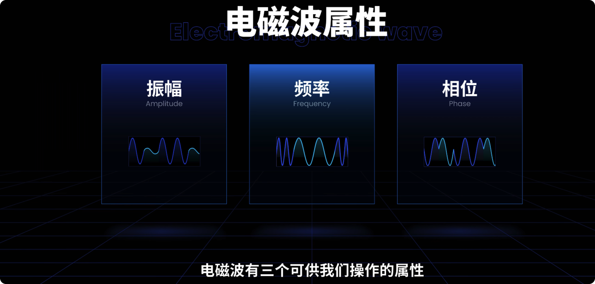​

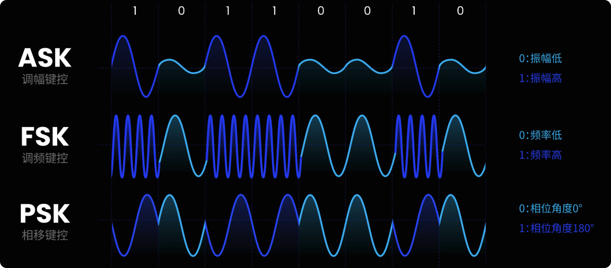

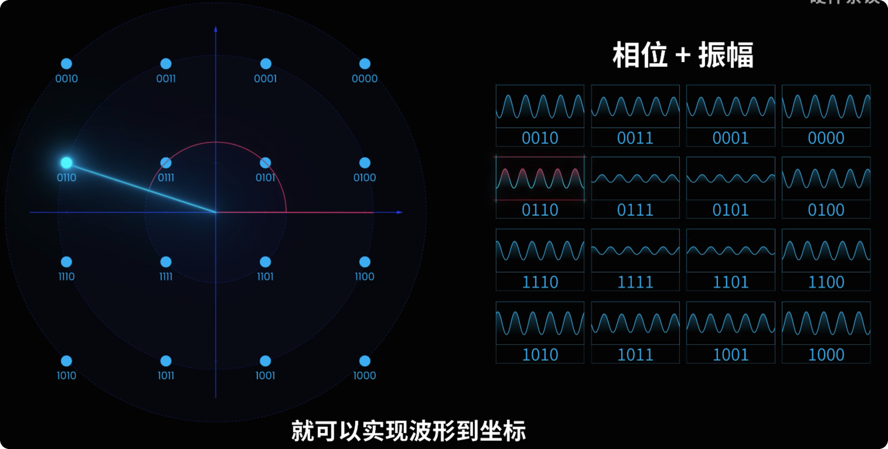

### 传播理论

电磁波**不需要传统意义上的传播介质**。它本身就是随时间变化的电场和磁场，二者相互耦合，可以在真空中传播。

可以把它理解成：

$\text{变化的电场} \rightarrow \text{产生变化的磁场}$ $\text{变化的磁场} \rightarrow \text{产生变化的电场}$  

于是这种扰动可以不断向前传播。在真空中传播速度为：

$\boxed{c\approx3\times10^8\ \text{m/s}}$  

所以无线电波、可见光、X 射线，本质上都是电磁波，都可以穿过真空。

---

黑洞的情况则不是因为“没有传播介质”，也不是因为光速被降到了 0。

更准确地说：

> **黑洞事件视界是一个因果边界。视界以内，所有未来指向的光路都只能通向黑洞内部，无法到达外部宇宙。**

在广义相对论里，光沿着**零测地线（null geodesic）** 传播。强引力实际上是时空发生了弯曲。

可以粗略想象成：

```text
黑洞外：

光 → → → 可以朝外传播


事件视界以内：

        ↓
     所有未来方向
        ↓
      黑洞内部
```

不是光“动力不够”，而是：

> **时空结构本身已经没有一条“朝外且通向未来”的路径。**

---

一个很重要的点是：

$\boxed{\text{光在局部仍然始终以 }c\text{ 传播}}$  

即使在事件视界附近，一个自由下落的观察者局部测量光速，仍然得到 $c$。

所以不能理解成：

> 黑洞引力太大，把光速从 $c$ 减慢到 0。

更好的理解是：

> **光仍然以** **$c$** **前进，但时空被弯曲到使所有允许的“前进方向”最终都指向黑洞内部。**

---

常见的“逃逸速度超过光速”可以帮助入门，但只是牛顿力学类比。

事件视界常写成史瓦西半径：

$r_s=\frac{2GM}{c^2}$  

在这个半径以内，经典类比会说“逃逸速度大于 $c$”。

但广义相对论真正的解释是：

$\boxed{\text{事件视界改变的是因果结构，而不是给光施加阻力}}$  

所以可以总结为：

> **电磁波不需要介质，因为它是电磁场自身的传播；黑洞也不是“阻止电磁波传播”，而是事件视界以内的时空结构使任何光都不存在通向外界的未来路径。**

---

### 分类


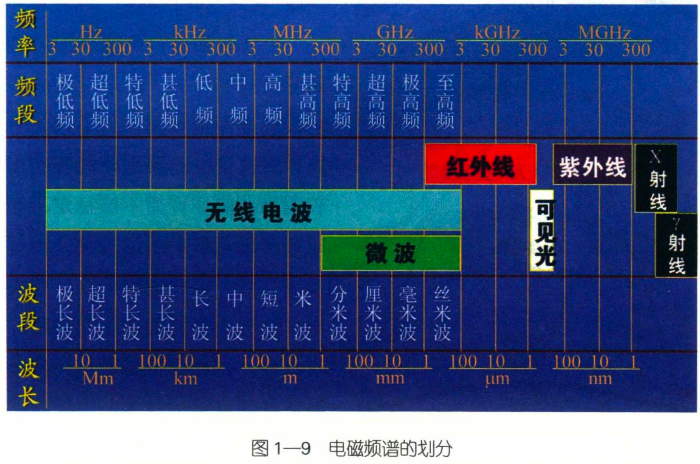

|频段名称|英文缩写|英文全称|
| ----------| ----------| --------------------------|
|甚低频|VLF|Very Low Frequency|
|低频|LF|Low Frequency|
|中频|MF|Medium Frequency|
|高频|HF|High Frequency|
|甚高频|VHF|Very High Frequency|
|特高频|UHF|Ultra High Frequency|
|超高频|SHF|Super High Frequency|
|极高频|EHF|Extremely High Frequency|

可以按程度来记：

$\text{Low} \rightarrow \text{Medium} \rightarrow \text{High}$  

再往上就是：

$\text{Very High} \rightarrow \text{Ultra High} \rightarrow \text{Super High} \rightarrow \text{Extremely High}$

‍

|频段名称|英文缩写|频率范围|基本特性|主要应用|
| ----------| ----------| -------------------------------------------------------------------------------------------------------------| ---------------------------------------------------------------------------------------------------------------------------------------------| ---------------------------------------------------------------------------------------------------------------------|
|甚低频|VLF|3～30 kHz|主要是地波传播，有较好的衍射和透射海水的性能，稳定性和可靠性强|海岸和远航船舶/潜艇间通信、水上导航、固定业务、频率和时间信号，尤其用于国际性长距离无线电导航通信|
|低频|LF|30～300 kHz|主要是地波传播，有较好的衍射和透射海水的性能，稳定性和可靠性强|中程通信、地下通信、水上导航、固定业务，尤其用于国际性长距离无线电导航通信|
|**中频**|**MF**|**300～3000 kHz**|**主要是地波传播，稳定性和可靠性强**|**国内广播和导航、固定、移动业务，尤其用于中距离点对点广播和航海**|
|高频|HF|3～30 <span data-type="text" style="background-color: var(--b3-card-info-background); color: var(--b3-card-info-color);">M</span>Hz|主要是长距离天波通信，但容易受到电离层影响|导航、广播、固定、移动等业务，特别是远程或短程点对点通信、广播和移动通信|
|甚高频|VHF|30～300 <span data-type="text" style="background-color: var(--b3-card-info-background); color: var(--b3-card-info-color);">M</span>Hz|电离层散射通信一般为 30～60 MHz；人工电离层通信一般为 30～144 MHz；流星余迹通信一般为 30～100 MHz（40～80 MHz 较适合）|导航、电视、FM 广播、雷达、固定和移动业务；短距离和中距离点对点通信、LAN、广播（TV），以及与卫星/导弹等飞行目标通信|
|特高频|UHF|300～3000 <span data-type="text" style="background-color: var(--b3-card-info-background); color: var(--b3-card-info-color);">M</span>Hz|低容量微波中继系统（8～12 路）一般为 352～420 MHz；中等容量微波中继系统（120 路）一般为 1700～2400 MHz；对流层散射通信一般为 700～10000 MHz|导航、电视、雷达、固定、移动、空间、对流层散射业务；短距离和中等距离点对点通信、LAN、广播（TV）、卫星通信|
|超高频|SHF|3～30 **G**Hz|大容量微波中继系统（6000 路）一般为 3600～4200 MHz；大容量微波中继系统（2500 路）一般为 5850～8500 MHz|导航、电视、雷达、固定、移动、空间、航空业务；短距离和中等距离点对点通信、LAN、广播（TV）、移动/个人通信、卫星通信|
|极高频|EHF|30～300 **G**Hz|视距传播|导航、固定、移动、空间业务；短距离点对点、微蜂窝、LAN、移动/个人通信、卫星通信、重返大气层通信|
|红外线|—|300～4×10⁵ **G**Hz|热效应显著，具有一定的穿透性|遥控、热成像仪、医疗、红外制导导弹等|
|可见光|—|3.84×10⁵～7.69×10⁵ **G**Hz|由紫、蓝、青、绿、黄、橙、红等七色光组成，可被人眼感知|光学成像、遥感、通信等|
|紫外线|—|7.69×10⁵～3×10⁸ **G**Hz|具有显著的化学效应和荧光效应|杀菌、消毒、治疗皮肤病和软骨病、金属探伤等|
|X 射线|—|3×10⁸～5×10¹⁰ **G**Hz|具有较强的穿透性|CT 照相、治疗肿瘤等|
|γ 射线|—|约 10⁹ **G**Hz 以上|穿透力很强，对生物肌体的破坏力很强|医学上治疗肿瘤；工业中用于探伤或流水线自动控制|

‍

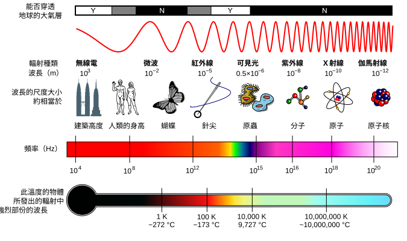​

## 波长与频率关系

$\lambda=\frac{c}{f}$  

即：**频率越高，波长越短；频率越低，波长越长。**

||修正|
| ------------------------| ---------------------------------------------------------------------------------------------------------------|
|波长越短，传播距离越长|❌ 不一定。无线通信中通常是低频、长波长更容易绕射和远距离传播；高频更容易被遮挡、吸收|
|波长越短，能量越小|❌ 如果说单个光子的能量，正好相反：$E=hf$，频率越高、波长越短，光子能量越高|
|波长越短，穿透力越强|❌ 不能一概而论。RF 范围内通常低频更容易穿过建筑、土壤等；X 射线、γ 射线又因为物理机制不同而具有很强穿透能力|

‍

对于你现在学习的 **RF / 无线通信**，可以先形成这个直觉：

> **低频、长波长：更擅长“**​**==绕==**​ **”和传播。**   
> **高频、短波长：更擅长“**​**==定向==**​ **”和传输大量数据，但更怕遮挡。**

例如：

- 几百 MHz：==绕射==能力较好，覆盖范围容易做大。
- 2.4 GHz / 5 GHz：Wi-Fi 常用，5 GHz 通常比 2.4 GHz 更容易被墙体衰减。
- 毫米波，如 28 GHz：波长很短，方向性强，但人体、墙壁、雨水都可能造成明显衰减。

另外，“**信号能量**”和“频率”要区分语境。一个 100 MHz 信号完全可以比一个 10 GHz 信号功率大得多，因为射频系统中的实际信号功率主要还取决于**==振幅和发射功率==**；只有讨论单个光子时，才直接有：

$E=hf$

所以最简洁地记：

$\boxed{\text{频率高} \Leftrightarrow \text{波长短}}$  

但：

$\boxed{\text{传播距离、穿透能力不能只由波长单独判断}}$  

---

# 调制方法

> https://www.youtube.com/watch?v=dWNj1NCEEeo


---

## PSK

### QPSK 正交相移键控

> QPSK signal generation
>
> https://www.etti.unibw.de/labalive/experiment/qpsksignalgeneration/

> QPSK 是 **Quadrature Phase Shift Keying**，中文叫 **正交相移键控**，属于一种**数字相位调制**。

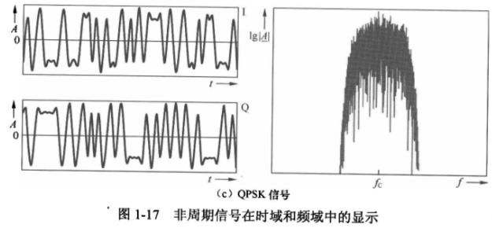​

QPSK，四比特相位偏移调制，有时也称作四相位PSK、4-PSK、4-QAM，在坐标图上看是圆上四个对称的点。通过四个相位，QPSK可以编码2比特符号。图中采用[格雷码](https://zh.wikipedia.org/wiki/%E6%A0%BC%E9%9B%B7%E7%A0%81 "格雷码")来达到最小比特差错率（BER） — 是BPSK的两倍. 这意味着可以在BPSK系统[带宽](https://zh.wikipedia.org/wiki/%E5%B8%A6%E5%AE%BD "带宽")不变的情况下增大一倍数据传送速率或者在BPSK数据传送速率不变的情况下将所需带宽减半。

数学分析表明，QPSK既可以在保证相同信号带宽的前提下倍增BPSK系统的数据速率，也可以在保证数据速率的前提下减半BPSK系统的带宽需求。在后一种情况下，QPSK的BER与BPSK系统的BER完全相同。

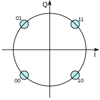​

QPSK的坐标图，其比特对映符号方式用[格雷码](https://zh.wikipedia.org/wiki/%E6%A0%BC%E9%9B%B7%E7%A0%81 "格雷码")对映。

由于无线电通信的带宽都是由FCC一类部门所事先分配规定的，QPSK较之于BPSK的优势便开始显现出来：QPSK系统在给定的带宽内可以在BER相同的情况下可以提供BPSK系统两倍的带宽。采取QPSK系统在实际工程上的代价是其接收设备要远比BPSK系统的接收设备复杂。然而，随着现代电子技术的迅猛发展，这种代价已经变得微不足道。

较之BPSK系统，QPSK系统在接收端存在相位模糊的问题，所以实际应用中经常采取差分编码QPSK的方式。

QPSK遵循如下公式：

$$
{\displaystyle s_{n}(t)={\sqrt {\frac {2E_{s}}{T_{s}}}}\cos \left(2\pi f_{c}t+(2n-1){\frac {\pi }{4}}\right),\quad n=1,2,3,4.}
$$

公式包含π/4、3π/4、5π/4与7π/4四个相位。

---

它的核心思想是：

> **不改变载波中心频率，主要通过改变载波的相位来表示数字信息。**

一个载波可以写成：

$s(t)=A\cos(2\pi f_ct+\phi)$  

QPSK 让相位 $\phi$ 取 4 种不同状态，例如：

$45^\circ,\ 135^\circ,\ 225^\circ,\ 315^\circ$

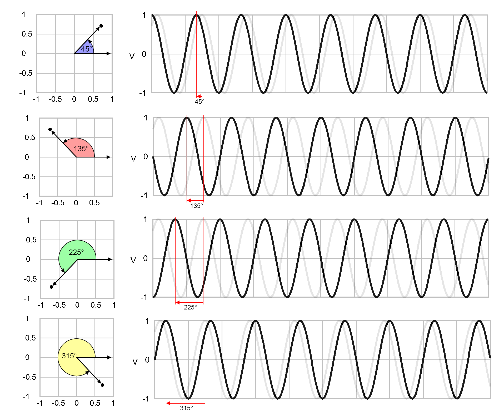​

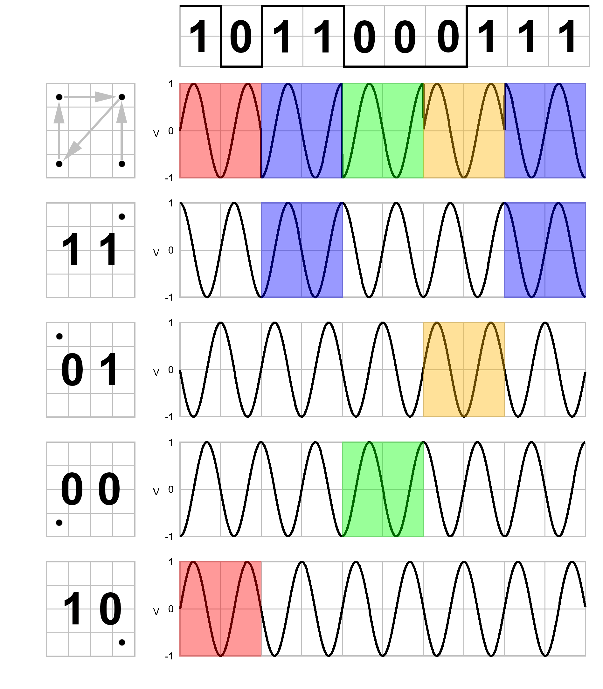

因为有 4 种状态，所以一次可以表示：

$\log_2 4=2\text{ bit}$  

例如：

|比特|相位|
| ------| ------|
|00|$45^\circ$​|
|01|$135^\circ$​|
|11|$225^\circ$​|
|10|$315^\circ$​|

因此：

$\boxed{\text{QPSK 每个符号可以携带 2 bit 信息}}$

‍

---

# 相关数学/物理知识

## 功率

功率最基本的公式是：

$\boxed{P=UI}$  

- $P$：功率，单位 W（瓦特）
- $U$：电压，单位 V
- $I$：电流，单位 A

---

如果是**纯电阻**电路，根据欧姆定律

 $U=IR$​

还可以写成：

$\boxed{P=\frac{U^2}{R}}$  

或：

$\boxed{P=I^2R}$  

在频谱仪的场景里，如果是一个正弦信号作用在 $50\Omega$ 负载上，通常使用有效值 **RMS**：

$\boxed{P=\frac{V_{\mathrm{RMS}}^2}{R}}$  

例如：

$V_{\mathrm{RMS}}=1V,\quad R=50\Omega$  

那么：

$P=\frac{1^2}{50}=0.02W=20mW$  

再换成 **dBm**：

$\boxed{P_{\mathrm{dBm}}=10\log_{10}\left(\frac{P}{1mW}\right)}$  

所以你当前最值得记住的是：

$\boxed{P=UI}$  

以及在 50 Ω 射频系统里：

$\boxed{P=\frac{V_{\mathrm{RMS}}^2}{50}}$  

‍

---

## $V_{\text{peak}}$ 峰值电压

$V_{\text{peak}}$ 就是**峰值电压**，也就是这个正弦波相对于 0V 能达到的最大电压幅度。

在：

$v(t)=V_{\text{peak}}\sin(\omega t)$  

里，因为：

$-1\le \sin(\omega t)\le1$  

所以电压范围就是：

$-V_{\text{peak}}\le v(t)\le V_{\text{peak}}$  

例如：

$V_{\text{peak}}=1V$  

那么这个正弦波最高到：

$+1V$  

最低到：

$-1V$  

因此峰**峰值**：

$V_{pp}=2V_{\text{peak}}$  

对于正弦波，还有：

$\boxed{V_{\mathrm{RMS}}=\frac{V_{\text{peak}}}{\sqrt2}}$  

所以可以记：

> $V_{\text{peak}}$<span data-type="text" style="font-size: 22px;"> = 单边最大幅度；</span>
>
> $V_{pp}$<span data-type="text" style="font-size: 22px;"> = 从最低点到最高点；</span>
>
> $V_{\mathrm{RMS}}$<span data-type="text" style="font-size: 22px;"> = 用来计算等效功率的有效值。</span>

‍

## RMS **均方根值**

RMS 是 **Root Mean Square**，中文叫 **均方根值**，在交流信号里通常也叫 **有效值**。

在你这个频谱仪语境里，**正弦电压**：

$v(t)=V_{\text{peak}}\sin(\omega t)$  

它的 RMS 值是：

$\boxed{V_{\mathrm{RMS}}=\frac{V_{\text{peak}}}{\sqrt{2}}}$  

RMS 的意义是：

> **这个交流电压在电阻上产生的平均功率，等效于多大的**​**<u>直流</u>**​**电压。**

例如一个正弦波峰值：

$V_{\text{peak}}=1V$  

那么：

$V_{\mathrm{RMS}}=\frac{1}{\sqrt2}\approx0.707V$  

如果接在 $50\Omega$ 负载上：

$P=\frac{V_{\mathrm{RMS}}^2}{R}$  

所以：

$P=\frac{0.707^2}{50}=0.01W=10mW$  

也就是：

$10\text{ dBm}$  

所以在频谱仪里，**RMS 主要是为了把交流电压正确换算成功率**。

你可以简单记：

$\boxed{\text{RMS = 交流信号的“等效直流值”}}$  

对于正弦波：

$\boxed{V_{\mathrm{RMS}}=0.707V_{\mathrm{peak}}}$  

---

## 对数

​`log、lg、ln` 可以把它们统一成一句话理解：

> **对数是在问：“底数要乘方多少次，才能得到这个数？”**

### 1. `log` 

一般形式：

$\boxed{\log_a b=c}$  

它等价于：

$\boxed{a^c=b}$  

例如：

$\log_{10}1000=3$  

因为：

$10^3=1000$  

所以对数本质上就是**指数运算的逆运算**。

### 2. `lg`​

​`lg` 通常专门表示**以 10 为底的对数**：

$\boxed{\lg x=\log_{10}x}$  

例如：

$\lg 100=2$  

因为：

$10^2=100$  

常见值：

$\lg1=0$  

$\lg10=1$  

$\lg100=2$  

$\lg1000=3$  

$\lg0.1=-1$  

因为：

$10^{-1}=0.1$  

---

这正是频谱仪里最重要的对数，因为：

$\boxed{\mathrm{dB}=10\lg\left(\frac{P_2}{P_1}\right)}$  

也就是：

$10\log_{10}$  

---

### 3. `ln`​

​`ln` 表示**自然对数**，底数是：

**e 是“把离散增长无限细分成连续增长”时自然出现的数。**

$e\approx2.71828$  

所以：

$\boxed{\ln x=\log_e x}$  

例如：

$\ln e=1$  

因为：

$e^1=e$  

以及：

$\ln(e^3)=3$  

​`ln` 在微积分、指数增长、微分方程、RC 电路、信号处理里非常常见。

比如电容放电：

$V(t)=V_0e^{-t/RC}$  

反过来求时间时就会出现：

$\ln$  

---

**三者关系：**

可以这样记：

$\boxed{\lg x=\log_{10}x}$  

$\boxed{\ln x=\log_e x}$  

而：

$\boxed{\log_a x}$  

是一般形式。

---

### 最重要的对数运算规则

<span data-type="text" style="background-color: var(--b3-card-info-background); color: var(--b3-card-info-color);">乘法变加法</span>

$\boxed{\log(ab)=\log a+\log b}$  

例如：

$\lg(100\times1000) = \lg100+\lg1000 = 2+3=5$

除法变减法

$\boxed{ \log\left(\frac ab\right) = \log a-\log b }$  

---

乘方变乘法

$\boxed{ \log(a^n)=n\log a }$  

---

这就是为什么学 dB 时：

$10\lg\left(\frac{V_2^2}{V_1^2}\right)$

可以变成：

$20\lg\left(\frac{V_2}{V_1}\right)$

因为：

$\lg(x^2)=2\lg x$

于是：

$10\times2=20$

## dB 分贝

> 来源：百度百科
>
> https://baike.baidu.com/item/%E5%88%86%E8%B4%9D/553473

分贝（decibel）是表示**两个相同单位**的物理量的**比例**，**或一个物理量相对于参考值的比例的计量单位**，常用分贝，即 dB 表示。分贝最初用于长途通讯行业，后来在声学、电磁学等领域推广。可表示为：

1. 表示功率量之比的一种单位，等于功率强度之比的常用对数的10倍。
2. 表示场量之比的一种单位，等于场强幅值之比的常用对数的 20 倍。
3. 声压级的单位，利用声压与参考值（20 微帕斯卡）的比例计算得到。

---

### 功率量计算方法

两个功率量的比值可以用分贝作为单位。功率值 $P_1$ 与另一个功率量 $P_0$ 之比用分贝表示为 $L_{dB}$：

$$
L_{dB}=10\log_{10}\left(\frac{P_1}{P_0}\right)
$$

以 10 为底两个功率值的比值的对数，就是贝尔（bel）值。两个功率量之比的贝尔值是分贝值的 $\frac{1}{10}$ 倍。**$P_1$** **与** **$P_0$** **必须度量同一个数值类型，具有相同的单位。**

如果在上式中

-  $P_1=P_0$，那么 $L_{dB}=0$。
- 如果 $P_1$ 大于 $P_0$，那么 $L_{dB}$ 是正的；
- 如果 $P_1$ 小于 $P_0$，那么 $L_{dB}$ 是负的。

### 场量计算方法

考虑到场的幅值时，通常使用 $A_1$（实际幅值）的平方与 $A_0$（参考幅值）的平方之比。这是因为大多数情况下，功率与幅值的平方成正比，并期望对同一物理量采取功率计算的分贝与用场的幅值计算的分贝相等。因此<span data-type="text" style="background-color: var(--b3-card-error-background); color: var(--b3-card-error-color);">场量</span>的分贝定义

如下：

$$
L_{dB}
=
10\log_{10}\left(\frac{A_1^2}{A_0^2}\right)
=
20\log_{10}\left(\frac{A_1}{A_0}\right)
$$

即：

$$
10\log_{10}\left(\frac{a^2}{b^2}\right)
=
20\log_{10}\left(\frac{a}{b}\right)
$$

这可由对数的性质得出。

> 在 dB 计算语境里，电压 $V$、电流 $I$、声压等常被归到\*\*幅度量/场量（field quantity）\*\*这一类，因为在**阻抗不变**时，功率与它们的平方成正比：
>
> $P=\frac{V^2}{R}$
>
> 所以功率比：
>
> $10\log_{10}\left(\frac{P_2}{P_1}\right)$
>
> 可以写成：
>
> $$
> 10\log_{10}\left(\frac{V_2^2}{V_1^2}\right)
> =
> \boxed{20\log_{10}\left(\frac{V_2}{V_1}\right)}
> $$
>
> 因此你说得对：**电压比确实用** **$20\log$**。
>
> 例如电压翻倍：
>
> $\frac{V_2}{V_1}=2$
>
> 则：
>
> $20\log_{10}(2)\approx 6.02\text{ dB}$
>
> 所以：
>
> $\boxed{\text{电压翻倍}\approx +6\text{ dB}}$
>
> 而功率翻倍：
>
> $10\log_{10}(2)\approx3.01\text{ dB}$
>
> 即：
>
> $\boxed{\text{功率翻倍}\approx +3\text{ dB}}$
>
> 最重要的前提是：**两次电压比较时阻抗相同**。否则不能直接用 $20\log(V_2/V_1)$ 来代表功率差。

电子电路中，阻抗不变时，耗散功率通常与电压或电流的平方成正比。以电压为例，有下述方程：

$$
G_{dB}
=
20\log_{10}\left(\frac{V_1}{V_0}\right)
$$

其中 $V_1$ 是电压的测量值，$V_0$ 是指定的参考电压，$G_{dB}$ 是用分贝表示的功率增益。类似的公式对电流也成立。

### 计算例子

- 计算 $1\,\text{kW}$（即 1 千瓦）与 $1\,\text{W}$ 之比的分贝值：

$$
G_{dB}
=
10\log_{10}\left(\frac{1000W}{1W}\right)
=
30dB
$$

- 计算 $\sqrt{1000}V\approx31.62V$ 与 $1V$ 之比的分贝值：

$$
G_{dB}
=
20\log_{10}\left(\frac{31.62V}{1V}\right)
=
30dB
$$

注意到：

$$
\left(\frac{31.62V}{1V}\right)^2
\approx
\frac{1kW}{1W}
$$

这解释了上述 $G_{dB}$ 的定义具有相同的值——$30dB$，不论是用功率值还是用电压幅值计算出来的，只要在特定系统中，功率之比正比于幅值之比的平方。

- 计算 $1mW$（one milliwatt）与 $10W$ 之比的分贝值：

$$
G_{dB}
=
10\log_{10}\left(\frac{0.001W}{10W}\right)
=
-40dB
$$

- 0 分贝的功率之比的实际比值是 1，因此 0 分贝表示两个信号一样大。

- 3 分贝的功率之比的实际比值是：

$$
G
=
10^{\frac{3}{10}}\times1
=
1.99526\ldots
\approx2
$$

3dB被称为半功率点或者截止频率点。即当分贝数下降 $3dB$ 时，功率降为总功率的一半。

当分贝数增加 $3dB$ 时，功率是原功率的两倍 

‍

---

**为什么工程上特别喜欢对数：** 因为工程量可能跨度巨大。

比如功率：

$1W$  

和：

$0.000000001W$  

相差：

$10^9$倍。

直接写非常不方便。

取对数以后：

$10\lg(10^9)=90dB$  

就变得非常容易比较。

所以对数最大的工程价值之一就是：

> **把乘除关系变成加减关系，把巨大的数量级范围压缩到容易处理的范围。**

这也是为什么频谱仪纵轴大量使用：

$\boxed{dB,\ dBm}$  

---

#### dB

**结合 dB 记几个常用数字：**

功率：

所以：

$10\lg(10)=10dB \to \boxed{\text{功率变10倍}=+10dB}$  

$\boxed{\text{功率变10倍}=+10dB}$  

---

$10\lg(100)=20dB$

$\boxed{\text{功率变100倍}=+20dB}$  

---

$10\lg(1000)=30dB$  

$\boxed{\text{功率变1000倍}=+30dB}$  

---

$10\lg(10000)=40dB$  

$\boxed{\text{功率变10000倍}=+40dB}$  

---

$10\lg(10^n)=(10·n) dB$  

所以：

$\boxed{\text{功率变(10\^ n)倍}=(+10·n) dB}$  

‍

---

**功率**变 2 倍：

$10\lg2\approx3.01dB$  

所以工程上经常记：

$\boxed{\text{功率翻倍}\approx+3dB}$  

---

**电压**在相同阻抗（R，电阻）下翻倍：

$20\lg2\approx6.02dB$  

所以：

$\boxed{\text{电压翻倍}\approx+6dB}$  

---

因为 **dB 和 dBm 都使用以 10 为底的对数**。

---

#### dBm

把 **正的** **$10N\text{ dBm}$** 和负的情况放在一起记会更清楚。

dBm 的定义是：

$\boxed{ P_{\mathrm{dBm}} = 10\log_{10}\left(\frac{P}{1\text{ mW}}\right) }$  

反过来：

$\boxed{ P(\text{mW})=10^{P_{\mathrm{dBm}}/10} }$  

因此：

$\boxed{+10N\text{ dBm}=10^N\text{ mW}}$  

 $\boxed{-10N\text{ dBm}=10^{-N}\text{ mW}}$  

例如：

|dBm|实际<span data-type="text" style="color: var(--b3-font-color13);">功率</span>|
| ----: | -----------------------------------------------: |
|$+40\text{ dBm}$​|$10^4\text{ mW}=10\text{ W}$​|
|$+30\text{ dBm}$​|$10^3\text{ mW}=1\text{ W}$​|
|$+20\text{ dBm}$​|$10^2\text{ mW}=100\text{ mW}$​|
|$+10\text{ dBm}$​|$10^1\text{ mW}=10\text{ mW}$​|
|$0\text{ dBm}$​|$1\text{ mW}$​|
|$-10\text{ dBm}$​|$10^{-1}\text{ mW}=0.1\text{ mW}$​|
|$-20\text{ dBm}$​|$10^{-2}\text{ mW}=0.01\text{ mW}$​|
|$-30\text{ dBm}$​|$10^{-3}\text{ mW}=1\mu\text{W}$​|

所以可以形成一个很方便的规律：

$\boxed{\text{dBm 每增加 }10\text{ dB，实际功率乘 }10}$  

$\boxed{\text{dBm 每减少 }10\text{ dB，实际功率除以 }10}$  

但术语上要注意：

> $+20\text{ dBm}$ 是一个绝对功率值，等于 $100\text{ mW}$，不是“放大了 100 倍”。

只有比较两个 dBm 时才能说放大/衰减多少，例如：

$-20\text{ dBm}\rightarrow 0\text{ dBm}$  

相差：

$20\text{ dB}$ 

所以功率增加：

$10^{20/10}=100$倍

最简记忆：

$\boxed{+10N\text{ dBm}=10^N\text{ mW}}$  

$\boxed{-10N\text{ dBm}=10^{-N}\text{ mW}}$  

---

# ​`采样理论`​

> 基于FPGA的频谱仪数字单元设计与实现 (NaN) (z-library.sk, 1lib.sk, z-lib.sk)

电信号有==时域==和==频域==两种描述方式，能够在示波器上显示出波形的为时域描述方式，这种描述方式以时间为横轴，纵轴表示电压或电流的大小。另一种方式为**频域**描述方式，这种方式得到的是**信号中含有的所有频率成分，以及每种频率成分信号量的大小**，时域与频域描述方式如图 2-1。

频域描述方式有时域描述方式不具备的优点，可以显示信号的**谐波分量**等，还可以根据信号占用的带宽滤除噪声，提高信号接收的信噪比

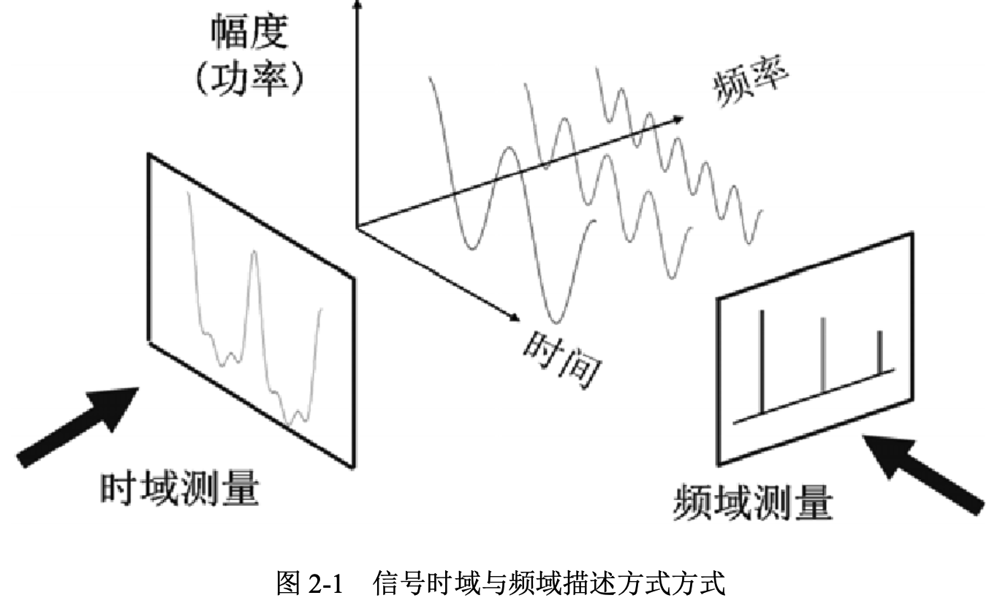​

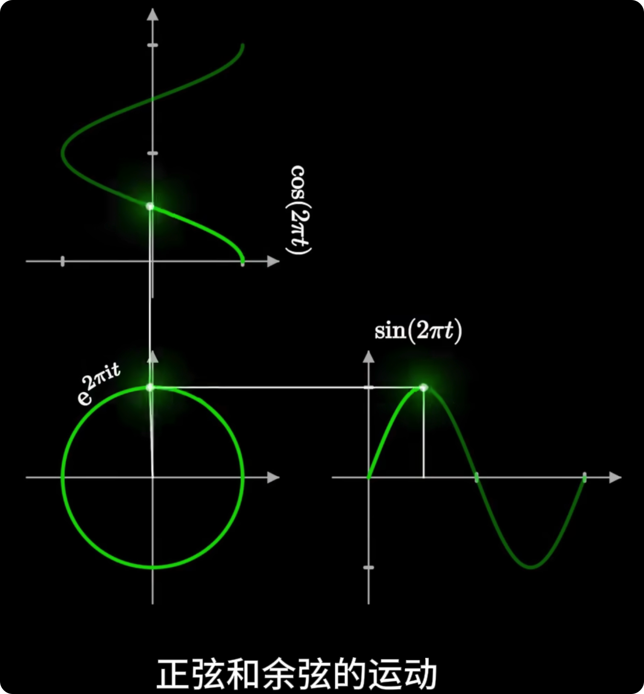​

信号的**==时域==**描述方式和**==频域==**描述方式为傅里叶变换的关系：

$$
X(f)=F\{x(t)\}
=\int_{-\infty}^{+\infty}x(t)e^{-j2\pi ft}\,dt
$$

和

$$
x(t)=F^{-1}\{X(f)\}
=\int_{-\infty}^{+\infty}X(f)e^{j2\pi ft}\,df
$$

式（2-2）

其中，$F\{x(t)\}$ 为时域信号 $x(t)$ 的傅立叶变换，$F^{-1}\{X(f)\}$ 为频域信号 $X(f)$ 的傅立叶逆变换

---

‍

## RF、IF、基带

### RF: 射频 Radio Frequency

RF 是仪器输入端看到的原始**高频**信号。

例如：

$f_{RF}=2.4\text{ GHz}$  

可以写成：

$v(t)=A\cos(2\pi\cdot2.4\text{GHz}\cdot t)$

它可能来自：

- Wi-Fi
- 蓝牙
- 手机通信
- 雷达
- 信号发生器

对频谱分析仪来说，前面板的 **RF Input** 接收到的就是这种信号。

---

### IF：中频 Intermediate Frequency

> **MF 和 IF 中文都可能被翻译成“中频”，但它们不是同一个概念。**
>
> 区别在于：
>
> - **MF（Medium Frequency）** ：指的是**无线电频段分类中的中频 300 kHz～3 MHz（中频**​**频段** **）**
> - **IF（Intermediate Frequency）** ：指的是**射频系统超外差架构中的中间**​**==处理==**​**频率（中间**​**频率** **）**
>
> 虽然中文都叫“中频”，但英文含义不同。

RF 频率可能非常高，不方便直接处理，所以通过混频器把它搬到较低的固定频率。

例如：

$f_{RF}=2.4\text{ GHz}$  

本振：

$f_{LO}=2.3\text{ GHz}$

> 本振 LO 是 **Local Oscillator，本地振荡器**，它会产生一个==频率可控、较稳定的正弦信号，送入混频器。==
>
> 它的主要作用是和输入 RF 信号进行混频，把原本较高的射频信号“搬移”到较低、方便处理的 IF 或基带频率。例如：
>
> $2.4\text{ GHz RF} - 2.3\text{ GHz LO}=100\text{ MHz IF}$ 所以可以简单记成：
>
>> **LO 就是频谱仪内部用来“搬频”的参考信号源。**
>>

混频产生差频：

$f_{IF}=|f_{RF}-f_{LO}|$  

于是：

$f_{IF}=100\text{ MHz}$  

也就是：

```text
2.4 GHz RF
    ↓ 混频
100 MHz IF
```

这里需要注意：

> RF 和 IF 往往只是“载波所在频率不同”，信号携带的信息并没有因此消失。

为什么要 IF？

因为我们可以针对固定的：$100\text{ MHz}$  

设计性能很好的放大器、滤波器和 ADC，而不需要让这些模块直接覆盖几 GHz、几十 GHz。

---

### BB: 基带Baseband

**基带（Baseband）首先是一个“频率位置/信号表示”的概念，不是某一个特定硬件。** 

如果继续把 IF 或 RF 搬到接近：

$0\text{ Hz}$  

的位置，就得到了**==基带==**。

‍

例如，原本一个信号占据：

$2.39\text{ GHz}\sim2.41\text{ GHz}$  

中心频率：

$2.4\text{ GHz}$  

如果用：

$2.4\text{ GHz}$  

的 LO 做正交下变频，那么信号==**中心**==可以被搬到：

$0\text{ Hz}$  

附近，变成：

$-10\text{ MHz}\sim+10\text{ MHz}$  

这就是基带信号。

```text
原始 RF：

						        信号
						          ↓
						----------▲----------------------→ f
						        2.4 GHz


下变频之后：

      信号
        ↓
--------▲------------------------→ f
        0
      基带
```

这时候通常使用：

$I(t)+jQ(t)$  

表示信号，也就是你之前见过的 **IQ 数据**。

‍

当然，实际仪器里会有专门处理基带的硬件，例如：

- Mixer
- ADC
- DDC
- FPGA
- DSP

所以：

> **基带是“信号所处的位置/表示方式”，DDC、FPGA 等才是处理它的硬件。**

---

‍

**搬到 0 Hz，不会把信号“压没”**

这里最容易误解的是：

> “搬到 0 Hz”不是把整个信号所有频率都变成 0 Hz。

而是：

$\boxed{\text{把信号的中心频率搬到 0 Hz}}$  

例如原来的 RF 信号：

```
频率

        信号带宽
      ┌─────────┐
______│_________│__________
    2.39G     2.41G
          ↑
        2.4GHz
```

用 2.4 GHz 进行==下变频==，相当于所有频率都减去：

$2.4\text{ GHz}$  

于是：

$2.39G-2.4G=-10MHz$  

$2.40G-2.4G=0$  

$2.41G-2.4G=+10MHz$  

所以变成：

```
频率

       基带信号
      ┌─────────┐
______│_________│__________
    -10M       +10M
          ↑
         0 Hz
```

信号的**相对频率关系、带宽、幅度、相位、调制信息都还存在**。

只是整个频谱平移了：

$\boxed{f_{\text{baseband}}=f_{\text{RF}}-f_{\text{LO}}}$​

---

**如果真的是一个纯 2.4 GHz 正弦波呢？**

例如：

$x(t)=A\cos(2\pi\cdot2.4G\,t+\phi)$  

如果恰好用：

$f_{LO}=2.4\text{ GHz}$  

下变频，那么这个纯载波确实会被搬到：

$0\text{ Hz}$  

但它不是“消失”了。

在 IQ 基带中，它可能表现成一个固定的复数：

$\boxed{I+jQ=Ae^{j\phi}}$  

也就是说：

- 振幅 $A$ 还在
- 相位 $\phi$ 还在
- 只是它不再高速旋转了

你可以把它想象成：

> 原来一个指针每秒转 24 亿圈；现在你自己也跟着它以每秒 24 亿圈旋转，于是在你的参考系里，这个指针看起来静止了。

这就是下变频非常好的直觉。

所以最核心的一句话是：

> **DDC 不是把信号压成 0，而是把“中心频率”移到 0 Hz，让我们只处理它相对于中心频率的变化。**

这也是为什么频谱仪可以把几 GHz 的 RF 信号变成几十 MHz 的 IQ 数据，再交给 FPGA 做 FFT。

‍

---

**一个具体超外差频谱仪例子：**

假设频谱仪要观察一个：

$2.45\text{ GHz}$  

的信号。

‍

第一步，RF：

$\boxed{2.45\text{ GHz}}$  

进入频谱仪。

‍

然后假设 LO：

$2.35\text{ GHz}$  

混频：

$2.45-2.35=0.10\text{ GHz}$  

得到：

$\boxed{100\text{ MHz IF}}$  

然后**数字下变频 DDC** 再用：

$100\text{ MHz}$  

把它搬到：

$\boxed{0\text{ Hz附近的基带}}$  

所以整条链：

$\boxed{ 2.45\text{ GHz RF} \rightarrow 100\text{ MHz IF} \rightarrow 0\text{ Hz附近 Baseband} }$  

接下来 FPGA 就可以对基带 IQ 数据做：

$FFT$  

得到频谱。

---

### 为什么不直接处理 RF？

假设频谱仪最高要测：$26.5\text{ GHz}$

**如果直接 ADC 采 26.5 GHz 信号，对 ADC 采样率、模拟带宽、数据吞吐量的要求都会非常高**。

所以更常见的方法是：

$\boxed{\text{先把高频信号搬低，再数字处理}}$  

也就是：

```text
高频 RF
  ↓
Mixer
  ↓
较低 IF
  ↓
ADC
  ↓
IQ / Baseband
  ↓
FFT
```

---

三者最简单的记忆方式

|名称|英文|可以怎么理解|
| ------| ------------------------| ----------------------|
|RF|Radio Frequency|原始高频信号|
|IF|Intermediate Frequency|搬频后的中间频率|
|BB|Baseband|搬到 0 Hz 附近的信号|

可以把它想成搬家：

> **RF 是信号原来的地址，IF 是中转站，Baseband 是送到数字处理最方便的位置。**

信号的“内容”基本没变，主要变化的是它所在的**频率位置**。

---

# 信号调制与解调

```verilog
信号调制与解调
https://zhuanlan.zhihu.com/p/517843859
```

# FT 傅里叶变换

> FT  - Fourier Transform

傅里叶变换用于在**时域**和**频域**之间转换信号表示。

### 1. 基本思想

一个复杂信号可以看作多个不同频率、不同幅度、不同相位的正弦/余弦信号叠加。

因此：

$\boxed{\text{时域信号} \xrightarrow{\text{傅里叶变换}} \text{频域成分}}$  

傅里叶变换相当于把复杂波形“==拆解==”，得到其中包含哪些频率，以及各频率成分的幅度和相位。

---

### 2. FT 傅里叶变换

连续傅里叶变换：

$X(f)=\int_{-\infty}^{+\infty}x(t)e^{-j2\pi ft}\,dt$  

方向为：

$\boxed{x(t)\rightarrow X(f)}$

**时域 → 频域**

其中：

- $x(t)$：时域信号
- $X(f)$：频域信号
- $f$：频率
- $\boxed{j=\sqrt{-1}}$ , 它是**虚数单位**

---

### 3. IFT 逆傅里叶变换

> IFT - Inverse Fourier Transform

$x(t)=\int_{-\infty}^{+\infty}X(f)e^{j2\pi ft}\,df$  

方向为：

$\boxed{X(f)\rightarrow x(t)}$  

即：

**频域 → 时域**

可以理解为将不同频率成分重新“合成”为原始波形。

---

### 4. DFT 与 FFT

> 离散傅里叶变换
>
> DFT - Discrete Fourier Transform
>
> ‍
>
> 快速傅里叶变换
>
> FFT - Fast Fourier Transform

数字系统中，ADC 得到的是离散采样数据：

$x[0],x[1],\ldots,x[N-1]$  

因此使用 **==DFT（离散傅里叶变换）==** ：

$X[k] = \sum_{n=0}^{N-1} x[n]e^{-j(2\pi kn)/N}$  

其中：

- $n$：时间采样点**索引**
- $k$：频率点**索引**

这里的 $\frac{2\pi kn}{N}$ 本质上表示一个**旋转角度**。随着 $n$ 增加，这个复指数会在复平面上不断旋转，这正是 DFT 用来“检测某个频率成分”的关键。

==FFT（Fast Fourier Transform）不是新的变换==，而是：

$\boxed{\text{FFT = 快速计算 DFT 的算法}}$  

因此：

$\boxed{x[n]\xrightarrow{\mathrm{FFT}}X[k]}$​

---

### 5. 在频谱分析仪中的作用

频谱分析仪可以对 ADC 获取的时域采样数据进行 FFT：

```text
时域采样 x[n]
      ↓
     FFT
      ↓
频域数据 X[k]
```

从而得到信号中的各个频率成分。

例如一个信号由：$1\text{ kHz}+3\text{ kHz}$  

两个正弦波组成，时域中它们叠加成一个复杂波形，而 FFT 后可以直接看到 1 kHz 和 3 kHz 两个频谱峰。

---

**核心记忆**

$\boxed{\text{傅里叶变换：拆解}}$

$\boxed{\text{FFT：时域}\rightarrow\text{频域}}$

对于频谱分析仪，可以简单理解为：

> **通过 FFT 将采样波形拆解成不同频率成分，从而形成频谱。**

$\boxed{\text{逆傅里叶变换：合成}}$

 $\boxed{\text{IFFT：频域}\rightarrow\text{时域}}$

# 频谱仪与示波器

> 示波器观察时域（Time Domain），频谱分析仪观察频域（Frequency Domain）。

它们之==间最核心的==桥梁就是：

$\boxed{\text{傅里叶变换 Fourier Transform}}$  

简单理解：

$$
\text{时域波形}
\quad\xrightarrow{\text{Fourier Transform}}\quad
\text{频域频谱}
$$

也就是说：

```
        示波器看到的
         x(t)
          │
          │ Fourier Transform
          ↓
	      X(f)
	   频谱仪看到的
```

举个更典型的例子。

假设示波器看到一个方波：

```
电压
 ↑
   ┌────┐      ┌────┐
   │    │      │    │
───┘    └──────┘    └────→ 时间
```

你可能觉得：

> “就是一个方波。”

但是从频域来看，它其实不是只有一个频率。

理想方波可以展开成很多正弦波：

$$
x(t)=
\sin(\omega t)
+\frac13\sin(3\omega t)
+\frac15\sin(5\omega t)
+\cdots
$$


所以频谱分析仪看到的是：

```
功率
 ↑
 |
 | ▲
 | │
 | │
 | │         ▲
 | │         │         ▲
 | │         │         │
 |_|_________|_________|________→ 频率
   f        3f        5f
```

这里：

- $f$：基波
- $3f$：三次谐波
- $5f$：五次谐波

于是会出现一个很重要的认知：

> **示波器告诉你“它长什么样”，频谱仪告诉你“它是由什么组成的”。**

‍

---

## 基波与谐波

可以把**==基波==**​==理解成“主频率”==，把**==谐波==**​==理解成“这个主频率的整数倍频率成分”==。

假设一个周期信号的最低主要频率是：

$f_0=1\text{ kHz}$那么：

$1f_0=1\text{ kHz}$叫**基波（Fundamental）** 。

而：

$$
2f_0=2\text{ kHz},\quad
3f_0=3\text{ kHz},\quad
4f_0=4\text{ kHz}
$$

分别叫：

- 二次谐波
- 三次谐波
- 四次谐波

所以可以记成：

$\boxed{\text{第 }n\text{ 次谐波}=n f_0}$  

比如频谱仪上可能看到：

```
功率
 ↑
 |
 |        ▲
 |        │
 |        │
 |        │       ▲
 |        │       │       ▲
 |________│_______│_______│________→ 频率
         1kHz    2kHz    3kHz
          ↑       ↑       ↑
        基波    二次谐波 三次谐波
```

‍

### 为什么会有谐波？

最关键的一点是：

> **纯正弦波只有基波，没有谐波。**

比如：

$x(t)=\sin(2\pi\cdot1000t)$  


它就是一个非常纯的 1 kHz 正弦波。

频谱里理想情况下只有：

```
           ▲
           │
___________│____________
          1kHz
```

但如果波形不是纯正弦波，例如方波：

```
   ┌────┐      ┌────┐
   │    │      │    │
───┘    └──────┘    └────
```

它其实可以看成很多正弦波叠加出来的。

理想对称方波大致可以写成：

$$
x(t)
=
\sin(\omega t)
+
\frac13\sin(3\omega t)
+
\frac15\sin(5\omega t)
+\cdots
$$

所以如果方波基频是 1 kHz，频谱中会看到：

$1\text{ kHz},3\text{ kHz},5\text{ kHz},7\text{ kHz}\ldots$也就是：

这说明一个非常重要的概念：

> **复杂的周期波形，可以看成一个基波加上一堆谐波。**

这就是==傅里叶级数==背后的核心思想。

```
幅度
 ↑
 |
 | ▲
 | │
 | │
 | │         ▲
 | │         │         ▲
 | │         │         │
 |_|_________|_________|________→
 1k        3k        5k
 基波      三次       五次
```

---

你也可以从“波形为什么会变形”来理解谐波。

先有一个纯基波：

```
      /\
     /  \
____/    \____
```

再加一点三次谐波、五次谐波：

```
基波 + 三次谐波 + 五次谐波
```

合成出来的波形就会越来越不像正弦波，甚至慢慢接近方波。

所以：

> **谐波其实是在塑造波形的形状。**

只有基波时，波形是纯正弦。

谐波越多，波形通常越“复杂”。

---

## **谐波失真**

> https://zhuanlan.zhihu.com/p/617565407

在你的频谱仪工作里，还有另一种非常重要的情况：**谐波失真**。

比如你给一个放大器输入一个纯净的：$1\text{ GHz}$ 正弦波。

理想放大器应该只输出：$1\text{ GHz}$  

但真实放大器存在非线性，可能产生：$2\text{ GHz},3\text{ GHz},4\text{ GHz}$ 于是频谱仪看到：

```
功率
 ↑
 |
 |             ▲
 |             │
 |             │
 |             │
 |             │        ▲
 |             │        │        ▲
 |_____________│________│________│______
              1GHz     2GHz     3GHz
               ↑        ↑        ↑
              基波    二次谐波  三次谐波
```

这里输入明明只有 1 GHz，但设备自己“制造”出了 2 GHz、3 GHz。

这通常说明：

$\boxed{\text{系统存在非线性}}$  

因此工程师经常用频谱仪测：

- 二次谐波
- 三次谐波
- 谐波失真
- THD（Total Harmonic Distortion，总谐波失真）：将各谐波引起的失真叠加起来，就是[总谐波失真度](https://zhida.zhihu.com/search?content_id=225367959&content_type=Article&match_order=1&q=%E6%80%BB%E8%B0%90%E6%B3%A2%E5%A4%B1%E7%9C%9F%E5%BA%A6&zhida_source=entity)

来判断设备性能。

你可以先牢牢记住一句：

> **基波是信号最基本的周期成分；谐波是基波整数倍频率上的成分。纯正弦波只有基波，非正弦周期信号通常包含多个谐波。**

还有一个容易混淆的地方：**==谐波一定是整数倍，但杂散（spurious）不一定是整数倍==**​ **。**  这个区别对频谱分析仪非常重要。

  

---

比如一个放大器输入一个非常干净的：

$1\text{ GHz}$正弦信号。

示波器上可能还是看起来：

```
~~~~~~~正弦波~~~~~~~
```

似乎没什么异常。

但频谱仪一看：

```
                     基波
                       ▲
                       │
                       │
                       │
            杂散 ▲      │       ▲ 谐波
                │      │       │
________________│______│_______│________
```

你会发现：

- 1 GHz：主信号
- 2 GHz：二次谐波
- 3 GHz：三次谐波
- 其他位置：杂散
- 底部：噪声

这也是为什么射频工程里频谱分析仪特别重要。

因为很多 RF 问题（射频，Radio Frequency）：**谐波、杂散、邻道泄漏、相位噪声、噪声底、互调失真**

从时域波形上非常难直接看出来，但频域里非常明显。

不过再补一个重要的严谨点：现代仪器之间并不是绝对分开的。

现代数字示波器通常也能对采样数据做 FFT，所以：

> **示波器也可以看频域。**

而现代实时频谱分析仪也会保存 IQ 数据，所以也能够观察：

> **信号随时间发生了什么变化。**

因此“示波器 \= 时域、频谱仪 \= 频域”讲的是它们各自最核心、最擅长的观察方式，而不是说它们只能做这一件事。

你现在可以先牢牢记住这组对应关系：

$$
\boxed{
\begin{array}{ccc}
\text{示波器} &:& \text{时间} \rightarrow \text{电压}\\
\text{频谱仪} &:& \text{频率} \rightarrow \text{幅度/功率}
\end{array}}
$$

再更形象一点：

> **示波器问：“信号什么时候发生了什么？”**
>
> **频谱仪问：“信号里面有哪些频率？各有多强？”**

‍

# `超外差频谱分析仪`​

## 概述

经典扫频超外差频谱分析仪（Swept Superheterodyne Spectrum Analyzer）是一种利用**混频器（Mixer）+ 可扫频本振（LO）+ 中频滤波器（IF Filter）** 实现频谱测量的仪器。思想是把不同 RF 频率依次“搬运”到**==固定==**的中频，再测量它们有多强。

其基本思想是：==输入的 RF 信号包含多个频率成分，频谱仪不会一次性分析全部频率，而是通过改变本振频率，将不同 RF 频率依次搬移到一个固定的中频（IF），然后对该固定频率上的信号幅度进行检测，最终得到频率与功率之间的关系==。

主信号链：

$$
\boxed{
\text{输入信号}
\rightarrow
\text{RF衰减器}
\rightarrow
\text{预选器}
\rightarrow
\text{混频器}
\rightarrow
\text{IF增益}
\rightarrow
\text{IF滤波器}
\rightarrow
\text{对数放大器}
\rightarrow
\text{包络检波器}
\rightarrow
\text{视频滤波器}
\rightarrow
\text{显示}
}
$$

另外还有一条“控制链”：

$$
\boxed{
\text{扫描发生器}
\rightarrow
\text{本地振荡器 LO}
\rightarrow
\text{混频器}
}
$$

扫描发生器同时控制显示屏横轴，所以最终才能形成：

横轴 \= 频率，纵轴 \= 幅度/功率


​`图 2-1. 典型超外差频谱分析仪的结构框图`​

图2-1是一个超外差频谱分析仪的简化框图。

-  **==“外差”是指混频==**​==，即对频率进行转换==，
-  **==“超”==**​==则是指超音频频率或高于音频的频率范围==。

从图中我们看到，输入信号先经过一个衰减器，再经低通滤波器（稍后会看到为何在此处放置滤波器）到达混频器，然后与来自**本振（LO）** 的信号相混频。

‍

## 控制链

## 扫描发生器（Sweep Generator）

==扫描发生器负责控制频谱仪从低频到高频==​==**依次扫描**==​==。==

==它产生一个随时间变化的==​==**控制信号**====，用于改变本地振荡器 LO 的频率==：

$f_{LO}(t)$

例如：

```
LO 频率

 ↑
 |          /
 |        /
 |      /
 |    /
 |___/____________→ 时间
```

随着 LO 频率不断变化，不同的 RF 输入频率会依次满足：

$|f_{RF}-f_{LO}|=f_{IF}$

因此，不同 RF 频率会依次被搬到**==固定的==**  IF 频率，并通过 IF 滤波器。

例如 IF 固定为：

$100MHz$

那么扫描过程中可能出现：

$$
f_{LO}=1.0GHz
\Rightarrow
f_{RF}=900MHz
$$

$$
f_{LO}=1.1GHz
\Rightarrow
f_{RF}=1.0GHz
$$

$$
f_{LO}=1.2GHz
\Rightarrow
f_{RF}=1.1GHz
$$

所以可以理解为：

> 扫描发生器不断改变 LO，从而让频谱仪依次“检查”不同的 RF 频率。

扫描发生器还会与显示系统同步，使仪器知道当前测量结果应该放在横轴的哪个频率位置。

---

## 本地振荡器（LO，Local Oscillator）


本地振荡器==用于产生稳定、可调节的正弦波信号==，是频谱仪完成频率扫描的关键部件。

LO 的频率由扫描发生器**控制**，通过不断改变：

$$
f_{LO}
$$

使不同 RF 频率依次满足：

$$
|f_{RF}-f_{LO}|=f_{IF}
$$

由于 $f_{IF}$ 固定，因此通过改变 $f_{LO}$，就可以选择不同的 $f_{RF}$。

‍

例如固定中频：

$$
f_{IF}=100MHz
$$

当 LO 变化时：

|LO频率|被检测RF频率|
| --------| --------------|
|1.0GHz|900MHz|
|1.1GHz|1GHz|
|1.3GHz|1.2GHz|

因此在扫频频谱仪中：

$\boxed{\text{改变 LO 频率} \approx \text{改变当前正在测量的 RF 频率}}$  

LO 是实现超外差频率扫描的核心器件。

---

## 主信号

### 基准振荡器（Reference Oscillator）

**频谱仪里的基准振荡器，和示波器里的参考时钟/时基参考源是同一类角色——都是给整台仪器提供稳定的“**​**==时间/频率基准==**​ **”。**

区别只是它们服务的重点不同。

频谱仪里，基准振荡器常见是：

$10\text{ MHz Reference}$  

然后内部的 PLL、LO、本振合成器、ADC 采样时钟等都从这个参考频率派生出来。于是它直接影响：

$\boxed{\text{频率轴准不准}}$  

例如参考源偏了 1 ppm，那么由它锁定出来的 LO、采样时钟也会相应产生频率误差，最后频谱峰的位置就会偏。

示波器里也有类似的高稳定参考时钟，用来产生 ADC 采样时钟和时间基准，因此主要影响：

$\boxed{\text{时间轴准不准、采样频率准不准}}$  

比如示波器标称：

$1\text{ GS/s}$  

这个采样速率通常也是由内部参考时钟经过 PLL 等电路生成的。

所以可以对应着理解：

|仪器|基准源主要影响|
| --------| ------------------------------------------|
|频谱仪|LO、频率轴、频率测量准确度|
|示波器|ADC采样时钟、时间轴、周期/频率测量准确度|

但不要把“基准振荡器”和“ADC 采样时钟”当成同一个东西。更准确的关系是：

$\boxed{\text{基准振荡器} \rightarrow \text{PLL/时钟合成} \rightarrow \text{采样时钟/LO}}$  

例如：

$$
10\text{ MHz Reference}
\rightarrow
PLL
\rightarrow
1\text{ GHz ADC Clock}
$$

因此你可以把基准振荡器理解成：

> **整台仪器内部所有频率和时间的“母时钟/频率标尺”。**

而 ADC 时钟、LO 等，是基于这把“尺子”生成出来的具体工作时钟。

---

### RF 输入信号（RF Input）

RF 输入信号是被测信号进入频谱分析仪的入口。RF 表示 Radio Frequency（射频），通常指 MHz 到 GHz 范围内的高频电信号，例如无线通信中的 Wi-Fi、蓝牙、蜂窝通信信号等。

进入频谱仪的 RF 信号通常不是单一频率，而可能包含多个频率分量。例如输入信号可能同时包含：

$$
900MHz,\quad 1GHz,\quad 1.2GHz
$$

频谱仪的目标就是分析这些频率成分分别具有多大的功率。

==由于 RF 信号频率较高，后续电路难以直接处理，因此需要先经过衰减、滤波和混频等步骤，将高频信号转换为便于处理的中频信号==

### RF 衰减器（RF Attenuator）

RF 衰减器位于输入端，用于==控制进入后级电路的信号功率==。

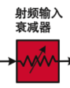

射频信号可能具有较大的输入功率，如果直接进入混频器或放大器，可能导致器件进入非线性区域，产生压缩和失真。因此，频谱分析仪通常通过设置不同的衰减值，例如：

$$
0dB,\ 10dB,\ 20dB
$$

来降低输入信号幅度。

例如：

输入信号：

$$
+10dBm
$$

经过：

$$
20dB
$$

衰减后：

$$
-10dBm
$$

进入后续电路。

RF 衰减器的主要作用是保护后级器件，同时调整仪器的动态范围。

### 预选器（Preselector）

预选器是位于混频器之前的滤波器，==用于选择目标频率范围并抑制不需要的频率==。

由于混频器会产生多个频率分量：

$$
f_{RF}+f_{LO}
$$

以及：

$$
|f_{RF}-f_{LO}|
$$

如果输入端存在大量无关频率，这些信号经过混频后可能产生假的响应，即镜像信号或杂散信号。

预选器通过提前限制输入频带，减少无关信号进入混频器，提高测量准确性。

简单理解：

> ==预选器负责“粗筛选”，先决定哪些频率可以进入后续处理。==

---

### 低通滤波器（Low-Pass Filter，LPF）

低通滤波器是一种**==允许低频信号通过、对高频信号进行衰减==**的滤波器。

其基本特性可以表示为：

$\boxed{\text{低频通过，高频衰减}}$  

低通滤波器通常有一个**==截止频率==**  ==$f_c$==。

- 当信号频率低于 $f_c$ 时，信号基本可以通过；
- 当频率高于 $f_c$ 后，信号会逐渐被衰减。

典型频率响应：

```text
增益
 ↑
 |──────────────
 |             \
 |              \
 |               \
 |________________\______→ 频率
                fc
```

对于最简单的一阶 RC 低通滤波器：

$\boxed{f_c=\frac{1}{2\pi RC}}$  

其中：

- $R$：电阻
- $C$：电容
- $f_c$：截止频率

---

**在频谱分析仪中的作用：**

在超外差频谱分析仪中，RF 衰减器之后通常会设置**低通滤波器、带通滤波器或预选器（Preselector）** ，用于限制进入混频器的 RF 频率范围，减少无关信号、镜像响应和杂散。

它的目标不是简单地“把高频全部滤掉”，而是：

$\boxed{\text{保留当前需要测量的频段，抑制不需要的频段}}$

因此，频谱仪中的前端滤波器通常不是只有一个固定低通滤波器，而可能由多个可切换滤波器组成，或者使用可调谐预选器。

例如：

```text
RF 输入
   ↓
滤波器组 / Preselector
   ├─ 0～1 GHz
   ├─ 1～3 GHz
   ├─ 3～6 GHz
   └─ 6～12 GHz
   ↓
Mixer
```

仪器会根据当前测量频段自动选择合适的滤波路径，使目标 RF 信号能够通过。

需要注意，前端滤波器的选择主要依据的是**当前 RF 频段**，例如 Center Frequency 或 Start/Stop Frequency，而不是单纯依据 扫频（Span）。

---

**与 RBW 滤波器的区别**

前端低通滤波器和 IF 中的 RBW 滤波器作用不同：

$\boxed{\text{RF前端滤波器：决定哪些大频段进入混频器}}$  

$\boxed{\text{IF/RBW滤波器：决定频率分辨能力}}$  

因此，前端滤波主要用于**频段选择和抑制无关信号**，而 RBW 主要用于**区分彼此接近的频率成分**。

---

### 混频器（Mixer）

混频器是超外差频谱仪的核心器件之一，它==负责完成频率搬移==。

混频器有两个输入：

- RF 输入信号频率：$f_{RF}$​
- 本振信号频率：$f_{LO}$​

两者相乘后会产生新的频率分量：

$$
f_{RF}+f_{LO}
$$

以及：

$$
|f_{RF}-f_{LO}|
$$

频谱仪通常利用差频：

$$
f_{IF}=|f_{RF}-f_{LO}|
$$

将不同 RF 频率转换成固定的中频。

例如：

输入：

$$
f_{RF}=2.4GHz
$$

本振：

$$
f_{LO}=2.3GHz
$$

经过混频：

$$
2.4GHz-2.3GHz=100MHz
$$

于是：

$$
2.4GHz\rightarrow100MHz
$$

这个过程称为**下变频（Down Conversion）** 。

混频器并没有改变信号携带的信息，只是改变了信号所在的频率位置。

---

### 中频增益（IF Gain）

混频后的信号进入中频放大阶段。

由于 RF 信号经过：

- 衰减器
- 预选器
- 混频器

后功率可能较低，因此需要 IF 放大器提高信号电平，使后续滤波和检测电路能够准确处理。

​==IF 增益影响仪器的灵敏度和动态范围。==

---

### 中频滤波器（IF Filter）

IF 的英文全称是：

$\boxed{\text{Intermediate Frequency}}$  

中文是：

$\boxed{\text{中间频率，通常简称中频}}$  

在超外差频谱仪里，RF 信号经过 Mixer 和 LO 混频后，会被搬到 IF，方便后续滤波、放大和检测。

> 相关阅读：
>
> 频谱仪使用过程中怎样选择最好的分辨率带宽(RBW)?
>
> https://zhuanlan.zhihu.com/p/338365205
>
> ---
>
> 频谱仪分辨率带宽(RBW)越窄越好吗？频谱仪使用过程中怎样选择最好的分辨率带宽(RBW)?
>
> https://zhuanlan.zhihu.com/p/16946092095
>
> ---
>
> 频谱仪使用过程中怎样选择最好的分辨率带宽(RBW)?
>
> https://docs.keysight.com/kkbopen/rbw-620138708.html
>
> ---
>
> 高速ADC测试和评估
>
> https://www.analog.com/cn/resources/app-notes/an-835.html

==IF 滤波器是决定频率分辨能力的重要器件（==​==**允许哪个频段范围通过**==​==）。==

经过混频后，不同 RF 信号都会被转换到固定 IF，但只有落在 IF 滤波器**通带范围**内的信号才能通过。

#### <span data-type="text" style="background-color: var(--b3-card-error-background); color: var(--b3-card-error-color);">RBW</span> 分辨率带宽

该滤波器对应频谱分析仪中的：

$$
RBW（Resolution  Bandwidth）
$$

即==分辨率带宽==。<span data-type="text" style="background-color: var(--b3-card-success-background); color: var(--b3-card-success-color);">RBW 决定仪器区分</span>==**两个相邻信号**==<span data-type="text" style="background-color: var(--b3-card-success-background); color: var(--b3-card-success-color);">的能力。</span>

例如：

两个信号：

$$
1.000GHz
$$

和：

$$
1.001GHz
$$

如果 RBW 足够小，可以分辨两个峰；如果 RBW 太大，两个信号可能融合成一个峰。

因此：

- RBW 越小（窄），频谱分析仪的底噪越低，频率**分辨率/灵敏度**越高；

  > 在使用窄RBW时，[频谱分析仪](https://zhida.zhihu.com/search?content_id=252411099&content_type=Article&match_order=6&q=%E9%A2%91%E8%B0%B1%E5%88%86%E6%9E%90%E4%BB%AA&zhida_source=entity)显示出较低的平均噪声(DANL)，且动态范围增加，灵敏度有所改进
  >
- 但RBW 越小，扫描速度通常也越慢。

---

RBW小于等于两个信号的频率间隔，可以分辨出两个信号峰。在[双音测试]()中，两个信号相隔10kHz（约 3dB），RBW＝10KHz时，仪表测试可显示出两个信号峰。显然用10kHz滤波器分辨出等幅双音信号是没有问题的。

> 双音测试（Two-Tone Test）是==向电子或音频系统输入两个==​==**频率相近**==​==的正弦波信号，用来评估其==​==**线性度**==​==和==​==**互调失真（IMD）**==​==的关键测试方法==。

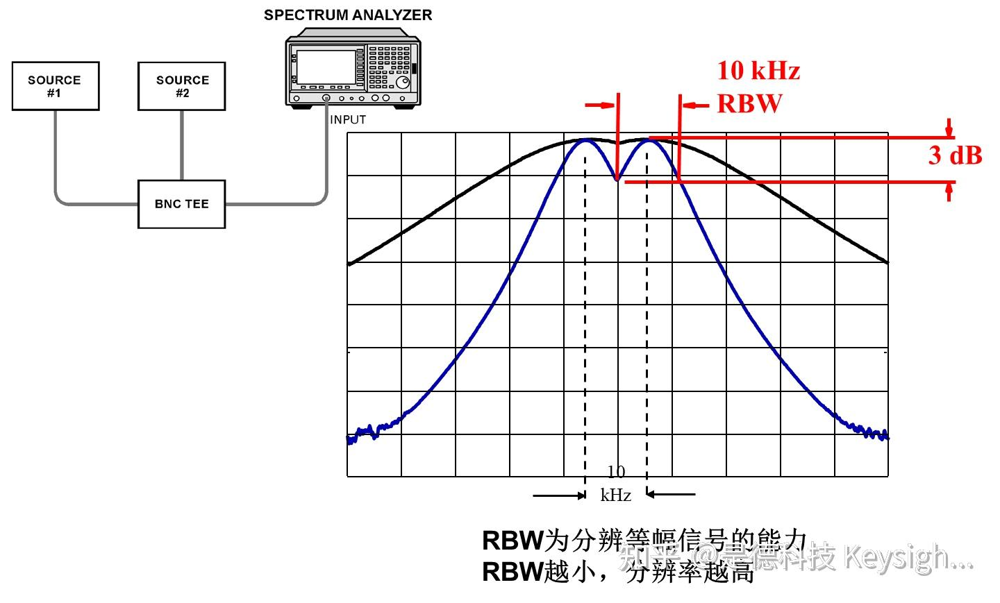​

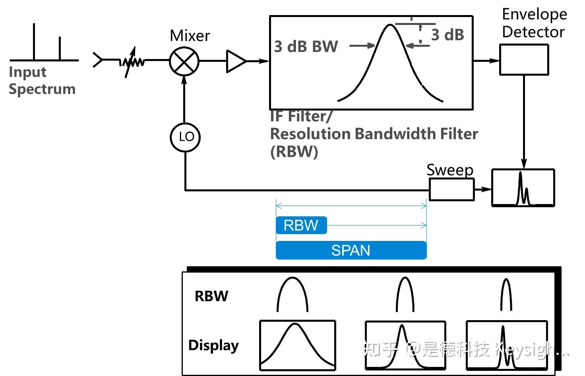​

 *•RBW是中频滤波器的3dB带宽。*   
 *•分辨带宽可自动和手动设置，自动状态下，RBW由测量扫频宽度（Span）决定*  
 *• RBW影响频谱仪的显示噪声电平，频率分辨率和测试速度*  
 *• 根据测试信号的灵敏度和频率分辨率要求设置RBW*

---

#### 怎样选择最好的分辨率带宽 **(RBW)?**

必须认真考虑分辨率带宽(RBW)的设置，因为他关系到频谱成分的分离，适宜的噪声基底的设置和信号的解调。

在进行有苛刻要求的频谱测量时，频谱分析仪必须精确、快速并具有高动态范围。在多数情况下，强调其中某一参数会对其它参数有所影响。因此在进行RBW设置时需要综合权衡这些因素。

通过低电平信号的测量，可以看到使用窄RBW的优点。==在使用窄RBW时，频谱分析仪显示出较低的平均噪声(DANL)，且动态范围增加，灵敏度有所改进。==在图1中，把RBW从100 kHz改变到10 kHz将能更好地分辨-95 dBm 的信号。

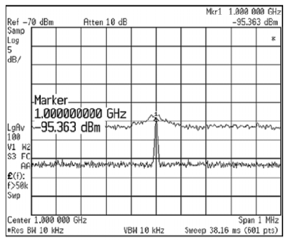

图1. 100KHz RBW 和10KHz RBW的测试结果

但并非任何情况都是最窄的RBW最好。对于调制信号，RBW一定要设置得足够宽，使它能将信号边带包括在内。如果忽略这一点，测量将是极不精确的。

==窄RBW设置的一项重要缺点是扫频速度。更宽的RBW设置在给定频率范围内允许更快的扫频==。图2和图3 比较了在200 MHz 频率范围内，10 kHz 和3 kHz RBW 的扫频时间。

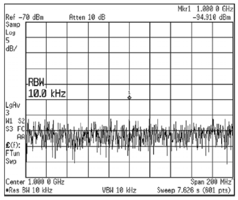

图2. 10KHz RBW的扫描时间为7.627S

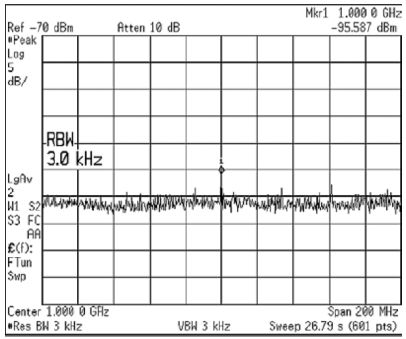

图3. 3KHz RBW的扫描时间为26.79S

---

‍

---

#### <span data-type="text" style="background-color: var(--b3-card-error-background); color: var(--b3-card-error-color);">中频 IF 不能选在待测 RF 频率范围里</span>

**中频 IF 不能随便选在待测 RF 频率范围里面，否则会出现“**​**==中频直通==**​ **”问题。**

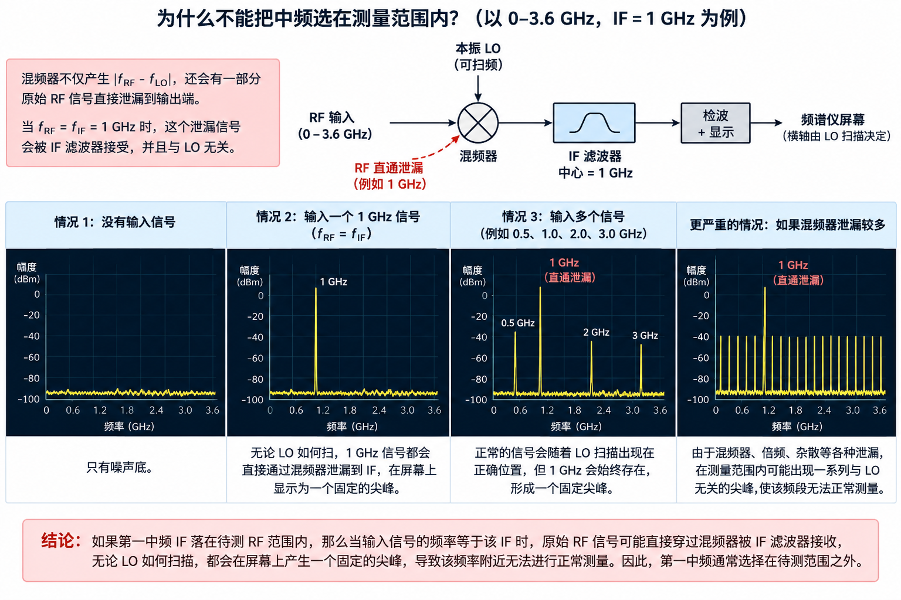

假设频谱仪要测：

$0\sim3.6\text{ GHz}$  

如果我们选择：

$f_{IF}=1\text{ GHz}$  

问题就在于：**1 GHz 本身就在待测范围里。**

正常情况下，频谱仪希望通过混频得到：

$\boxed{|f_{RF}-f_{LO}|=f_{IF}}$  

例如要测：

$f_{RF}=1\text{ GHz}$  

如果：

$f_{IF}=1\text{ GHz}$  

可以让：

$f_{LO}=2\text{ GHz}$  

于是：

$|1-2|=1\text{ GHz}$  

这个 1 GHz IF 再通过中频滤波器，完成正常测量。

但现实中的混频器并不完美。除了产生：

$f_{RF}+f_{LO}$  

和

$|f_{RF}-f_{LO}|$  

之外，还会有一部分**==原始 RF 信号直接泄漏到输出端==**。

所以，如果输入信号本身就是：

$1\text{ GHz}$  

由于：

$f_{RF}=f_{IF}=1\text{ GHz}$  

它即使**没有经过正确混频**，也可能直接从混频器“==漏过去==”，然后恰好通过 1 GHz 的 IF 滤波器：

```text
1 GHz RF 输入
      ↓
    Mixer
      ↓
  一部分直接泄漏
      ↓
   1 GHz
      ↓
IF Filter（中心也是 1 GHz）
      ↓
   顺利通过
```

这就出问题了。

正常情况下，改变 LO：

$f_{LO}$  

应该决定：

> “当前正在测哪个 RF 频率。”

但这个 1 GHz 输入根本不管 LO 是多少，它都可以直接漏进 1 GHz IF：

```text
LO = 1.2 GHz   → 仍然看到 1 GHz 泄漏 ❌
LO = 1.5 GHz   → 仍然看到 1 GHz 泄漏 ❌
LO = 2.0 GHz   → 仍然看到 1 GHz
LO = 3.0 GHz   → 仍然看到 1 GHz 泄漏 ❌
...
```

于是检波器会发现：

> “奇怪，不管 LO 扫到哪里，我一直有一个信号。”

而传统扫频频谱仪的横坐标是由 LO 扫描位置决定的，所以这种信号就无法和正常的“某一个 RF 频率被转换到 IF”区分开。

核心问题就是：

$\boxed{f_{RF}=f_{IF}}$  

导致**原始 RF 信号可以冒充正常的 IF 信号**。

因此，如果频谱仪要测：

$0\sim3.6\text{ GHz}$  

第一中频通常会故意选择在这个范围之外，例如：

$f_{IF}>3.6\text{ GHz}$  

假设：

$f_{IF}=4\text{ GHz}$  

那么待测输入最大只有：

$3.6\text{ GHz}$  

输入端永远不可能直接出现一个 4 GHz 的合法待测信号，因此就不会和 4 GHz IF 混淆。

可以把整件事记成一句话：

> **IF 如果落在频谱仪自己的 RF 测量范围内，那么一个与 IF 同频的 RF 输入可能直接穿过混频器并被 IF 滤波器接收，使测量结果不再受 LO 控制，因此形成测量盲区。**
>
> ‍
>
> 正常混频的 IF 输出必须只在特定 LO 频率下出现，这样仪器才能知道它来自哪个 RF 频率。若 RF 本身等于 IF，并能直接泄漏到 IF 通道，那么这个输出在 LO 扫描过程中一直存在，频率定位关系被破坏，幅度也可能被污染。

所以超外差频谱仪设计第一中频时，经常遵循一个很重要的思路：

$\boxed{\text{第一 IF 尽量放在待测 RF 范围之外}}$  

这也解释了为什么有些频谱仪明明最终要处理较低频率，却会先把 RF **上变频到一个很高的第一 IF**，之后再逐级下变频。

---

### 对数放大器（Log Amplifier）

射频信号的功率范围非常宽，例如：

$$
0dBm
$$

到：

$$
-100dBm
$$

相差：

$$
100dB
$$

如果使用线性显示，需要处理非常大的动态范围。

==对数放大器将信号幅度转换为对数形式，使其可以用 dB/dBm 表示==：

$$
P_{dBm}=10\log_{10}\frac{P}{1mW}
$$

因此频谱仪屏幕上的纵轴通常采用：

$$
dBm
$$

单位。

‍

---

### 包络检波器（Envelope Detector）

> 维基百科：
>
> **包络检波器**（英语：**envelope detector**）是以高频信号为输入信号并提供原始信号的[包络](https://zh.wikipedia.org/wiki/%E5%8C%85%E7%BB%9C "包络")的一种电子线路。电路中的[电容器](https://zh.wikipedia.org/wiki/%E7%94%B5%E5%AE%B9%E5%99%A8 "电容器")会在上升沿充电，并在信号下降时通过[电阻器](https://zh.wikipedia.org/wiki/%E9%9B%BB%E9%98%BB%E5%99%A8 "电阻器")缓慢释放电荷。串联的二极管将输入信号[整流](https://zh.wikipedia.org/wiki/%E6%95%B4%E6%B5%81%E5%99%A8 "整流器")，只在正输入端比负输入端电位高的时候允许电流流过。
>
> 大多数实际的包络检波器使用半波或全波[整流](https://zh.wikipedia.org/wiki/%E6%95%B4%E6%B5%81%E5%99%A8 "整流器")信号来转换[交流](https://zh.wikipedia.org/wiki/%E4%BA%A4%E6%B5%81%E9%9B%BB "交流电")音频输入到[直流](https://zh.wikipedia.org/wiki/%E7%9B%B4%E6%B5%81%E9%9B%BB "直流电")脉冲信号。然后用[滤波](https://zh.wikipedia.org/wiki/%E7%94%B5%E5%AD%90%E6%BB%A4%E6%B3%A2%E5%99%A8 "电子滤波器")来平滑最终结果。这种滤波是很少完美的，一些“纹波”会保持输出包络跟随，尤其对于低频输入（如低音吉他的音符）。更多滤波会得到更平滑的结果，但会降低响应性；因此，实际的设计必须针对应用进行优化。

包络检波器用于==从中频信号中提取==​**==幅度随时间变化的信息==**。经过 IF 滤波器之后，信号仍然是一个==高速振荡==的中频信号，例如：

$v_{IF}(t)=A(t)\cos(2\pi f_{IF}t)$  

其中 $f_{IF}$ 是中频，而 $A(t)$ 表示信号的包络，也就是信号幅度随时间的变化。

包络检波器的作用，就是尽量去掉高速振荡的载波部分，只保留：

$\boxed{A(t)}$  

也就是说，它不关心 IF 载波每秒振荡几千万、几亿次，而关心：

> “这个高速信号现在整体有多强？”

可以直观理解为：

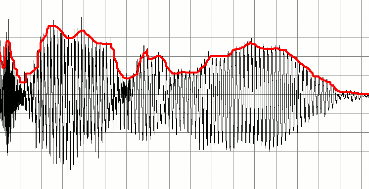

信号和它的包络（红色）

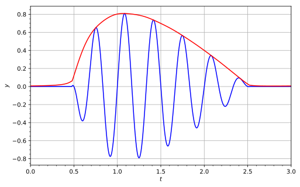

信号（蓝）与其[解析信号](https://zh.wikipedia.org/wiki/%E8%A7%A3%E6%9E%90%E4%BF%A1%E5%8F%B7 "解析信号")的幅度（红），显示了包络效果

因此，包络检波器把“高速 IF 波形”转换成了一个较慢变化的**==幅度==**信号，使后续电路可以判断：

> 当前扫描到的频率位置上，信号到底有**多强。**

在传统扫频频谱仪中，这一步非常关键，因为屏幕纵轴最终需要显示的就是各频率位置对应的幅度或功率，而不是 IF 载波本身的高速振荡波形。

---

### 视频滤波器（Video Filter）

视频滤波器位于包络检波器之后，是一个==用于平滑==​==**检波输出**==​==的低通滤波器==。

**这里的“Video”并不是指视频或图像，而是历史上把检波后的**​**==低频幅度信号称为 Video Signal==**​ **，因此对这个信号进行滤波的电路称为 Video Filter。**

包络检波后的信号可能包含明显的噪声和快速波动，例如：

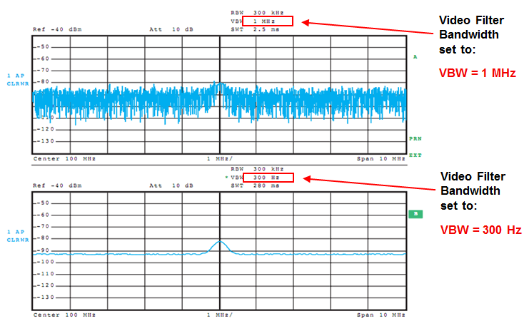

---

#### VBW 视频带宽

视频滤波器通常对应频谱仪参数：

$\boxed{\text{VBW = Video Bandwidth}}$  

即**==视频带宽==**。

VBW是Video Bandwidth的缩写，是指video filter的带宽。传统的频谱仪采用的是[模拟IF处理技术](https://zhida.zhihu.com/search?content_id=10799353&content_type=Article&match_order=1&q=%E6%A8%A1%E6%8B%9FIF%E5%A4%84%E7%90%86%E6%8A%80%E6%9C%AF&zhida_source=entity)，RF输入信号经下变频至末级IF，经过RBW filter之后，再采用[包络检波器](https://zhida.zhihu.com/search?content_id=10799353&content_type=Article&match_order=1&q=%E5%8C%85%E7%BB%9C%E6%A3%80%E6%B3%A2%E5%99%A8&zhida_source=entity)直接提取IF信号包络。包络信号一般频率很低，所以通常称为视频信号(video signal)。Video filter为低通滤波器(LPF)，位于包络检波器之后，专门对包络信号作滤波处理。

- VBW 越小，滤波作用越强，频谱曲线会更加平滑，**但仪器对信号变化的响应也会变慢**。

- VBW 越大，响应更快，但屏幕上的噪声波动会更加明显。

因此，VBW 主要影响的是：

$\boxed{\text{频谱显示的平滑程度和响应速度}}$  

它与 RBW 不同。RBW 主要决定频率分辨能力，而 VBW 主要作用于检波后的幅度信号。

---

为什么 VBW 越**==小==**越平滑，核心原因是：<span data-type="text" style="background-color: var(--b3-card-success-background); color: var(--b3-card-success-color);">包络检波之后得到的是一个随时间变化的</span>**低频信号**<span data-type="text" style="background-color: var(--b3-card-success-background); color: var(--b3-card-success-color);">，其中既包含真实的幅度变化，也包含</span>**快速的随机噪声**<span data-type="text" style="background-color: var(--b3-card-success-background); color: var(--b3-card-success-color);">。视频滤波器本质上是一个</span>**低通滤波器**<span data-type="text" style="background-color: var(--b3-card-success-background); color: var(--b3-card-success-color);">：</span>

$\text{包络信号} \rightarrow \text{Video LPF} \rightarrow \text{显示}$  

当 VBW 较小时，只允许变化较慢的成分通过，快速抖动被滤掉，所以曲线更平滑；但真实信号如果突然变化，也会因为滤波器来不及快速跟随而显示得更慢。

对于最简单的一阶 RC 低通滤波器：

$\boxed{f_c\approx\frac{1}{2\pi RC}}$  

这个截止频率就可以近似理解为 VBW。因此：

$RC\uparrow\Rightarrow VBW\downarrow\Rightarrow 响应更慢、更平滑$  

$RC\downarrow\Rightarrow VBW\uparrow\Rightarrow 响应更快、噪声更明显$  

RC 可以理解成一个电容：

> 电容越大，充放电越慢，对快速变化越“不敏感”，所以输出越平滑。

现代数字频谱仪里不一定真的有这个 RC 电路，而可能是在 DSP/FPGA/CPU 里实现数字低通滤波器，但思想相同。

---

### 显示系统（Display）

显示系统将扫描过程中得到的频率信息和幅度信息组合起来，形成最终的频谱图。

横轴表示：

$\boxed{\text{Frequency}}$  

纵轴表示：

$\boxed{\text{Amplitude / Power}}$  

通常使用：

$dBm$  

作为功率单位。

例如：

```
功率
 ↑
 |
 |            ▲
 |            │
 |      ▲     │          ▲
 |______│_____│__________│______→ 频率
      900M   1GHz       1.2GHz
```

扫描发生器决定当前横坐标的位置，而经过检波和视频滤波后的幅度信号决定纵坐标高度。

因此，在一次完整扫描过程中：

$\text{频率逐渐变化}$  

同时不断测量：

$\text{该频率位置上的信号强度}$  

最终就得到：

$\boxed{\text{频率} \rightarrow \text{功率}}$  

这样的频谱曲线。

---

**从包络检波器到显示的整体流程**

这一段信号链可以简化为：

$$
\boxed{
\text{IF信号}
\rightarrow
\text{包络检波器}
\rightarrow
\text{幅度信号}
\rightarrow
\text{视频滤波器}
\rightarrow
\text{平滑幅度信号}
\rightarrow
\text{显示}
}
$$

同时控制链为：

$$
\boxed{
\text{扫描发生器}
\rightarrow
\text{LO}
\rightarrow
\text{决定当前测量频率}
}
$$

两条链最终在显示系统中结合：

$$
\boxed{
X轴=\text{频率}
\qquad
Y轴=\text{幅度/功率}
}
$$

这就是传统扫频超外差频谱仪形成频谱曲线的最后几个步骤。

‍

## 常见拓展/相关功能

### Span 扫宽

Span 在频谱仪里指**扫宽 / 频率跨度**，也就是屏幕横轴从起始频率到终止频率一共覆盖多宽的频率范围。

公式是：

$\boxed{\text{Span}=f_{\text{stop}}-f_{\text{start}}}$  

例如：

$f_{\text{start}}=2.4\text{ GHz}$  

 $f_{\text{stop}}=2.5\text{ GHz}$  

那么：

$\boxed{\text{Span}=100\text{ MHz}}$  

如果用中心频率表示：

$\boxed{ f_{\text{start}}=f_{\text{center}}-\frac{\text{Span}}{2} }$  

$\boxed{ f_{\text{stop}}=f_{\text{center}}+\frac{\text{Span}}{2} }$  

例如：

$f_{\text{center}}=2.45\text{ GHz},\quad \text{Span}=100\text{ MHz}$  

那么显示范围就是：

$2.40\text{ GHz}\sim2.50\text{ GHz}$  

可以直接记：

> **Center 决定“看哪里”，Span 决定“看多宽”。**

‍

### 跟踪源（TG）

跟踪源也称为TG（Tracking Generator），是频谱分析仪的一种常见扩展功能。

TG是一个信号源，它所产生的信号频率完全与频谱分析仪的调谐频率相一致，也就是当前频谱分析仪扫描到那个频率TG就发出那个频率的正弦波。扫描做主，TG做从，无需选择，自动关联。 跟踪源是频谱分析仪上的常见选件之一。

当跟踪源输出经被测件的输入端口，而此器件的输出则接到频谱仪的输入端口时，频谱仪以及跟踪源形成了一个完整的自适应扫频测量系统。跟踪源输出的信号的频率能精确地跟踪频谱分析仪的调谐频率。频谱仪配搭跟踪源选件，可以用作简易的标量网络分析，观测被测件的激励响应特性曲线，例如：器件的频率响应、插入损耗等。

---
